# Markdown编写

## Markdown的学习过程

### 本教程由[菜鸟教程](https://www.runoob.com/markdown/md-tutorial.html)进行总结

#### 1、Markdown标题

​	本章跳转：——-> [Markdown标题](https://www.runoob.com/markdown/md-title.html)

* 使用:

    1. 使用#作为标题：使用 **#** 号可表示 1-6 级标题，一级标题对应一个 **#** 号，二级标题对应两个 **#** 号，以此类推

        

        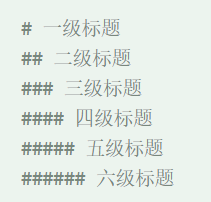

显示效果如下：

​		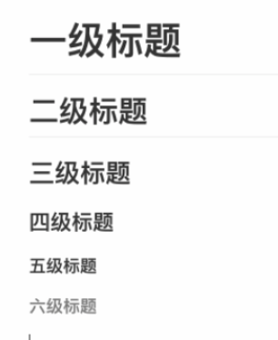


#### 2、Markdown段落格式

​	本章跳转：——-> [Markdown段落格式](https://www.runoob.com/markdown/md-paragraph.html)

##### 字体:一共由六种组成

​	*斜体文本*

​	_斜体文本_

​	**粗体文本**

​	***粗斜体文本***

​	___粗斜体文本___

##### 分割线

你可以在一行中用三个以上的星号、减号、底线来建立一个分隔线，行内不能有其他东西。你也可以在星号或是减号中间插入空格

例: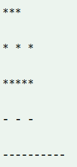

-----

***

********

##### 删除线

如果段落上的文字要添加删除线，只需要在文字的两端加上两个波浪线 **~~** 即可，实例如下：

RUNOOB.COM

GOOGLE.COM

~~BAIDU.COM~~

##### 下划线

下划线可以通过 HTML的 <U>标签来实现：

<u>带下划线脚本</u>

#### 3、Markdown 列表

本章跳转：——-> [Markdown 列表](https://www.runoob.com/markdown/md-lists.html)

##### Markdown 支持有序列表和无序列表

无序列表使用星号(*****)、加号(**+**)或是减号(**-**)作为列表标记，这些标记后面要添加一个空格，然后再填写内容：

* 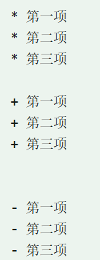

显示结果如下：

 * 第一项
 * 第二项
 * 第三项
    + 第一项
    + 第二项
    + 第三项
        - 第一项
        - 第二项
        - 第三项

##### 列表嵌套

列表嵌套只需在子列表中的选项前面添加两个或四个空格即可

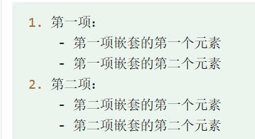

​			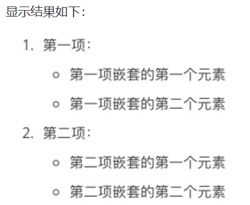		

#### 4、Markdown 区块

本章跳转：——-> [Markdown 区块](https://www.runoob.com/markdown/md-block.html)

Markdown 区块引用是在段落开头使用 **>** 符号 ，然后后面紧跟一个**空格**符号：

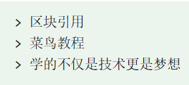

显示结果如下：

​				

另外区块是可以嵌套的，一个 **>** 符号是最外层，两个 **>** 符号是第一层嵌套，以此类推

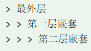

显示结果如下：

​				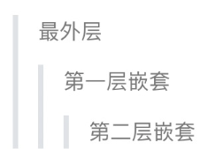

##### 区块中使用列表

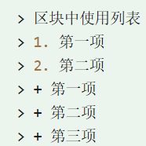

显示结果如下：

​			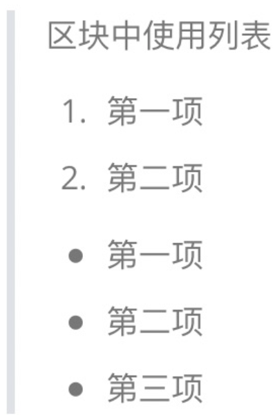

##### 列表中使用区块

​	如果要在列表项目内放进区块，那么就需要在 **>** 前添加四个空格的缩进。

列表中使用区块实例如下：

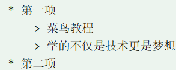

显示结果如下：

​		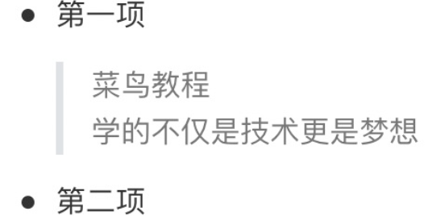			

# 快捷键

<kbd>+/:自动生成快捷键的视图

> [!warning]

格式:先>，之后用[!+warning]

> [!tip]

格式:先>，之后用[!+tip]

> [!note]

格式:先>，之后用[!+note]

> [!caution]

格式:先>，之后用[!+caution]

> [!important]

格式:先>，之后用[!+important]

- [ ] 格式：<kbd>ctrl+shift+x</kbd>


### 美人鱼图标格式

```mermaid
~~~ mermaid
graph LR
用户 --wifi--> AP --eth--> sw --> Router路由器 ---> 运营商 -->sever

~~~
```


## 特殊字符

```

```


| 特殊字符 | 描述           | 字符的代码（不带空格） |
| -------- | -------------- | ---------------------- |
| &nbsp;   | **空格符**     | **&nbsp ;**            |
| **<**    | **小于号**     | **&lt ;**              |
| **>**    | **大于号**     | **&gt ;**              |
| &        | 和号           | &amp ;                 |
| ￥       | 人民币         | &yen ;                 |
| &copy;   | 版权           | &copy ;                |
| &reg;    | 注册商标       | &reg ;                 |
| &deg;    | 摄氏度         | &deg ;                 |
| &plusmn; | 正负号         | &plusmn ;              |
| &times;  | 乘号           | &times ;               |
| &divide; | 除号           | &divide ;              |
| &sup2;   | 平方2（上标2） | &sup2 ;                |
| &sup3;   | 平方3（上标3） | &sup3 ;                |
| \*       | 星号           | \ *                    |
| _        | 下划线         | \ _                    |
| $long_2$ | 下标           | $1 _ 2$                |
| $\pi$    | 派             | $\pi$                  |

 

花括号:[markdown常用语法--花括号（超详细）_markdown花括号-CSDN博客](https://blog.csdn.net/csh1807266489/article/details/129079756)


