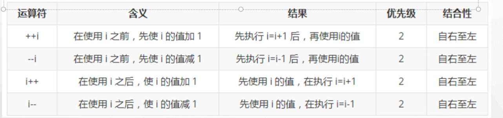
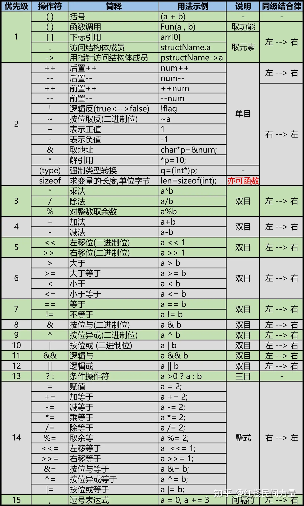
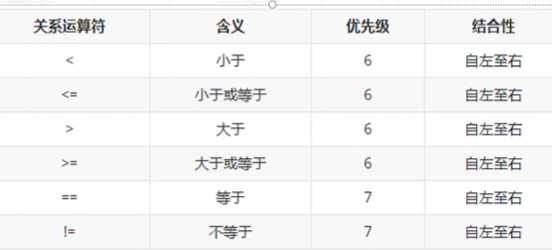
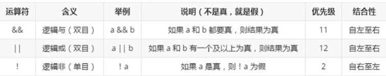
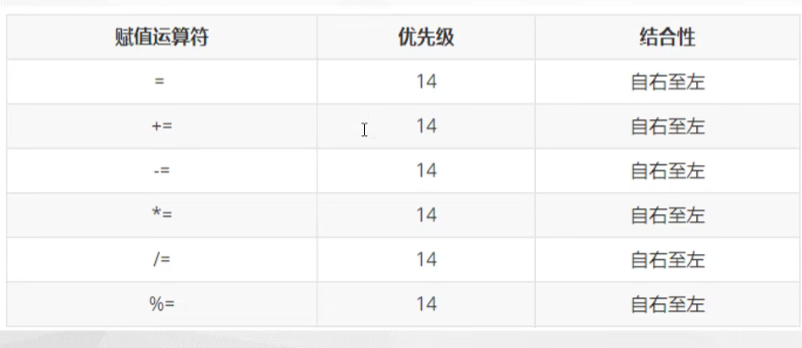
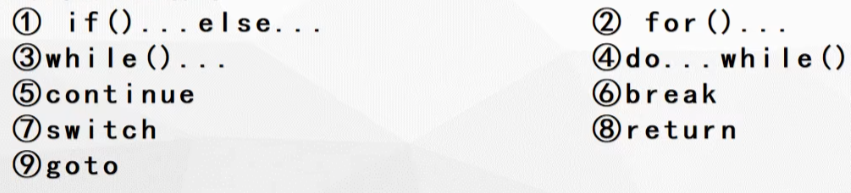

# C语言程序设计

## 1、基本数据类型:[传送门](https://www.bilibili.com/video/BV1jt4y1j7tF?p=3&vd_source=64709a8217a1bbd540960dd246f1356a)

标识符定义规则：必须由字母、数字、下划线组成，且开头必须由字母或下划线组成，不能是数字开头

字符型 存字符的，char占1个字节

单子字符用’a’

多个字符用“abcdefg”

字符可以和数字之间有类型的转换 ASCII

Char ch = ‘a’

Ch= 65;//’A’

Int a;

a = ch;//隐示转换

Ch = (int)ch;//强制转换

 

浮点型：存的是小数

单精度  float    占4个字节  精确到小数点后6-7位

双精度  double  占8个字节  请确的小数点后16-17位

编译器默认类型为double

但是，例如：float x=1.2345678f//最后这个f表示这个小数是float类型，f不影响值

高精度：精度高，比如说能计算到小数点后面10位

低精度：精度低，比如说能计算到小数点后面2位

基本数据类型之间，是可以进行转换，如果是计算，会往高精度转（那个字节数最高的自动转成该类型）

如果将一个小数数据赋值给一个整型变量，那么整型变量只会保留整数部分，小数部分会省略掉

 

格式占位符：将输出的数据转换为指定格式进行输出

//printf(“格式占位符”,%变量)；输出格式：%d,是整形   %c是char   %f是float 

%lf是double     %s是字符串

//在输出小数的时候，默认输出小数点后面6位，不够补0，多了的话四舍五入

想要输出指定位数的小数部分的话可以用：printf(“%.8lf”,a):表示保留八位小数

 

Scanf:格式化输入

//scanf（“变量1的类型的格式占位符 变量2的类型的格式占位符）

Getchar()：从键盘获取一个字符    

## 2、运算符和表达式：[传送门](https://www.bilibili.com/video/BV1jt4y1j7tF/?p=4&spm_id_from=333.880.my_history.page.click&vd_source=64709a8217a1bbd540960dd246f1356a)

运算符：算术运算符、自增自减运算符、关系运算符、逻辑运算符、条件运算符、赋值运算符、逗号运算符

### 为什么叫单目、双目、三目运算符

根据操作数：一个运算符要用到几个变量计算，比如需要两个数进行计算，那么就叫做双目运算符，如果是三个数进行计算，那么就叫做三目运算符

例如：单目运算符包括：自增自减运算符、取反运算符

双目运算符：按位与&、按位或|、按位异或^ 、左移<< 、右移>>

三目运算符：条件运算符

### 算术运算符：+、-、*、/

​                               

### 自增自减运算符：++、--

自增运算符是两个+连起来的符号，作用是使变量得值加1

自减运算符是两个-连起来的符号，作用是使变量的值减1

#### 自增自减运算符前后缀的区别

前缀：++a 先自增在参与运算

后缀：a++ 先参与运算再自增

### 运算符的优先级

在一个计算中，有多个不同的运算符，那么有些运算符的优先级来进行计算

##### 

### 关系运算符：>、>=、 < 、<=、 ==、 !=

关系运算符比较运算符两边的表达式的大小关系，其运算过后产生的结果为逻辑值，要么关系表达式为真（逻辑真），运算结果为非0值，要么表达式为假（逻辑假），运算结果为0

#### 关系运算符的基本使用

### 强制转换运算符:优先级是最高的

`int b =(double)10;`

`printf()`结果为双精度double类型的10.00000

或者是`int c='1'`

亦或者是`int c='a';`然后`printf("$d\n",c);`结果为97

### 逻辑运算符：&& 、 ||、   !

逻辑运算符用于判断运算符两边的表达式的逻辑关系，一般用于连接多个条件表达式

#### 逻辑运算符的使用

### 位运算符 << 、>>、~、|、&、^

左移：<< 左移相当于乘以2的n次方，移几位就乘以2的几次方

右移：>> 右移相当于除以2的n次方，移几位就除以2的几次方

按位非（取反）：~  二进制1变0,0变1	

按位或 : | 对应位置，有1则为1，全为0则为0 

按位与 ：&对应位置，全为1则为1，有0则为0

按位异或： ^ 对应位置，相同为0，不同为1

### 二进制位最高位为符号数

#### 正数和负数的原码、反码、补码之间的区别

正数的原码、反码、补码是一样的，而负数的原码、反码、补码的最高位是符号位：1代表负数，0代表正数

求负数的反码：除了符号位其他位按位取反

求负数的补码：再求完反码的基础上末尾加1

### 赋值运算符

  赋值符号“=”就是赋值运算符，用于给变量赋值，和算术运算符组合可以构成复合赋值运算符

#### 赋值运算符的基本使用

 

b +=a;b=b+a	b /=a;b=b/a 	b%=a;b=b%a

### 条件运算符（三目运算符)

 使用格式： 表达式1？表达式2：表达式3

使用描述：先执行表达式1，根据结果如果为1则执行表达式2，否则执行表达式3

### sizeof运算符

求数据类型大小，求数据的字节数大小

例如`printf("%d\n",sizeof(float))`结果为4	

​	`printf("%d\n",sizeof(10))`结果为4

​	`printf("%d\n",char)`结果为1

### 3、表达式

1、表达式的含义以及组成：用运算符和括号将运算对象（也叫操作数）连接起来的、符合C语言语法规则、用于相关运算的式子，成为C语言表达式。运算对象包括常量、变量、函数等。

2、示例：合法的算术表达式：a*b/c-1.5+‘a’

3、执行规则：在计算表达式的值时，应先按运算符的优先级别顺序执行，例如先乘除再加减。存在同一级别的运算符做运算时，则需要看运算符的结合性。（同一级别的运算符结合性是一致的，可以用小括号改变运算的优先级）

4、不同数据类型之间的混合运算：有以下几种情况

（1）当float与double类型混合运算时，全都转化成double类型，再进行运算。

（2）int与float或double型数据进行运算时，先把int转化成float或double型，在进行运算。

（3）char与int混合运算时，每一个char型字符都有相应的ASCII码数值对应，所以两者是可以相互转换的。在计算时，一般把字符型转换成整型，再进行运算。

### C语句

C语句一般是由表达式和语句结束符‘;’组成，是构成c语言函数的基本单位。

C语言中常见的C语句有如下几类：

