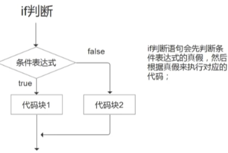

## 3、循环与分支[传送门](https://www.bilibili.com/video/BV1jt4y1j7tF/?p=5&spm_id_from=333.880.my_history.page.click&vd_source=64709a8217a1bbd540960dd246f1356a)

## 流程控制

流程控制结构是指能够改变程序执行顺序的结构，他们可以根据不同的条件在一段或多端程序种中选择一个运行或者不运行。

### 三大控制结构分别为：

顺序结构、循环结构、选择结构。

#### 顺序结构：

顺序结构的程序设计是最简单的，只要按照解决问题的顺序写出相应的语句就行，它的执行顺序是自上而下从左至右，依次执行。

#### 分支结构：

分支结构是依据一定的条件选择执行的路径，而不是严格按照语句出现的前后顺序执行。

 选择分支结构

C语言支持两种选择结构：

##### `if`选择分支结构

基本格式：

```c
if(表达式)
语句1；
[else
 语句2]
执行流程：首先判断if之后条件表达式的逻辑值，如果逻辑为真则执行语句1，否则如果逻辑为假则不执行语句1，如有else则执行else之后的语句2(else可有可无)     
```



##### `switch`多分支结构

```c
switch(表达式)
{
	case 常量1:语句1；break;
	case 常量2:语句2；break；
	………………
	case 常量n:语句n；break；
	default:语句n+1；
}
执行流程：
首先判断switch之后表达式的值，如果这个值和case之后的某个常量相等则执行对应case之后的语句（此后继续执行下面为执行完的语句，但是这时候不在判断条件，如果想要退出此语句需要再执行后语句加一个break；进行跳出），若与所有值都不相等，则执行default之后的语句（defalut不论在哪里都是在整个switch判断条件全都未执行的情况下最后执行的。哪怕是在第一个位置）
```


#### 循环结构：

循环结构是依据一定的条件重复执行某一句或者某几句代码，是为反复做某个操作而设置的一种程序结构。

C语言支持三种循环结构：

##### 1.for循环

```c
for(表达式1；表达式2；表达式3)
{
循环体；
}
//表达式1：初始化语句，只有开始循环时才执行一次
//表达式2：循环的判定条件
//表达式3：循环条件的改变
//循环体：需要重复执行的代码段
//注意：表达式之间的分隔符；不能少
执行流程：首先执行初始化语句，然后判断条件，如果条件满足则继续执行循环体，否则结束循环。
```


for的循环嵌套

做一个双重循环最外边的循环执行一次最里边的循环执行到条件表达式2不成立为止


##### while循环

``` c
while (判断表达式1)
{
	循环体语句；
	表达式2；
}
执行流程：
先进行判断表达式1的结果，若结果为1，则执行循环体语句，若结果为0，则不执行该循环体，且如果没有设定条件大多数情况下容易让循环体无限循环下去，所以需要执行一个表达式2作为终止该循环体的条件
```

###### do-while循环

特点：不先判断条件，而是先执行一次，所以`do-while`是至少执行一次循环

```c
do
{
	循环体语句；
	表达式2；
} while(判断表达式1)
执行流程：
    和while循环差不多，唯一的区别是先执行一次循环体，然后再进行循环体条件的判断
```

## 跳转语句

使用while或for循环时，如果想提前结束循环（在满足循环条件的情况下结束循环），可以使用break或continue关键字。

### 1、break:

结束循环结构for、while、do-while或者分支结构switch当前的执行。

### 2、continue

结束本次的循环，继续执行下一次循环。

### 3、goto:

跳转到指定标记的位置。（结构化程序最好不要使用）
