# 一、计算机网络体系结构

[传送门](https://www.bilibili.com/video/BV19E411D78Q/?p=2&spm_id_from=pageDriver&vd_source=64709a8217a1bbd540960dd246f1356a)

## 计算机网络的概念

什么是计算机网络

是一个将众多分散的、自治的计算机系统，通过通信设备与线路连接起来，由功能完善的软件实现资源共享和信息传递的系统。

计算机网络、互联网、互连网的区别

计算机网络：由若干节点和连接这些结点的链路组成

互联网：译为因特网，特指全世界最大的计算机网络，由各大ISP和国际机构组件，使用TCP/IP协议族作为通信规则

互连网：多个计算机网络通过路由器相互连接而成，可使用任意通信协议

## 计算机网络的组成、功能

### 组成

#### 从组成部分看：硬件、软件、协议

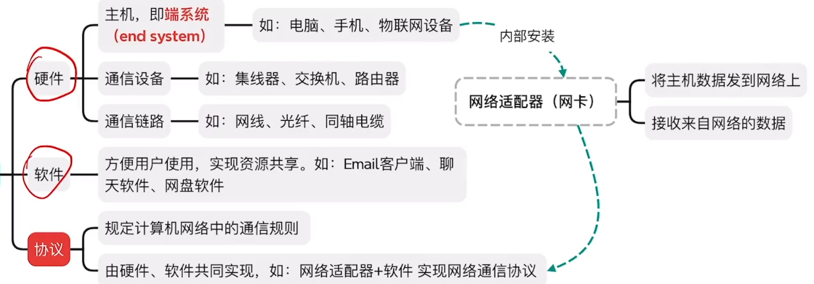

从工作方式看：边缘部分、核心部分

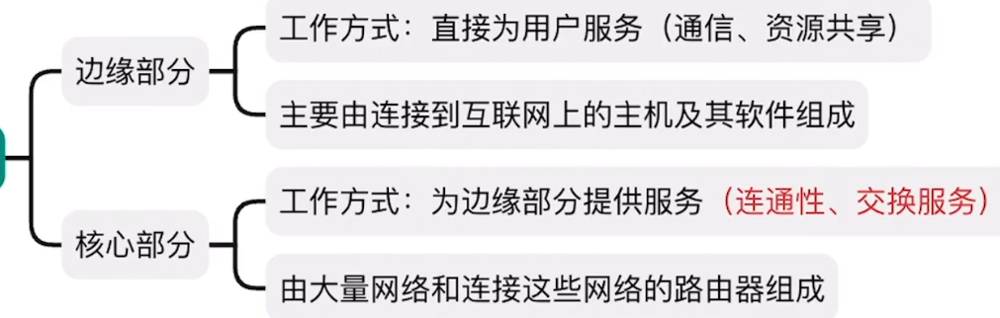

从逻辑功能看：资源子网、通信子网

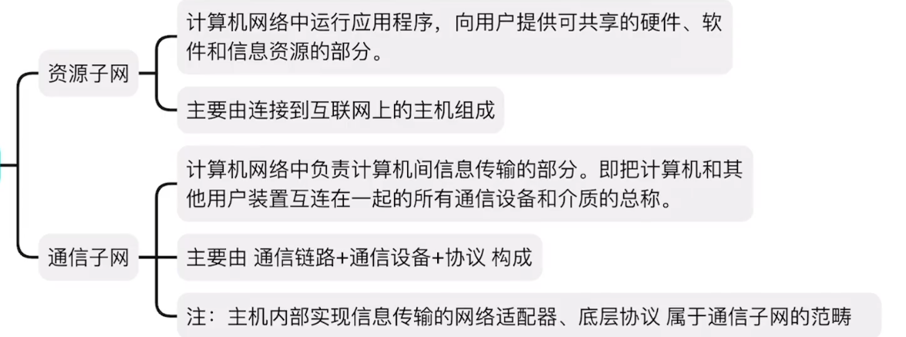

### 计算机网络的功能

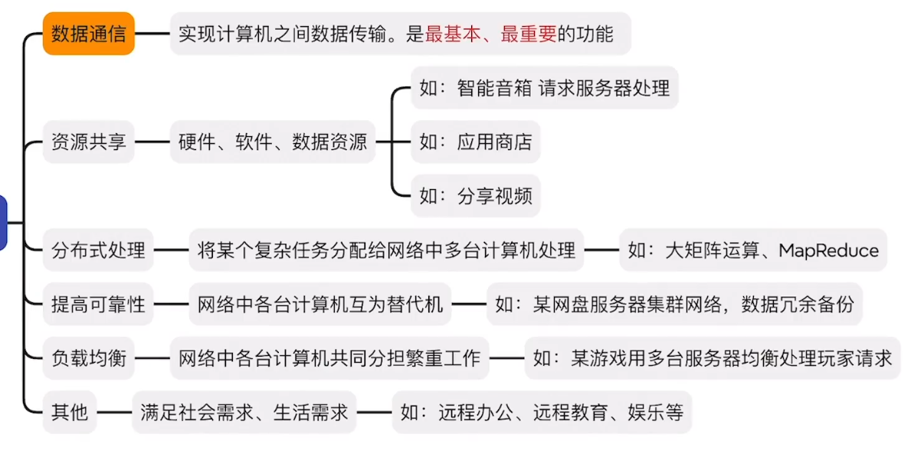

#### 资源共享

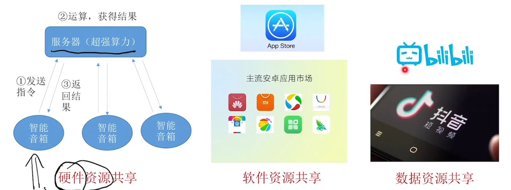

#### 分布式管理

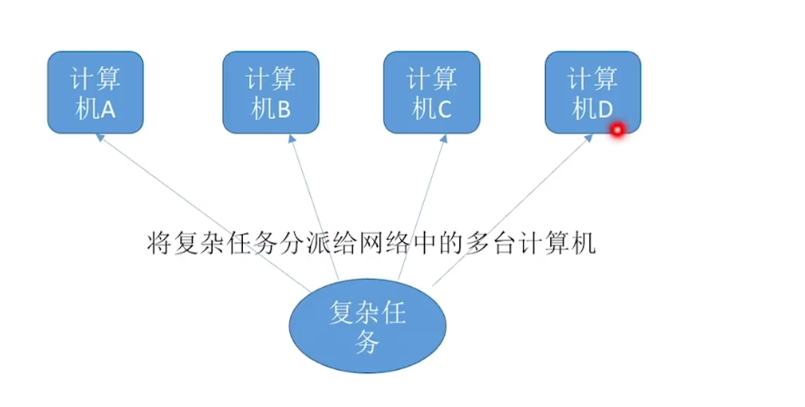

如同矩阵乘法可以拆分成多个子任务：两个n行n列矩阵相乘，第i行与第j列相乘相加，得到<i,j>

#### 提高可靠性

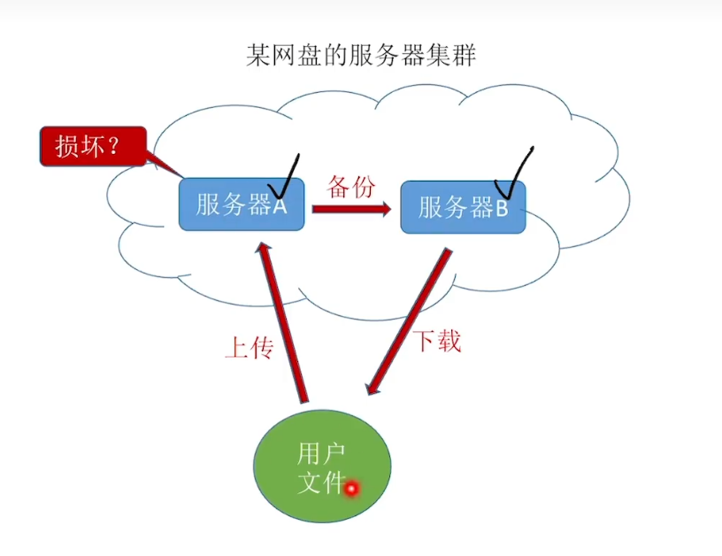

如果服务A崩了，你还可以通过服务器B重新下载下来，远比自己电脑上保存着的可靠性高更高。

#### 负载均衡

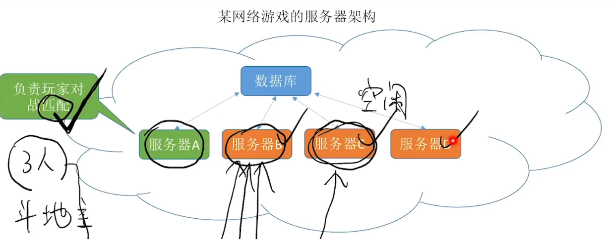

比如说斗地主三个人已经完成了匹配，此时服务器C比较空闲，就可以让服务器C作为这三个斗地主的人的房间。

# 电路交换、报文交换、分组交换

[传送门](https://www.bilibili.com/video/BV19E411D78Q/?p=5&spm_id_from=pageDriver&vd_source=64709a8217a1bbd540960dd246f1356a)

## 电路交换

用于电话网络

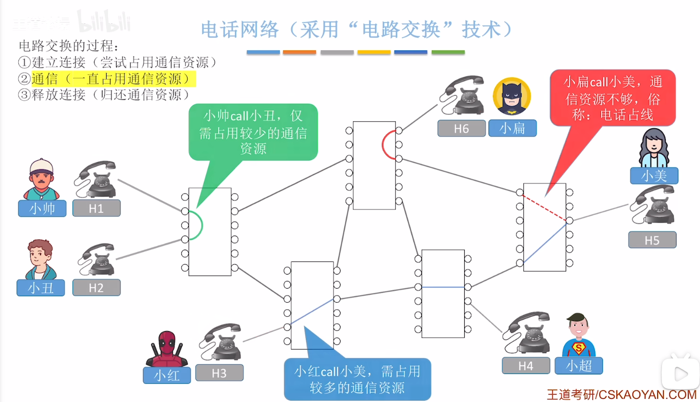

电路交换：通过物理线路的连接，动态地分配传输线路资源

### “电路交换”的优缺点

优点:通信前从主叫端到被叫端建立一条专用的物理通路，在通信的全部时间内，两个用户始终扎用端到端的线路资源。数据直送，传输速率高。（更适用于低频次、大量地传输数据）

缺点：建立/释放连接，需要额外的时间开销

​	   线路被通信双方独占，利用率低

​	   线路分配的灵活性差 

​	   交换节点不支持”差错控制“（无法发现传输过程中的发生的数据错误）

## 报文交换

用于电报网络

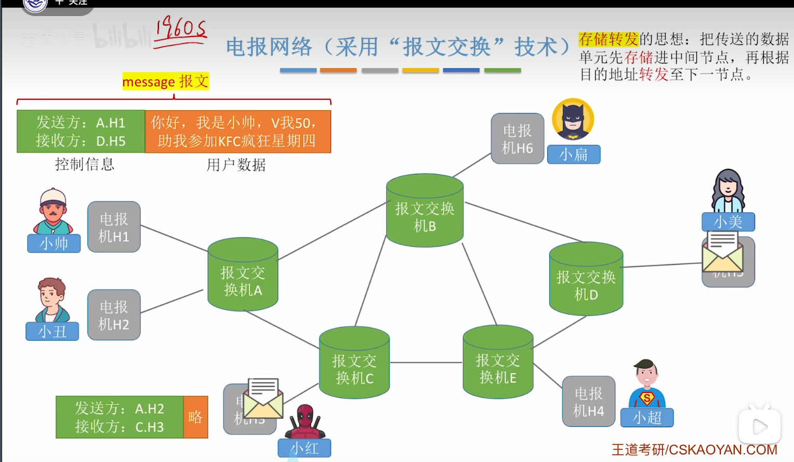

### 报文交换的优缺点：

优点：

通信前无需建立连接

数据以”报文“为单位被交换节点间”存储转发“，通信线路可以灵活分配

在通信时间内，两个用户无需独占一整条物理线路。相比于电路交换，线路利用率高

 交换节点支持”差错控制“（通过校验技术）

缺点：

报文不定长，不方便存储转发管理

长报文的存储转发时间开销大、缓存开销大

长报文容易出错，重传代价高

## 分组交换

用于现代计算机网络

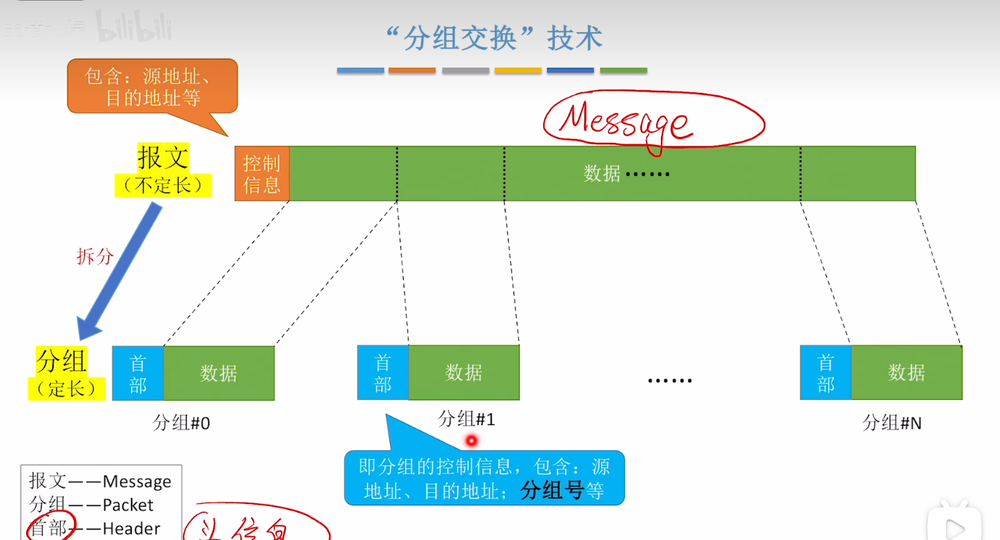

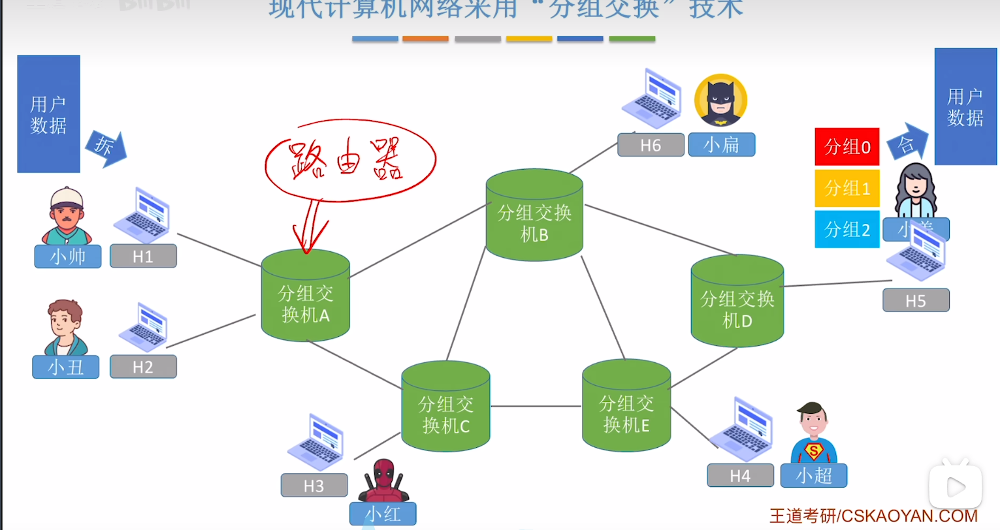

网络数据以固定长度的分组，在各个路由器中交换，而路由器判断一个分组，它是从什么地方发出又应该发到什么位置是通过IP地址来判断的，发送方由IP地址同时接收方也有IP地址

### 分组交换的优缺点

优点：

通信前无需建立连接

数据以“分组”为单位被交换节点间“存储转发”，通信线路可以灵活分配

在通信时间内，两个用户无需独占一整条物理线路。相比于电路交换，线路利用率高。

交换节点支持“差错控制”（通过校验技术）

#### 相比于报文交换，分组交换改进了如下问题：

分组定长，方便存储转发管理

分组的存储转发时间开销小、缓存开销小

分组不易出错，重传代价低

缺点：

相比于报文交换，分组交换占比增加

相比于电路交换，依然存在存储转发时延

报文被拆分为多个分组，传输过程中可能出现失序、丢失等问题，增加处理的复杂度

### 基于分组交换的基础上的“虚电路交换”

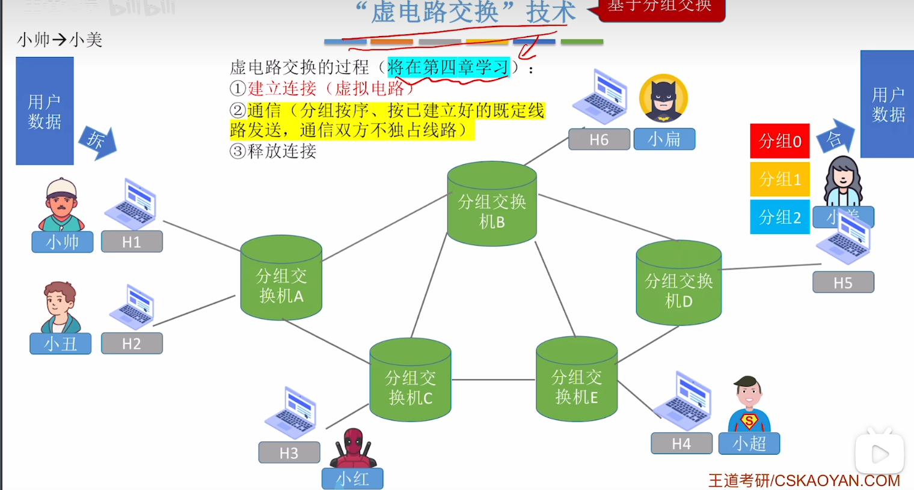

#### 分组交换与虚电路交换的区别：

由于计算机本身的算力强大，分组交换把保证分组不乱序、不丢失这些乱七八糟的问题交给了计算机终端自己解决，而虚电路交换是把这些问题交给了网络的核心部分去处理，这样的话反而会影响网络核心部分的数据传输能力

### 三种交换方式的性能对比

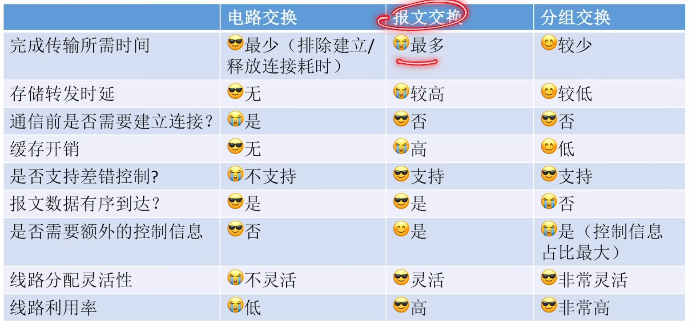

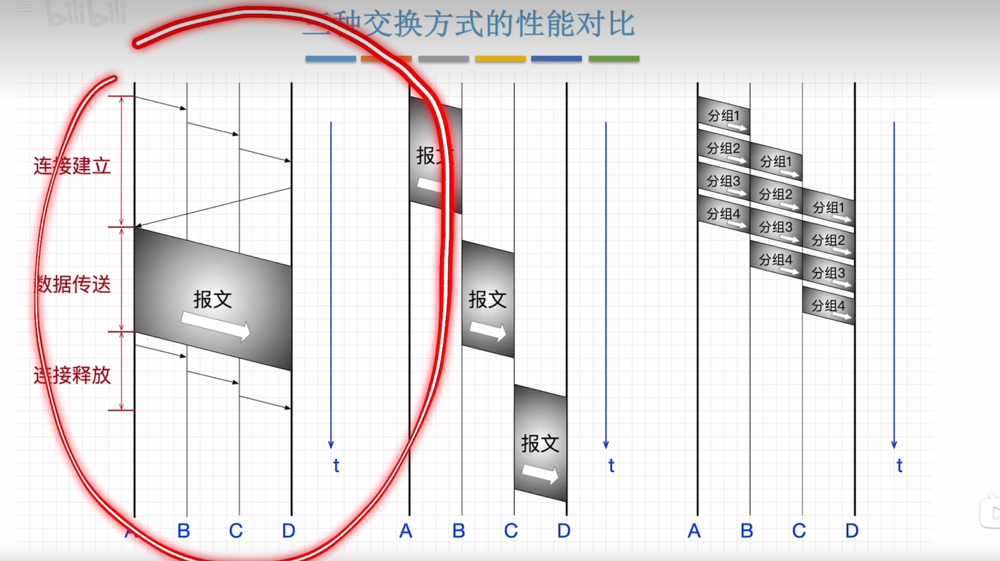

## 计算机网络的分类

### 按传输技术分类

广播式网络：当一台计算机发送数据分组时，广播范围内所有计算机都会受到该分组，并通过检查分组的目的地址决定是否接受该分组。

点对点网络:数据只会从发送方“点对点”发到接收方，精准送达。

### 按拓扑结构分类

总线性结构：数据“广播式“传输：存在”总线争用“问题

环形结构：数据”广播式“传输；通过“令牌”解决总线争用问题令牌顺环形依次传递，拿到令牌者可使用总线

典型代表:令牌环网(流行于2000年以前的局域网技术)

星形结构:由中央设备实现数据的“点对点”传输;不存在“总线争用”问题

典型代表: 以太网交换和连接的设备

网状结构:数据通过各中间节点逐一存储转发;属于“点到点”传输
典型代表:由众多路由器构建的广域网 

### 按使用者分类

公用网--向公众开放的网络。如:办宽带、交手机话费即可使用的互联网
专用网·--仅供某个组织内部使用的网络。如:政府、军队、电力、银行的内部网络

### 按传输介质

有线网络一如:网线、光纤
无线网络--如:5G、WiFi、卫星

## 性能指标1:速率

速率(Speed):指连接到网络上的节点在信道上传输数据的速率。也称数据率或比特率、数据传输速率速率单位:bit/s，或b/s，或bps
注意:有时也会用B/s,注意：有时也会用B/s(1B=8b，B=Byte字节，b=bit 比特)
#### 计算机网络中常用的数量前缀:
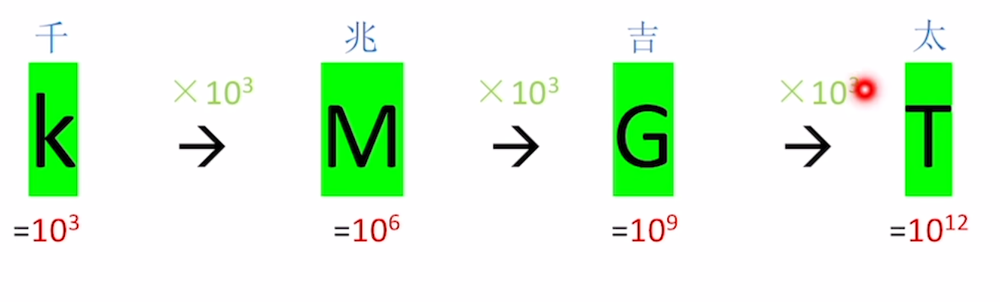

## 性能2:带宽

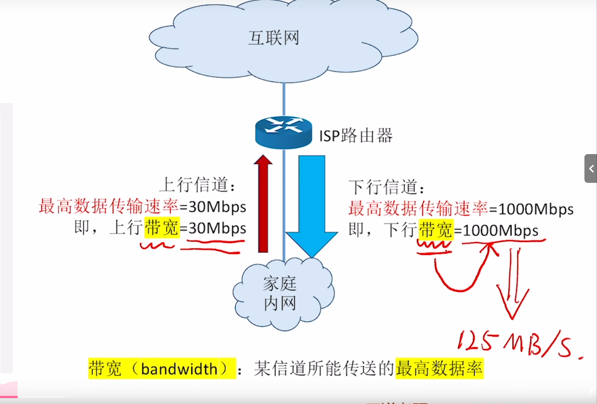

在《计算机网络》中:带宽(bandwidth)表示某信道所能通过的“最高数据率。单位:bps(或记为 b/s、bit/s;可加上数量前缀k、M、G、T)
在《通信原理》(通信领域的一门基础学科)中:带宽(bandwidth):表示某信道允许通过的信号频带范围单位:Hz(读作“赫/赫兹”;可加上数量前缀k、M、G、T)

### 性能指标3:吞吐量

重过某个网络(或信道、接口)的实际数据量吞吐量(Throughput):指单 位时间内吞吐量受带宽限制、受复杂的网络负载青况影响

### 性能指标4:时延

时延(Delay):指数据(一个报文或分组，甚至比特)从网络(或链路)的一端传送到另一端所需的时间。有时也称为延迟或迟延。

总时延=发送时延+传播时延+处理时延+排队时延

 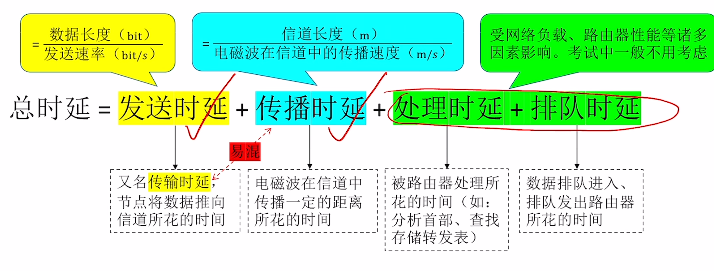

### 性能指标5:时延带宽积

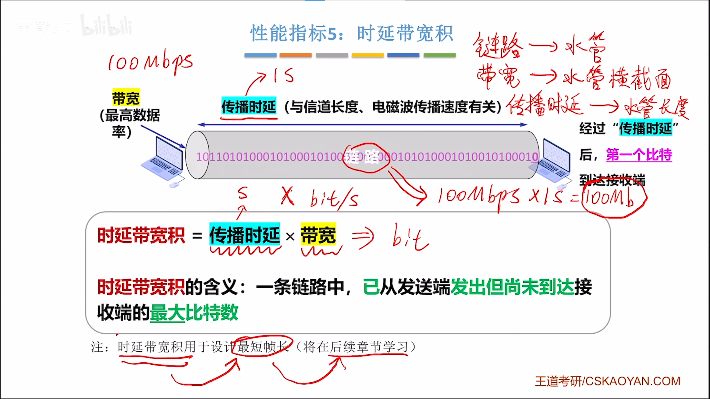

### 性能指标6：往返时延

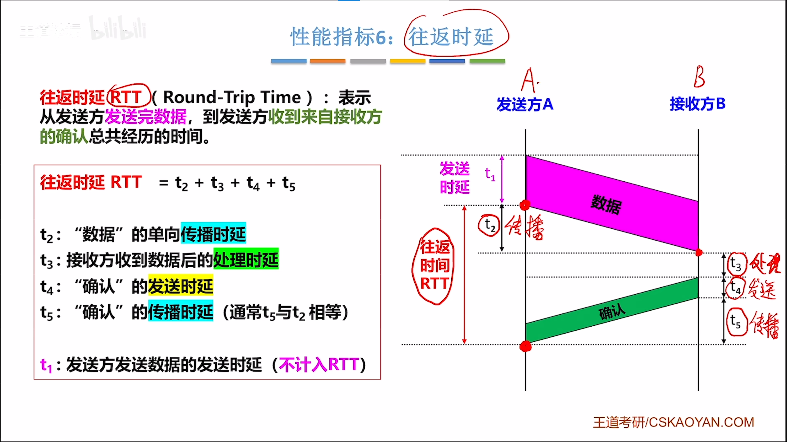

### 性能指标7：信道利用率

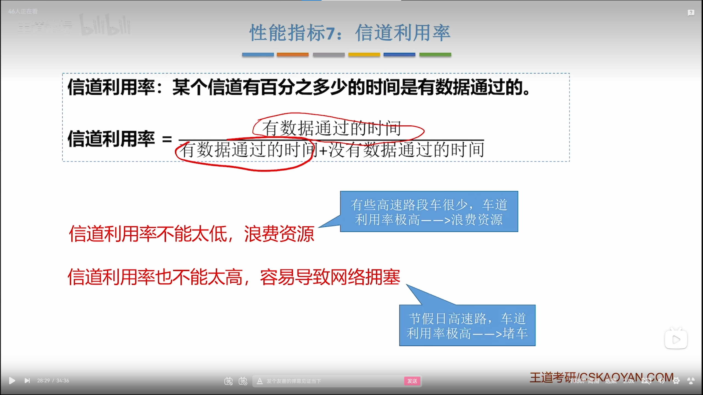

## 分层结构

[传送门](https://www.bilibili.com/video/BV19E411D78Q?p=9&spm_id_from=pageDriver&vd_source=64709a8217a1bbd540960dd246f1356a)

### “分层”的设计思想

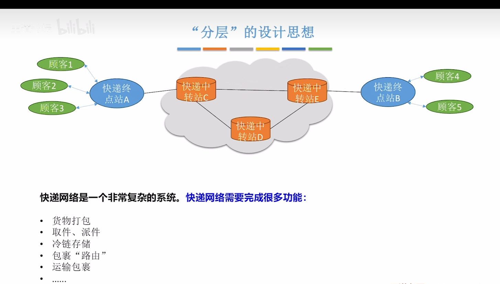

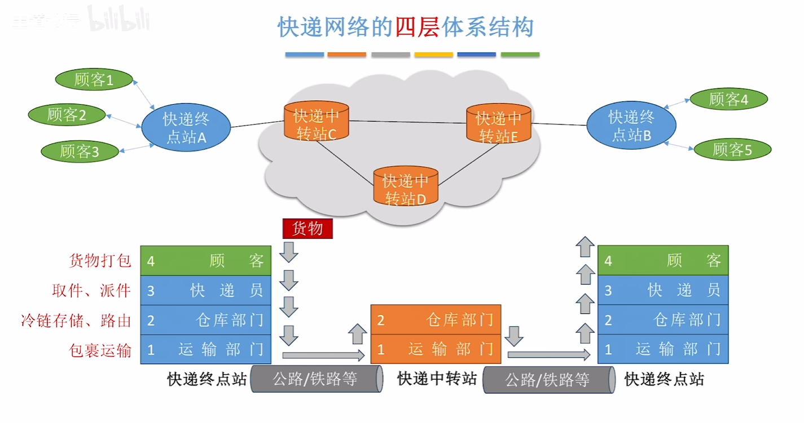

* 将复杂的快递网络在逻辑上划分为多个层次，并将各种“功能”安排在合适的层次中

    不同类型的节点，实现的功能层次可能不一样

    **分层**的设计思想：将庞大而复杂的问题，转化为若干较小的局部问题

### 计算机网络要完成的功能

* 差错控制：确保数据在传输过程中不出错。
* 流量控制：发送端的发送速率必须使接收端来得及接收，不要太快。
* 分段和重装：发送端将要发送的数据划分为更小的单位，并在接收端将其还原。
* 复用和分用：发送端几个高层会话复用一条低层的链接，在接收端再进行分用
* 连接建立和释放：交换数据前先建立一条逻辑连接，数据传送结束后释放连接。
* ……

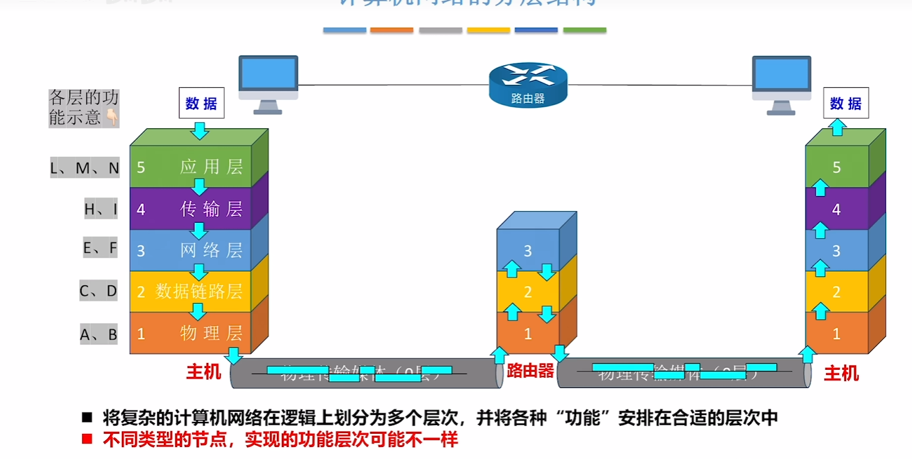

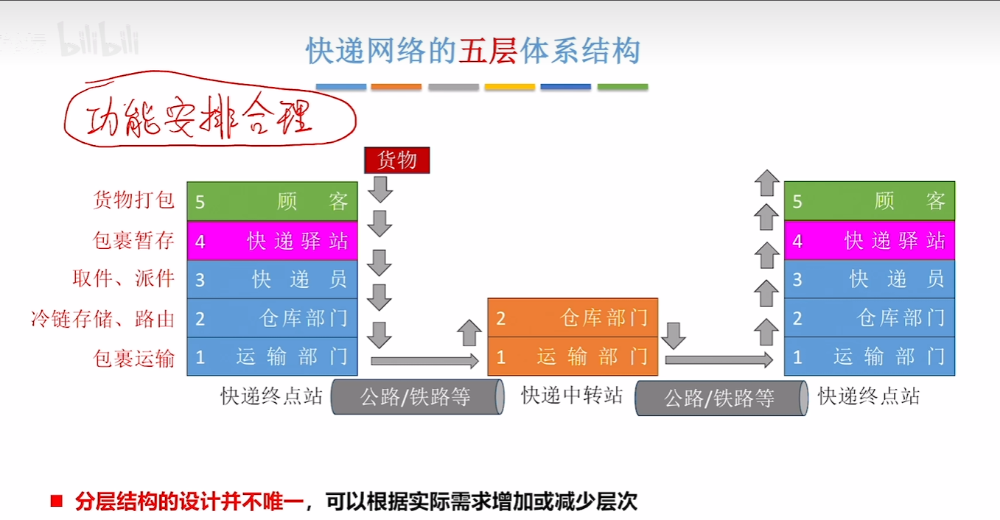

* 同一个功能可以在多个层次中重复出现。

 

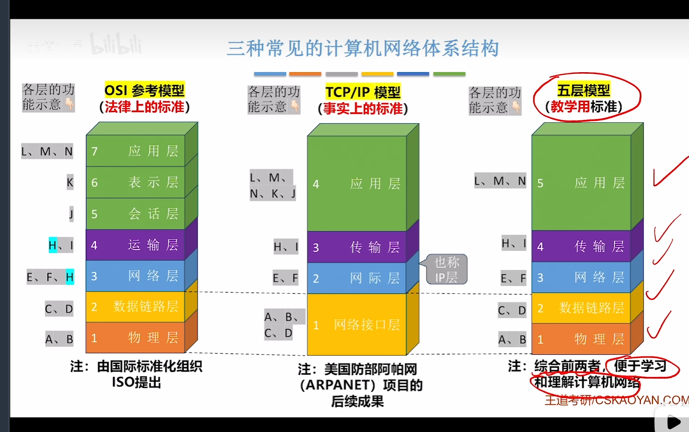

网络的体系结构(Network Architecture)是计算机网络的各层及其协议的集合，就是这个计算机网络及其构件所应完成的功能的精确定义(不涉及实现)。

实现(implementation)是遵循这种体系结构的前提下，用何种硬件或软件完成这些功能的问题。

**体系结构是抽象的，而实现则是具体的**

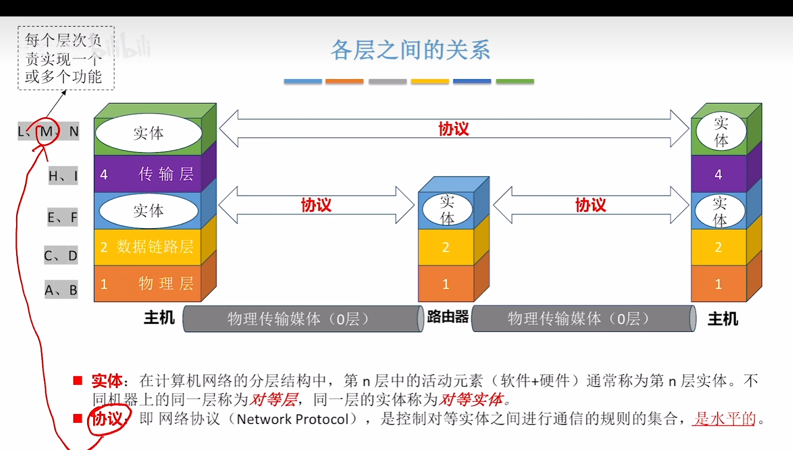

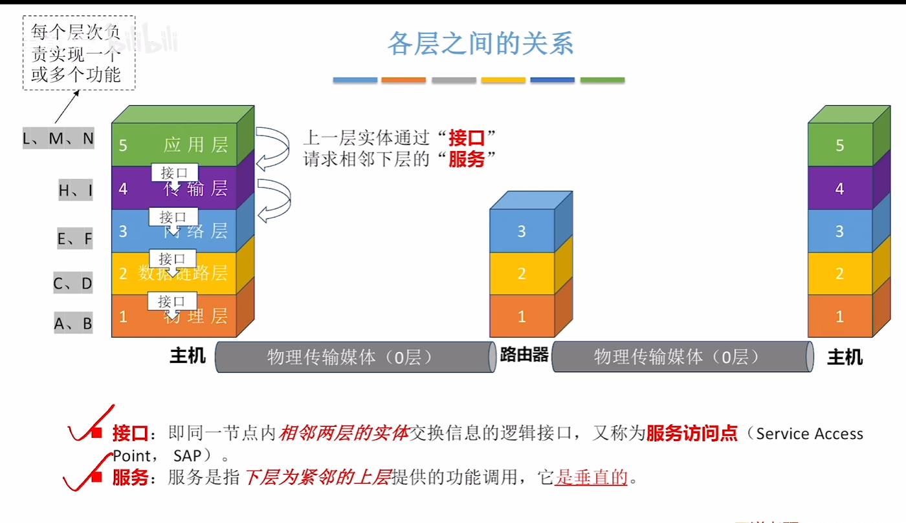

* 实体：在计算机网络的分层结构中，第N层中的活动元素(软件+硬件)通常称为第n层实体。不同机器上的同一层称为对等层。同一层的实体称为对等实体。
* 协议：即网络协议(Network Protocol)是控制对等实体之间进行通信的规则的集合，__是水平的__

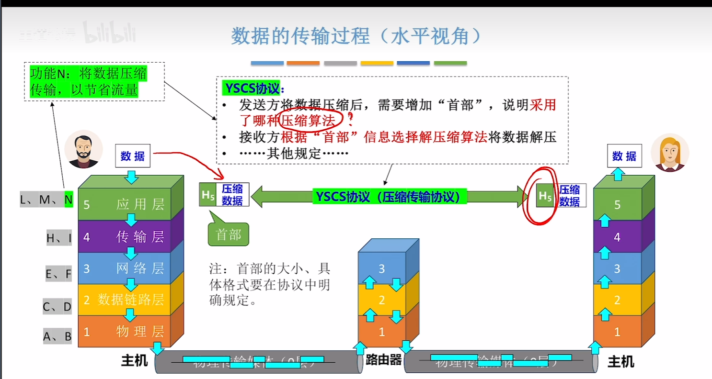

### PDU、SDU、PCI的概念

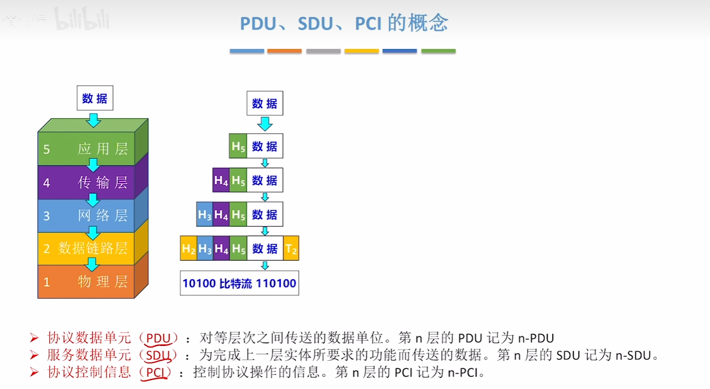

### 协议的三要素

协议由语义、语法和同步三部分组成(协议的三要素)：

1. 语法。数据与控制信息的格式。例如，协议控制信息(首部)部分占几个字节、每个字节是什么含义：协议的数据部分最多有多少字节。
2. 语义。即需要发出何种控制信息、完成何种动作及做出何种应答。例如，协议中需要明确规定：发送方完数据后，接收方是否需要”应答“，以及应答的种类有哪些（如：传输成功、。传输失败）
3. 同步(或时序)，执行各种操作的条件、时序关系等，即事件实现顺序的详细说明。例如，发送方发完数据后，接收方需要立即应答。如果发送方在10秒内未收到“传输成功”应答，则发送方会再次发送数据。

## OSI参考模型

[传送门](https://www.bilibili.com/video/BV19E411D78Q/?p=11&spm_id_from=pageDriver&vd_source=64709a8217a1bbd540960dd246f1356a)

### 1.物理层

物理层任务：实现相邻节点之间比特(0或1)的传输

1. 需定义电路接口参数(如：形状、尺寸、引脚数等。)
2. 需定义传输信号的含义、电气特征(如:5V表示1，1V表示0;每比特电信号持续时间0.1ms)

### 2.链路层

链路层任务：确保香菱节点之间的链路逻辑上无差错。包含以下功能：

1. 差错控制：检错+纠错：或检错+丢弃+重传
2. 流量控制：协调两个结点的速率

### 网络层

网络层任务：把“分组”从源节点转发到目的结点。包含以下功能：

1. 路由选择：构造并维护路由表，决定分组到达目的节点的最佳路径
2. 分组转发：将“分组”从合适的端口转发出去
3. 拥塞控制：发现网络拥塞，并采取措施缓解拥塞
4. 网际互连：实现异构网络互联 
5. 其他功能：差错控制、流量控制、连接建立与释放、可靠传输管理 

### 传输层

 传输层任务：实现端到端通信（即实现进程到进程的通信，“端”指“端口”） 

1. 复用和分用：发送端几个高层实体复用一条底层的连接，在接收端再进行分用。
2. 其他功能：差错控制、流量控制、建立连接与释放、可靠传输管理

### 会话层

会话层任务：管理进程间会话（主要功能：<u>会话管理</u>（采用检查点机制，当通信失效时从检查点继续恢复通信）

### 表示层

表示层任务：解决不同主机上信息表示不一致的问题（主要功能：<u>数据格式转换</u>（如编码转换、压缩/解压、加密/解密）

### 应用层

应用层任务：实现特定的网络应用（功能繁多，根据应用需求设计）

### 总结：各层数据传输单位

应用层与应用层之间：通过报文传输，1个文件就是1个报文

表示层和会话层不会拆分报文

传输层会把报文拆分成报文段，以报文段为单位进行数据传输

网络层会把报文段拆分成 分组然后以分组为单位进行传输

网络层的分组交给数据链路层，数据链路层会把分组拆分成帧

物理层会把帧以比特为单位进行传输 

从大到小的数据单位大到数据单位小

| OSI参考模型   | 任务                               | 功能                                                         |
| ------------- | ---------------------------------- | ------------------------------------------------------------ |
| #7 应用层     | 实现特定网络应用                   | 略                                                           |
| #6 表示层     | 解决不同主机上信息表示不一致的问题 | 数据格式的转换                                               |
| #5 会话层     | 管理进程间会话                     | 会话管理                                                     |
| #4 传输层     | 实现端到端（进程到进程）通信       | 复用和分用、差错控制、流量控制、连接管理、可靠传输管理       |
| #3 网络层     | 把分组从源节点转发到目的结点       | 路由选择、分组转发、拥塞控制、网际互连、差错控制、流量控制、连接管理、可靠传输管理 |
| #2 数据链路层 | 确保相邻节点之间的链路逻辑上无差错 | 差错控制、流量控制                                           |
| #1物理层      | 实现相邻节点之间比特的传输         | 需定义电路接口参数、信号的含义/电气特性等                    |

注：物理传输媒体属于第0层

## TCP/IP模型

设计理念：如果某些应用需要数据格式转换、会话管理功能、就交给应用层的特定协议去实现

### TCP/IP网络接口层

网络接口层任务：实现相邻节点间的数据传输（为网络层传输“分组”），但其具体怎么传输不做规定）这使得TCP/IP网络体系结构具有更强的灵活性、适应性。

### TCP/IP网络层

由于数据的局部正确不等同于全局正确，但是数据的全局正确等同于局部的正确所以，基于这样的思路：**TCP/IP网络层功能**：路由选择、分组转发、拥塞控制、网际互联

TCP/IP网络层只保证“尽最大能力交付”数据传输是不可靠的

### TCP/IP传输层

TCP/IP模型中，由传输层负责保证数据传输的正确性，可靠性（传输层功能：**服用和分用**，差错控制、流量控制、建立连接与释放、可靠传输管理，导致路由器的功能简单，负载低

| TCP/IP模型    | 任务                                             | 功能                                                         |
| ------------- | ------------------------------------------------ | ------------------------------------------------------------ |
| #4 应用层     | 实现特定网络应用                                 | 略                                                           |
| #3 传输层     | 实现端到端（进程到进程）通信                     | 复用和分用、差错控制、流量控制、连接管理、可靠传输管理       |
| #2 网络层     | 把分组从源结点转发到目的结点                     | 路由选择、分组转发、拥塞控制、网际互连、~~差错控制、流量控制、连接管理、可靠传输管理~~ |
| #1 网络接口层 | 实现相邻节点之间的数据传输（为网络层传输“分组”） | 无具体规定                                                   |

