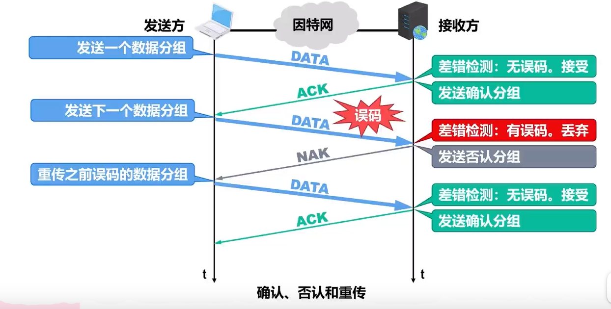
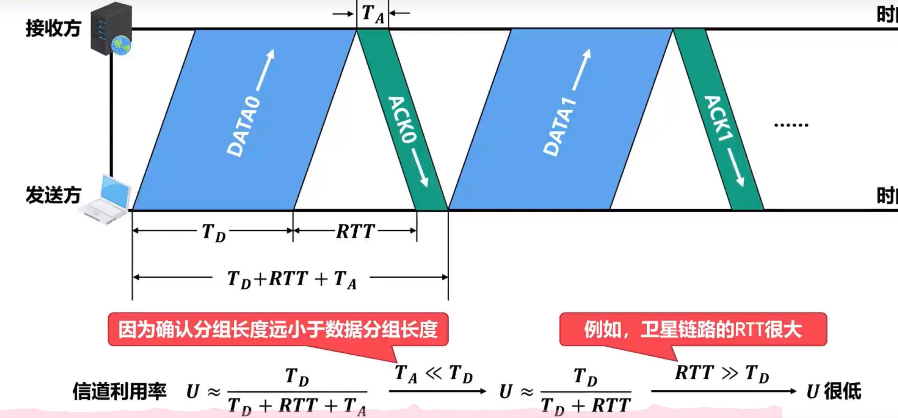
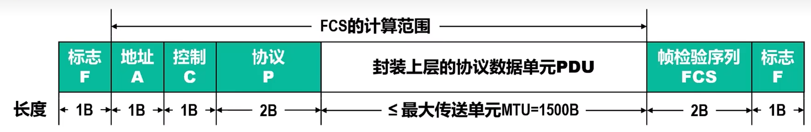
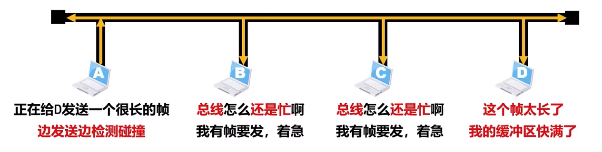
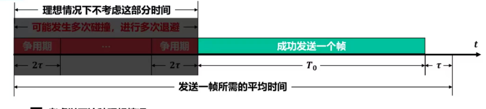

# 数据链路层

## 数据链路层基本概念

结点：主机、路由器

链路：网络中两个节点之间的物理通道，而中间没有任何其他的交换节点，链路的传输介质主要有双绞线、光纤和微波。分为有限链路、无线链路。

数据链路：网络中两个节点之间的逻辑通道，把实现控制数据传输协议的硬件和软件加到链路上就构成数据链路。

帧：链路层对等实体之间在水平方向·上进行逻辑通信的协议数据单元（PDU） 的协议数据单元（PDU)，封装网络层数据报。

计算机中的网络适配器（网卡）和相应的软件驱动程序就实现了这些协议。一般的网络适配器都包含了物理层和数据链路层这两层的功能。

数据链路层负责通过一条链路从一个结点向另一个物理链路直接互联的相邻节点传送数据报。 

### 数据链路层的三个重要问题

#### 封装成帧

 ~~~ mermaid
 graph LR
 发送方的应用层的应用层协议数据单元  --运输层首部--> 网络层 --添加网络层首部 --> 数据链路层 -- 链路层尾部和首部 --> 封装成帧
 ~~~

链路层首部和尾部包含有一些重要的控制信息。

 例如：

| 以太网V2的MAC帧（最大长度1518B） |
| :------------------------------: |

| 4   B | 46 —1500B | 2B   | 6B     | 6B       |
| ----- | --------- | ---- | ------ | -------- |
| FCS   | 数据载荷  | 类型 | 源地址 | 目的地址 |

封装成帧是指数据链路层给上层交付下来的协议数据单元PDU添加一个首部一个尾部，使之称为帧。

* 帧的首部和尾部中包含有一些重要的控制信息。
* 帧首部和尾部的作用之一就是帧定界。
* 并不是每一种数据链路层协议的帧都包含有帧定界。
* 为了提高数据链路层传输帧的效率，应当使<font color="orange">帧的数据载荷的长度尽可能地大于首部和尾部的长度。</font>
* 考虑到对缓存空间的需求以及差错控制等诸多因素，每一种数据链路层协议都规定了帧的数据载荷的长度上限，即最大传送单元（MTU）


#### 透明传输

透明传输是指<font color="orange">数据链路层对上层交付下来的协议数据单元PDU没有任何限制</font>，就好像数据链路层不存在一样。

* 面向字节的物理链路使用<font color="orange">字节填充</font>的方法实现透明传输。


* 面向比特的物理链路使用<font color="orange">比特填充</font>的方法实现透明传输。


#### 差错控制

误码：相关概念

* 实际的通信链路都不是理想的，比特在传输过程中可能会产生差错（称为比特差错）
    * 比特1可能变成0
    * 比特0可能变成1
* 在一段时间内，传输错误的比特数量占所传输比特总数的比率称为误码率
* 提高链路的信噪比，可以降低误码率。但在实际的通信链路上，不可能使误码率下降为0
* 使用差错检测技术来检测数据在传输过程中是否产生了比特差错，是数据链路层所要解决的重要问题之一。

##### 奇偶校验

* 奇校验是在待发送的数据后面添加1个校验位，使得添加该校验位后的整个数据中比特1的个数为奇数。


* 在所传输的数据中，如果有奇数个位发生误码，则所包含比特1的数量的奇偶性会发生改变，可以检测出误码。


* 偶校验是在待发送的数据后面添加1个校验位，使得添加该校验位后的整个数据中比特1的个数为偶数,


* 在所传输的数据中，如果有偶数个位发生误码，则所包含比特1的数量的奇偶性不会发生改变，无法检测出误码(漏检)
* 在实际使用时，奇偶校验又可分为垂直奇偶校验、水平奇偶校验以及水平垂直奇偶校验

##### 循环冗余校验

* 数据链路层广泛使用漏检率极低的循环冗余校验(CRC)检错技术
* 循环冗余校验CRC的基本思想：
    * 收发双方约定好一个生成多项式G(X)。
    * 发送方基于待发送的数据和生成多项式G(X)，计算出差错检测码
        冗余码)，将冗余码添加到待发送数据的后面一起传输。
    * 接收方收到数据和冗余码后，通过生成多项式G(X)来计算收到的数据和冗余码是否产生了误码。

发送CRC操作

生成多项式各项系数构成的比特串/待发送的数据+生成多项式最高次个0，得到商（注：商仅作为标记，防止计算过程对错位）和余数（长单应与生成多项式最高次数相同，作为冗余码）

将余数和待发送的数据拼接到一起进行发送


接收方CRC操作

生成多项式各项系数构成的比特串/已接收的数据+余数，得到商和余数，余数位0可判断接收无误码，余数不为0可判断接收有误码

 


## 可靠传输的相关基本概念

* 使用差错检测技术（例如循环冗余校验CRC）,接收方的数据链路层就可检测出帧在传输过程中是否产生了误码（比特差错）。
* 数据链路层向其上层提供的服务类型
    * 不可靠传输服务：仅仅丢弃有误码的帧，其他什么也不做
    * 可靠传输服务：通过某种机制实现发送方发送什么，接收方最终就能收到什么，
    * 一般情况下，有线链路的误码率比较低。为了减小开销，并不要求数据链路层向其上层提供可靠传输服务。即使出现了误码，可靠传输的问题由其上层处理。
    * 无线链路易受干扰，误码率比较高，因此要求数据链路层必须向其上层提供可靠传输服务。
    * 可靠传输服务并不局限于数据链路层，其他各层均可选择实现可靠传输。
    * 可靠传输的实现比较复杂，开销比较大，是否使用可靠传输取决于应用需求

### 停止-等待协议的实现原理

##### 传送门：[3.2.3 （2）可靠传输的实现机制 - 停止-等待协议_哔哩哔哩_bilibili](https://www.bilibili.com/video/BV1NT411g7n6?spm_id_from=333.788.videopod.episodes&vd_source=64709a8217a1bbd540960dd246f1356a&p=23)



注意事项：

* 使用超时重传机制后，就可以不使用否认机制了，这样可使协议实现起来更加简单。但是，如果点对点链路的误码率较高，使用否认机制可以使发送方在超时计时器超时前就尽快重传。
* 为了让接收方能够判断所收到的数据分组是否是重复的，需要给数据分组编号。由于停止-等待协议的特性，只需1个比特编序号即可，即序号0和序号1。
* 为了让发送方能够判断所收到的确认分组是否是重复的，需要给确认分组编号，所用比特数量与数据分组所用比特数量一样。
    * 数据链路层一般不会出现确认分组迟到的情况，因此在数据链路层实现停止·等待协议可以不用给确认分组编号
* 给超时计时器设置的超时重传时间RTO应当仔细选择，一般将RTO设置为略大于收发双方的平均往返时间RTT.
    * 在数据链路层，点对点的往返时间RTT比较固定，RTO就比较好设定
    * 在运输层，由于端到端往返时间非常不确定，设置合适的超时重传时间RTO有时并不容易。
* 停止·等待协议属于自动请求重传(Automatic RepeatreQuest，ARQ)协议。即重传的请求是发送方自动进行的，而不是接收方请求发送方重传某个误码的数据分组.

#### 停止-等待协议的信道利用率

$T_D$:发送方发送数据分组所耗费的发送时延

RTT：是信号在收发双方之间往返传播所耗费的时间

$T_A$:接收方发送确认分组所耗费的发送时延




* 若出现超时重传，对于传送有用的数据信息来说，信道利用率还要降低
* 在往返时间RTT相对较大的情况下，为了提高信道利用率，收发双方不适合采用停止·等待协议，而可以选择使用回退N帧(GBN)协议或选择重传(SR)协议。

### 回退N帧协议


* 在使用流水线传输方式时吗，发送方不能无限制地连续发送数据分组，否则可能会导致网络中地路由器或接收方来不及处理这些数据分组，进而导致数据分组的丢失，这实际上是对网络资源地浪费。因此，必须采取措施来限制发送方连续发送数据分组地数量。
* 回退N帧协议采用流水线传输方式。并且利用发送窗口来限制发送方连续发送数据分组地数量，这属于连续ARQ协议。


* 采用n个比特给分组编序号，序号范围时0\~（2<sup>n</sup>-1)。本例假设采用3个比特给分组编序号，则序号范围是0~7。
* 发送方需要维护一个<font color="pink">发送窗口$W_t$</font>，在未收到接收方确认分组的情况下，发送方可将序号落入$W_t$内的所有数据分组连续发送出去
    * 采用n个比特给分组便序号，则$W_T$的取值范围时<font color="liblue">1 <$W_T$ &le; (2<sup>n</sup>-1)</font>。本例假设采用3个比特给分组便序号，则$W_T$的取值范围是2~7,本例取$W_T$​=5。
    * 接收方需要维护一个<font color="orange">接收窗口$W_R$</font>,只有正确达到接收方（无误码）且序号落入$W_R$内的数据分组才被接收方接收。
        * <font color="orange">$W_R$​的取值只能是1</font>，这一点与停止-等待协议是相同的。
* 接收方每正确收到一个序号落入接收窗口的数据分组，就将接收窗口向前滑动一个位置，这样就有一个新的序号落入接收窗口，与此同时，接收方还要给发送方发送针对该数据分组的确认分组。
* 发送方每收到一个按序确认的确认分组，就将发送窗口向前滑动一个位置，这样就有一个新的序号落入发送窗口，序号落入发送窗口内的数据分组可继续被发送。
* 在回退N帧协议的工作过程中，发送方的发送窗口和接收方的接收窗口按上述规则不断向前滑动。因此，这类协议又称为<font color="red">滑动窗口协议</font>

在无传输差错的情况下，回退N帧协议的信道利用率比停止-等待协议的信道利用率有显著提升。提高的成都却决于发送窗口的大小。

但是一个数据分组的差错就可能引起大量数据分组的重传。在信道质量较差（容易出现误码）的情况下，回退N帧协议的信道利用率并不比停止-等待协议的信道利用率高。

* 回退N帧协议的接收方采用累计确认方式。
    * 接收方不必对收到的每一个数据分组都发送一个确认分组，而是可以在收到几个序号连续的数据分组后，对按序到达的最后一个数据分组发送确认分组。w接收方合适发送累积确认分组，有具体实现决定
    * 确认分组$ACK_n$​表明序号为n及之祈安的所有数据分组都已正确接收。
* 累积确认的优点：
    * 减少向网络中注入确认分组的数量。
    * 即使确认分组丢失，也可能不必重传数据分组
* 累积确认的缺点：
    * 不能向发送方及时准确地反映出接收方已正确接收地所有数据分组地数量。 

### 选择重传协议

假设采用3个比特给分组编序号，则序号范围是0~(2&sup3;-1)。

<font color="lightpink">接收窗口$W_R$</font>取最大值2<sup>(3-1)</sup>,即$W_R$=4.

<font color="lightblue">发送窗口$W_R$</font>能取到地最大值也为2<sup>(3-1)</sup>,即$W_T$=4

故意取$W_T$，使得$W_T$+$W_R$&ge;2&sup3;,接收方将无法分辨新旧数据分组。


## 点对点协议PPP

* 是目前使用最广泛地点对点数据链路层协议

* 点对点协议于1992年指定。目前PPP已成为因特网的正式标准

* 点对点协议PPP主要有两种应用：

    * ```mermaid
        graph LR
        因特网用户 --PPP协议 --> ISP-->因特网
        ```

    * 应用于广域网链路：
    
    ```mermaid
    graph LR
    1(路由器) -- PPP协议 --> 2(路由器)
    ```

* 从网络体系结构的角度看点对点协议PPP的组成
    $$
    \begin {cases}
    网络层
    \begin {cases}
    TCP/IP中的IP\\
    Novell NetWare网络操作系统中的IPX\\
    Apple公司的ApleTalk
    \end{cases}\\
    数据链路层PPP
    \begin {cases}
    一套网络控制协议NCP_S\\
    一个网络层PDU封装到串行链路的方法\\
    一个链路控制协议LCP
    \end {cases}\\
    物理层
    \begin {cases}
    面向字节的异步链路\\
    面向比特的同步链路
    \end {cases}
    \end {cases}
    $$
    

#### PPP的帧格式


#### PPP帧的透明传输

面向字节的一部链路使用字节填充来实现透明传输


发送方的处理：

1. 将数据载荷中出现的每一个0x7E减去0x20(相当于异或0x20)，然后再其前面插入<font color='red'>转义字符0x7D</font>
2. 将数据载荷中原来就含有0x7D，则把每一个0x7D减去0x20，然后再其前面插入<font color='red'>转义字符0x7D</font>
3. 将数据载荷中出现的每一个ASCII控制字符(即数值小于0x20的字符)，加上0x20(相当于异或0x20，将其转换成非控制字符)，然后在其前面插入<font color='red'>转义字符0x7D</font>

接收方的处理：

进行<font style="background:orange" color='block'>与发送方相反的变换</font>,就可以正确地恢复 出未经过字节填充的原始数据载荷。

<font color='lightblue'>面向比特的同步链路使用零比特填充来实现透明传输</font>


发送方的处理：

​	对帧的数据载荷进行扫描（一般由硬件完成），每出现<font color='red'>5个连续的比特1</font>，则在<font color='red'>其后填充一个比特0</font>

接收方的处理：

​	对帧的数据载荷进行扫描，每出现<font color="red">5个连续的比特1</font>时，就把<font color='red'>其后的一个比特0删除</font>

#### PPP的差错检测

 

帧检验序列FCS字段：其值是使用循环冗余校验CRC计算出的检错码	CRC采用的生成多项式为CRC-CCITT=x^16^+x^12^+x^5^+1

接收方每收到一个PPP帧，就进行CRC检验。若CRC检验正确，就收下这个帧；否则，就丢弃这个帧。使用PPP的数据链路层，<font style='background:orange' color='block'>向上提供的是不可靠数据传输服务</font>

#### PPP的工作状态

<font color="lightblue">以用户主机拨号接入因特网服务提供者ISP的拨号服务器的过程为例</font>


### 网络适配器和MAC地址

* 要将计算机连接到以太网，休要使用相应的网络适配器，网络适配器一般简称为“网卡”
* 在计算机内部，网卡和CPU之间的通信，一般是通过计算机主板上的I/O总线以并行传输方式进行。
* 网卡与外部以太网(局域网)之间的通信，一般是通过传输媒体(同轴电缆、双绞线电缆、光纤)以串行方式进行的。
* 网卡除要实现物理层和数据链路层功能，其另外一个重要功能就是要进行并行传输和串行传输的转换。由于网络的传输速率和计算机内部总线上的传输速率并不相同，因此在网卡的核心芯片中都会包含用于缓存数据的存储器。
* 在确保网卡硬件正确的情况下，为了使网卡正常工作，还必须要在计算机的操作系统中为网卡安装相应的设备驱动程序。驱动程序负责驱动网卡发送和接收帧。

#### MAC地址


* 当多个主机连接在同一个广播信道上，要想实现两个主机之间的通信，则每个主机都必须有一个唯一的标识，即一个数据链路层地址。
* 在每个主机发送的帧的首部中，都携带有发送主机(源主机)和接收主机(目的主机)的数据链路层地址。由于这类地址是用于媒体接入控制的，因此被称为MAC地址。
* MAC地址一般被固化在网卡的电可擦可编程只读存储器EEPROM中，因此MAC地址也被称为硬件地址
* MAC地址有时也被称为物理地址。
* 一般情况下，普通用户计算机中往往会包含两块网卡
    * 一块用于接入有线局域网的以太网卡
    * 一块用于接入无线局域网的wi-fi网卡
* 每块网卡都有一个全球唯一的MAC地址
* 交换机和路由器往往具有更多的网络接口，所以会拥有更多的MAC地址
* 综上所述，严格的说，MAC地址是对网络上各接口的唯一标识，而不是对网络设备上各设备的唯一标识。


 <font color="lightblue">IEEE 802的局域网的MAC地址格式</font>


IEEE 802局域网的MAC地址格式


IEEE 802局域网的MAC地址发送顺序


字节发送顺序：第1字节 —>第6字节

字节内的比特发送顺序：b0  ———> b7

单播MAC地址举例

* 网卡从网络上每收到一个无误码的帧，就检查帧首部中的目的MAC地址，按以下情况处理：

    * 如果目的MAC地址是广播地址(FF-FF-FF-FF-FF-FF),则接收该帧
    * 如果目的MAC地址与网卡上固化的全球单播MAC地址相同，则接收该帧
    * 如果目的MAC地址是网卡支持的多播地址，则接受该帧
    *  除上述1、2、3情况外，丢弃该帧。

* 网卡还可被设置为一种特殊的工作方式：混杂方式。工作在混杂方式的网卡，只要收到攻向媒体上传来的帧就会收下，而不管帧的目的MAC地址是什么。

    * 对于管理网络维护和管理人员，这种方式可以监视和分析局域网上的流量，以便找出提高网络性能的具体措施。

      ​    

总结：全球单播MAC地址就如同身份证上的身份证号码，具有唯一性，它往往与用户个人信息绑定在一起。因此，用户应尽量确保自己拥有的全球单播MAC地址不被泄露。为了避免用户设备连接wifi热点时MAC地址泄露的安全问题，目前大多数移动设备已经采用了随机MAC地址技术

### CSMA_CD协议的基本原理

* 在以太网的发展初期，人们普遍认为“无源的电缆线比有源器件可靠”，因此将多个站点连接在一条总线上来构建共享总线以太网。
* 共享总线以太网具有天然的广播特性，即使总线上某个站点给另外一个站点发送单播帧，表示帧的信号也会沿着总线传播到总线上的其他各站点。
*  当某个站点在总线上发送帧时，总线资源会被该站点独占。此时，如果总线上的其他站点也要在总线上发送帧，就会产生信号碰撞。  
* 当两个或多个站点同时使用总线发送帧时，就会产生信号碰撞。
* 为了解决个站点争用总线的问题，共享总线以太网使用了一种专用协议CSMA/CD,它是载波侦听多址接入/碰撞检测的英文缩写词。

多址接入MA：即多个站点连接在一根总线上，各主机随机发送帧

载波监听CS：发现总线忙时会持续检测总线，一旦发现总线空闲96比特时间则立即发送帧<font color="orange">边发送帧还要边检测碰撞，这就是碰撞检测CD</font>,只要没检测到碰撞就会继续发送帧的剩余部分

<font style="background-color:red">强化碰撞</font>:发送帧的站带你一旦检测到碰撞，除了立即停止发送帧外，还要继续发送32比特或48比特的人为干扰信号，以便有总够多的碰撞信号使所有站点都能检测出碰撞。

* 载波侦听检测到总线空闲，但<font style="background-color:red">总线并不一定空闲</font>
* 使用CSMA/CD协议的共享总线以太网上的各站点，只是尽量避免碰撞并在出现碰撞时做出退避后重发的处理，但不能完全避免碰撞。
* 在使用CSMA/CD协议时，由于正在发送帧的站点必须”边发送帧边检测碰撞“，因此站点不能同时进行发送和接收，也就是不可能进行全双工通信，而只能进行半双工通信(双向交替通信)。

##### 共享式以太网的争用期

* 站点从发送帧开始，最多经过时长 $2\tau$（即 $\delta \to 0$​）就可检测出所发送的帧是否遭遇了碰撞。
* 因此，共享总线以太网的端到端往返时间$2\tau$被称为争用期或碰撞窗口，它是一个非常重要的参数
    * 站带你从发送帧开始，<font style="background-color:red">经过争用期$2\tau$​这段时间还没有检测到碰撞，就可以肯定这次发送不会产生碰撞</font>
* 从争用期的概念可以看出，共享总线以太网上的每一个站点从发送帧开始，到之后的一小段时间内， 都有可能遭遇碰撞，而这一小段时间的长短是不确定的，它取决于另一个发送帧的站点与本站点的距离，但不会超过总线的端到端往返传播时延，即一个争用期$2\tau$
    * 很显然，总线的长度越长（单程端到端传播时延越大），网络中站点数量越多，发生碰撞的概率就越大。
    * 因此，共享以太网的总线长度不能太长，接入的站点数量也不能太多。 
* 


#### 共享式以太网的最小帧长和最大帧长

* 为了确保共享总线以太网上的每一个站点在发送完一个完整的帧之前，能够检测出是否产生了碰撞，帧的发送时延就不能少于共享总线以太网端到端的往返时间，即一个争用期$2\tau$​
* 
* 当某个站点在发送帧时，如果帧的前64B没有遭遇碰撞，那么帧的后续部分也就不会遭遇碰撞。也就是说，如果遭遇碰撞，就一定是在帧的前64B之内。
* 由于发送帧的站点边发送帧边检测碰撞，一旦检测到碰撞就立即中止帧的发送，此时已发送的数据量一定小于64B，因此，接收站收到长度小于64B的帧，就可判定这是一个遭遇了碰撞而异常终止的无效帧，将其丢弃即可。
* 一般来说，帧的数据载荷的长度应远大于帧首部和尾部的总长度，这样可以提高帧的传输效率
* 然而，如果不限制数据载荷的长度上限，就可能使得帧的长度太长，这会带来一些问题。



因此，以太网V2的MAC帧格式为

 

### 共享式以太网的退避算法和信道利用率

 * 在使用CSMA/CD协议的共享总线以太网中，正在发送帧的站点一边发送帧一边检测碰撞，当检测到碰撞时就立即停止发送，退避一段时间后再重新发送。

 * 共享总线以太网中的各站点采用截断二进制指数退避算法来选择退避的随机事件
    退避时间=基本退避时间（争用期$2\tau$）*随机数r（r从离散的整数集合{0,1,...,($2^k$-1)}中随机选出一个属，k=min[重传次数，10]
    
* | 重传次数 | k    | 离散的整数集合{0,1,...,($2^k$-1)} | 可能的退避时间                                         |
    | -------- | ---- | --------------------------------- | ------------------------------------------------------ |
    | 1        | 1    | {0,1}                             | 0\*$2\tau$, 1\*$2\tau$                                 |
    | 2        | 2    | {0,1,2,3}                         | 0\*$2\tau$, 1\*$2\tau$, 2\*$2\tau$, 3\*$2\tau$         |
    | 12       | 10   | {0,1,2,3,4,5,...,1023}            | 0\*$2\tau$, 1\*$2\tau$, 2\*$2\tau$, ..., 1023\*$2\tau$ |

    * 如果连续多次发生碰撞，就表明可能有较多的站点参与竞争信道，但使用上述退避算法可使重传需要推迟的平均时间随重传次数而增大（即动态退避)，因而减小产生碰撞的概率。
    * 当重传达16次仍不成功时，就表明同时打算发送帧的站点太多，以至于连续产生碰撞，此时应放弃重传并向高层报告。

#### 共享式以太网的信道利用率


考虑到一下这种理想情况：

* 总线一旦空闲就有某个站点立即发送帧
* 个站点发送帧都不会产生碰撞
* 发送一帧占用总线的时间为$\overline{T_0}$+$\overline{T}$,而帧本身的发送时间是$\overline{T_0}$。
 


### 使用集线器的共享式以太网

* 早期的传统以太网是使用粗同轴电缆的共享总线以太网，后来发展到使用价格相对便宜的细同轴电缆。
* 当初认为这种连接方法即简单又可靠，因为在那个时代普遍认为有源器件不可靠，而无源的电缆线才是最可靠的。
    * 然而，实践证明这种使用无源电缆线和大量机械接口的总线型以太网并不像人们想象的那么可靠


* 在使用细同轴电缆的共享总线以太网之后，以太网发展出来了一种使用大规模集成电路来替代总线、并且可靠性非常高的设备，叫做集线器(hub)
* 站点连接到集线器的传输媒体也转而使用更便宜、更灵活的双绞线电缆
* 集线器的一些主要特点如下
    * 使用集线器的以太网虽然物理拓扑结构是星型的，但在逻辑上仍然是一个总线网。总线上的各站点共享总线资源，使用的还是CSMA/CD协议。
    * 集线器只工作在物理层，它的每个接口仅简单地转发比特，并不进行碰撞检测。碰撞检测的任务由各站点中的网卡负责
    * 集线器一般都有少量的容错能力和网络管理功能。例如，若网络中某个站点的网卡出现了故障而不停地发送帧，集线器可以检测到这个问题，在内部断开于出故障网卡的连线，使整个以太网能正常工作。
* IEEE于1990年指定了10BASE-T星型以太网地标准802.3i，这种以太网是局域网发展史上的一座非常重要的里程碑，它为以太网在局域网中地统治地位奠定了牢固的基础。
* 10BASE-T以太网地通信距离较短，每个站点到集线器地举例不能超过100M.
* IEEE802.3以太网还可使用光纤作为传输媒体，相应地标准为10BASE-F，“F”表示光纤。光线主要用作集线器之间的远程连接。
* 
