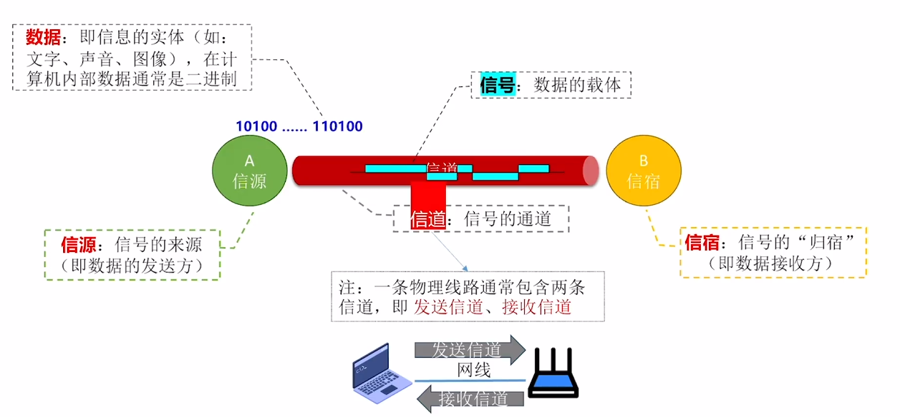
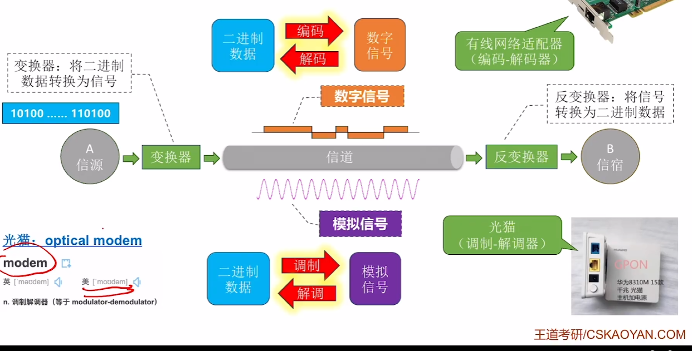
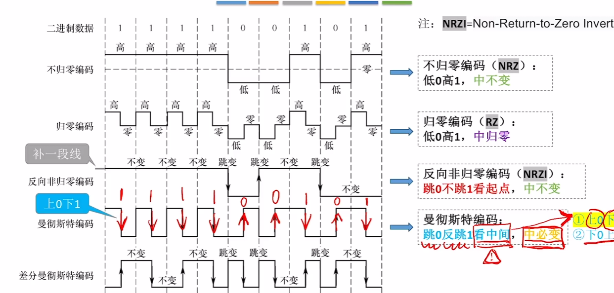
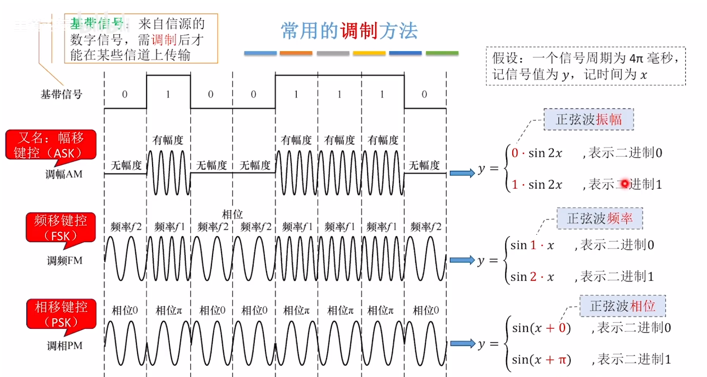
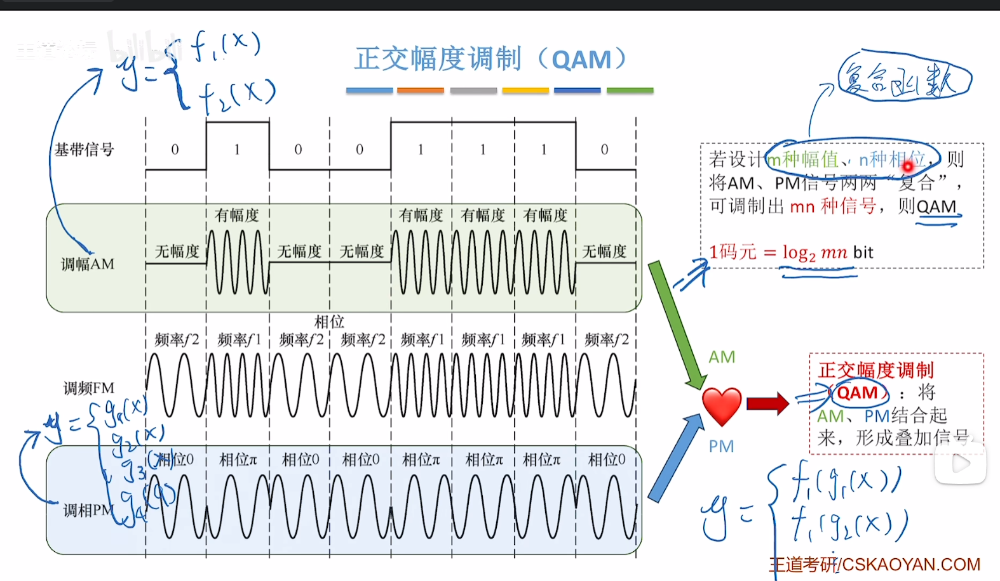

# 物理层

物理层任务：实现相邻节点之间比特(0或1)的传输

## 通信基础的基本概念

#### 信源、信宿、信号、信道

信源:信号的来源(即数据的发送方)

信宿：信号的“归宿”(即数据接收方)

信号：可以分为数字信号和模拟信号

数字信号：信号值是离散的	模拟信号：信号值是连续的

在一个“信号周期”内，有可能出现两种信号每种信号对应一个2进制数

信号可能分为4中：00、01、10、11

每一个信号就是一个‘码元’，可以把“信号周期”称为“码元宽度”

##### 码元的概念：

如果一个码元(即一个信号)可能有四种状态，那么可以称其为4进制码元(一个码元携带2bit数据)

类似地，如果一个码元，(即一个信号)可能有8种状态，那么可以称其为8进制码元(一个码元携带3bit数据)

##### 码元和比特的关系：

如果一个“周期”内可能出现**K种信号**，则：1码元=$log_2 K bit$
$$
速率
	\begin{cases}
	波特率
	\begin{cases}
	每秒传输几个码元  \\
	单位：码元/秒，或波特 \\
	\end{cases}
\\
	比特率
	\begin{cases}
	每秒传输几个比特 \\
	单位：bit/s,或b/s,bps \\
	\end{cases}
	\end{cases}
$$
注：若一个码元携带n比特的信息量，则波特率M Baud对应的比特率为Mn b/s。

### 信道的极限容量

#### 奈奎斯特定理(奈氏准则)

对于一个<u>理想低通信道</u>(**没有噪声**、带宽有限的信道)

极限波特率=2W(单位：波特，即码元/秒)  W：是信道的频率带宽(单位：Hz)

极限比特率=2W$log_2K b/s$​

奈奎斯特定理说明：

* 如果波特率太高，会导致“码间串扰”，即接收方无法识别码元
* 带宽越大，信道传输码元的能力越强
* 奈奎斯特定理并未对一个码元最多可以携带多少比特做出解释

#### 香农定理

对于一个**有噪声**、宽带有限的信道

极限比特率=W$log_2(1+S/N)$(单位：b/s)	W:是信道的频率带宽(单位:Hz)   S/N：信噪比(单位：db )

信噪比=S/N=信号的功率/噪声的功率

信噪比越高，噪声对数据传输的影响越小。

注意：使用香农定理计算信道的极限比特率时，“信噪比”应采用“无单位记法”

 香农定理说明：

* 提升信道带宽、加强信号功率、降低噪声功率、都可以提高信道的极限比特率
* 结合奈奎斯特定理，可知，再带宽、信噪比确定的信道上，一个码元可以携带的比特数是有上限的。

### 信道复用技术的基本原理

* 复用就是在一条传输媒体上同时传输多路用户的信号。
* 当一条传输媒体的传输容量大于多条信道传输的总容量时，就可以通过复用技术，在这条传输媒体上建立多条通信信道，以便充分利用传输媒体的带宽。
* 尽管实现信道复用会增加通信成本（需要复用器、分用器以及费用较高的大容量共享信道），但如果复用的信道数量较大，还是比较划算的。

#### 常见的信道复用技术

$$
\begin{cases}
频分复用FDM:频分复用的所有用户同时占用不同频带资源发送数据\\
时分复用TDM：时分复用的所有用户在不同的时间占用同样的频带\\
波分复用WDM:
\begin{cases}
* 根据频分复用的设计思想,可在一根光纤上，同时传输多个频率（波长）相近的光载波信号，实现基于光纤的频分复用技术\\
*目前可以在一根光纤上复用80路或者更多路的光载波信号。因此，这种复用技术也被称为密集波分复用DWDM。
\end{cases}
\\
码分复用CDM
\begin{cases}
* 码分复用常称为码分多址（CDMA），它是在扩频通信技术的基础上发展起来的一种无线通信技术。\\
* 与FDM和TDM不同，CDMA的每个用户可以在相同的时间使用相同的频带进行通信。\\
* CDMA最初用于军事通信，这种系统发送的信号有很强的抗干扰能力，其频谱类似于白噪声，不易被敌人现。\\
* 随着技术进步，CDMA设备的价格和体积都大幅度下降，因而现在已广泛用于民用的移动通信中。\\
* CDMA将每个比特时间划分为m个更短的时间片，称为码片(chip)。m的取值通常为64或者128\\
* CDMA中的每个站点都被指派一个唯一的m比特码片序列。\\
	(* 某个站要发送比特1，则发送它自己的m比特码片序列)\\
	(* 某个站要发送比特0，则发送它自己的m比特码片序列的反码)\\
\end{cases}
\end{cases}
$$

如果有两个或多i个站同时发送数据，则信道中的信号就是这些站各自所发送一些列码片序列或码片序列反码的叠加，为了从信道中分离出每个站的信号。必须遵循以下规则：

​	分配每个站的码片序列必须各不相同，实际常采用伪随机码序列。

​	分配个每个站的码片序列必须相互正交，即各码片序列相应的码片向量之间的规格化内积为0

## 编码与调制技术

### 编码&解码、调制&解调

[2.1.3_1 编码和调制（上）（25考研咸鱼版）_哔哩哔哩_bilibili](https://www.bilibili.com/video/BV19E411D78Q/?p=15&spm_id_from=pageDriver&vd_source=64709a8217a1bbd540960dd246f1356a)

### 常用的编码方法

补充：

 思考：给二进制串和信号波形，如何判断是曼彻斯特or差分曼彻斯特？

技巧：两种编码都是“中必变,如果中间跳变方向和二进制能够一一对应，就是曼彻斯特”

### 各种编码的特点

$$
\begin{cases}
不归零编码(NRZ)
\begin{cases}
自同步能力--无\\
浪费带宽--不浪费\\
抗干扰能力--弱\\
\end{cases}
\\
归零编码
\begin{cases}
自同步能力--有\\
浪费带宽--浪费\\
抗干扰能力--弱\\
\end{cases}
\\
反向非归零编码(NRZI)
\begin{cases}
自同步能力--若增加冗余位(eg:8-1bit)可支持自同步\\
浪费带宽--浪一点，但不多\\
抗干扰能力--弱\\
\end{cases}
\\
曼彻斯特便编码
\begin{cases}
自同步能力--有\\
浪费带宽--浪费\\
抗干扰能力--强\\
\end{cases}
\\
差分曼彻斯特便编码
\begin{cases}
自同步能力--有\\
浪费带宽--浪费\\
抗干扰能力--强\\
\end{cases}
\end{cases}
$$
自同步能力：信源和信宿可以根据信号完成“节奏同步”，无需时钟信号

### 常用的调制方法

#### 让一个码元携带更多比特

假设：一个信号周期为4$\pi$毫秒，记信号值为y，记时间为x

若设计K个幅值，则1码元=$log_2Kbit$

若设计K个频率，则1码元=$log_2Kbit$

若设计K个相位，则1码元=$log_2Kbit$

正交幅度调制(QAM)

常用的QAM调制方案：
QAM-16	即调制16种信号，1码元携带$log_216=4$bit数据

QAM-32	即调制32种信号，1码元携带$log_232=5$​bit数据

QAM-64	即调制64种信号，1码元携带$log_264=6$bit数据

QAM-128	即调制128种信号，1码元携带$log_2128=7$bit数据

总结：各种编码的特点

|            | 不归零(NRZ) | 归零(NR) |     方向非归零(NRZI)     | 曼彻斯特(以太网默认使用曼彻斯特编码) | 差分曼彻斯特 |
| :--------: | ----------- | -------- | :----------------------: | :----------------------------------: | ------------ |
| 自同步能力 | 无          | 有       | 若增加冗余位可实现自同步 |                  有                  | 有           |
| 浪费带宽？ | 无          | 浪费     |         不太浪费         |                 浪费                 | 浪费         |
| 抗干扰能力 | 弱          | 弱       |            弱            |                  强                  | 强           |

## 传输介质

$$
双绞线
\begin{cases}
主要工程：两根导线相互绞合而成
\begin{cases}
有屏蔽层=屏蔽双绞线(STP)\\
没有屏蔽层=非屏蔽双绞线(UTP)\\
\end{cases}
\\
抗干扰能力---较好，绞合，屏蔽层可以提升抗电磁干扰能力\\
代表应用---近些年的局域网、早期电话线\\
\end{cases}
$$

$$
同轴电缆
\begin{cases}
主要构成----内导体(用于传输信号)+外导体屏蔽层(用于抗电磁干扰)\\
抗干扰能力---好。屏蔽层带来良好的抗干扰性\\
代表应用----早期局域网、早期有线电视
\end{cases}
$$

​		内导体越粗，电阻最低，传输过程中信号衰减越少，传输距离越长
$$
光纤
\begin{cases}
主要构成
\begin{cases}
纤芯(高折射率)+包层(低折射率)\\
利用光的全反射特定，在纤芯内传输光脉冲信号
\end{cases}\\
分类
\begin{cases}
单模光纤---只有一条光现在一根光纤中传输，适合长距离传输、信号传输损耗小。\\
多模光纤---多条光线在一根光纤中传输，适合近距离传输，远距离传输光信号容易失真
\end{cases}\\
抗干扰能力---非常好。光信号对电磁干扰不敏感。\\
其他优点---信号传输损耗小，长距离传输时中继器少；很细很省布线空间
\end{cases}
$$
 多模光纤特点：纤芯更粗，可同时传输多条光线，信号传输损耗更高，适合较近距离传输

单模光纤特点：纤芯更细，直径小于一个波长，只能传输一条光线，信号传输损耗低，适合远距离传输

### 以太网对有线传输介质的命名规则

速度+Base+介质信息		Base：基带传输，即传输数字信号采用曼彻斯特编码)

* 10Base5———10Mbps，同轴电缆，最远传输距离500m

* 10Base2———10Mbps，同轴电缆，最远传输距离200m(实际是185)

* 10BaseF**——–10Mbps，光线。*\*可以是其他信息，如10BaseFL、10BaseFB、10BaseFP

* 10BaseT**——-10Mbps，双绞线。*可以是其他信息，如10BaseT1S、10BaseT1L

    其他示例：

    * 1000BaseT1——1000Mbps，双绞线
    * 2.5GBaseT—–2.5Gbps，双绞线

### 无线传输介质

$$
非导向型传输介质
(无线传输介质)
\begin{cases}
无线电波
\begin{cases}
特点：穿透能力强、传输距离长、信号指向性弱\\
如：手机信号、WiFi
\end{cases}\\
微波通信
\begin{cases}
特点：频率带宽高、信号指向性强、保密性差(容易被窃听)\\
如：卫星通信(卫星作为信号中继器，传播时延较大)\\
\end{cases}\\
其他：红外线通信、激光通信等----信号指向性强
\end{cases}
$$

本质上都是用电磁波。电磁波的公式：C=λF，C为光速，λ为波长，F为频率

* 电磁波频率、波长呈反比关系
* 频率越高，数据传输能力越强
* 波长越短，“信号指向性”越强，信号越趋于直线传播  

结论：长波更适合长距离，非直线通信，短波更适合短距离、高速通信，若用于长距离通信需建立中继站；短波信号指向性强，要求信号接收器”对准”信号源

#### 卫星通信(微波通信)

特点：传播时延较大，可用近地卫星解决

### 物理层接口特性

$$
物理层接口的特性
\begin{cases}
机械特性---知名接口所用接线器的形状和尺寸、引脚数目和排列、固定和锁定装置等\\
电气特性---知名在接口电缆的各条线上出现的电压的范围、传输速率、距离限制等\\
功能特性---知名某条线上出现的某一电平的电压的意义\\
过程特性(规程特性)---知名对于不同功能的各种可能时间的出现顺序
\end{cases}
$$

 ### 物理层设备

#### 中继器

$$
中继器
\begin{cases}
中继器只有两个端口，通过一个端口接收信号，将失真信号整形再生，并转发至另一端口(信号在会产生一些时延)\\
仅支持半双工通信(两端连接的节点不可同时发送数据，会导致"冲突")\\
中继器两个端口对应两个"网段"
\end{cases}
$$

Eg:物理层“电气特性”规定–0.5到1.5V是低电平，4.5到5.5是高电平，不符合此标准的信号视为无效，中继器收到信号后，会将低电平整形为1V，将高电平整形为5V，然后再输出

#### 集线器

$$
集线器(Hub)
\begin{cases}
本质上是多端口中继器，集线器将其中一个端口接收到的信号整形再生后，转发到所有其他端口\\
各端口连接的结点不可同时发送数据，会导致“冲突”\\
集线器的N个端口对应N个"网段“，各网段属于同一个"冲突域"
\end{cases}
$$

##### 冲突域

如果两台主机同时发送数据会导致“冲突”，则这两台主机处于同一个“冲突域”，处于同一冲突域的主机在发送数据前需要进行“信道争用”

##### 集线器、中继器的一些特性

集线器连接的网络，物理上是星型拓扑，逻辑上是总线型拓扑

集线器连接的个网段“共享带宽”
$$
与教材不同
\begin{cases}
集线器可以连接不同的传输介质，因此两个网段的物理层接口特性可以不同(这就意味着集线器连接的网段“物理层协议”可以不同)\\

集线器如果连接了速率不同的网段、会导致所有网段“速率向下兼容”
\end{cases}
$$
教材上的：中继器、集线器不能连接物理协议不同的网段，也不能连接速率不同的网段

