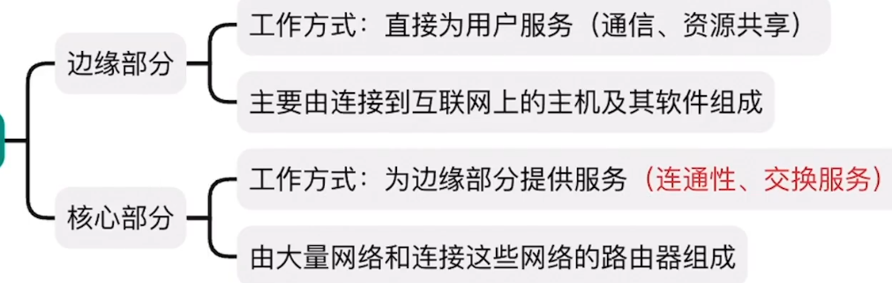
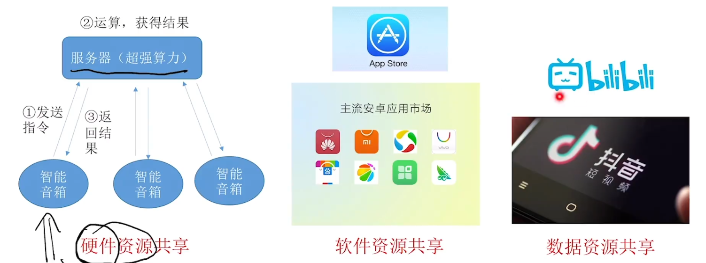
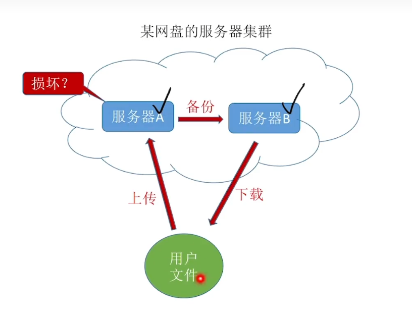
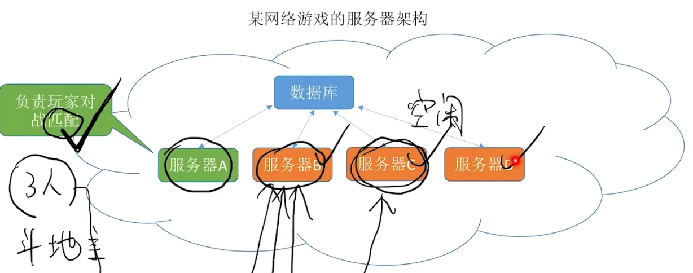
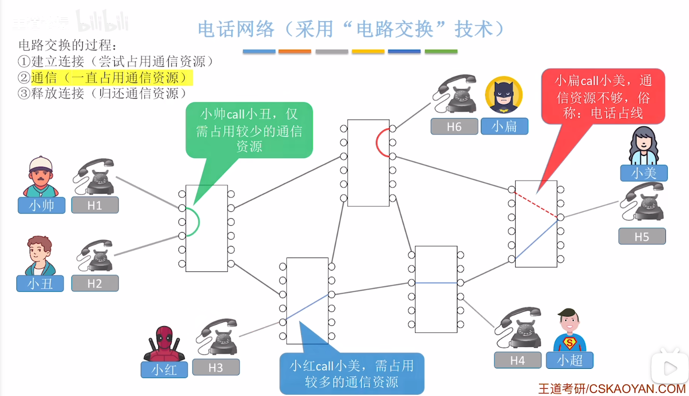
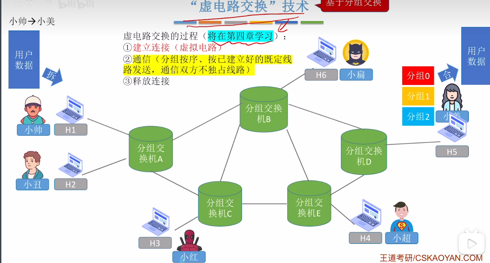
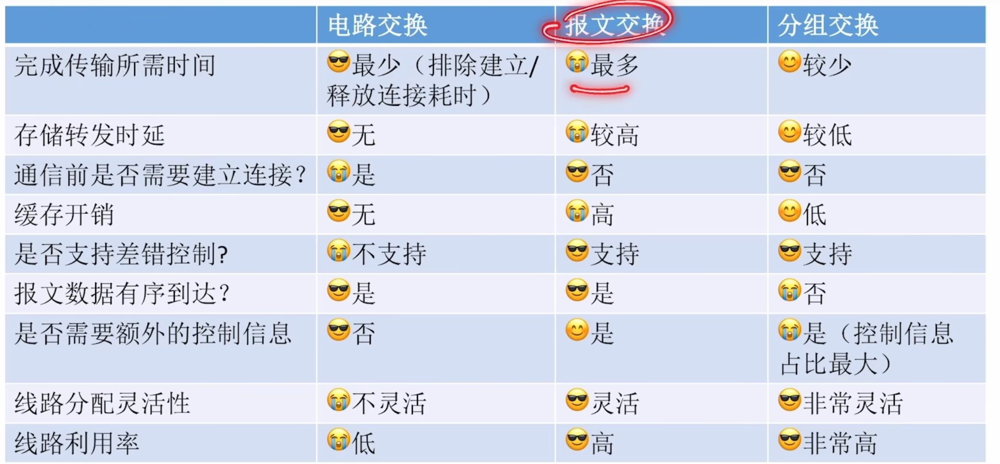
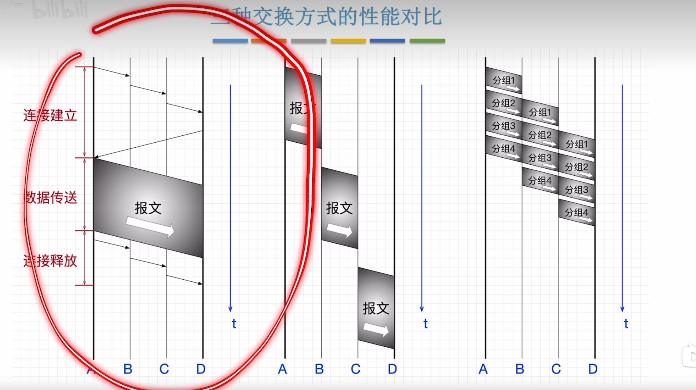
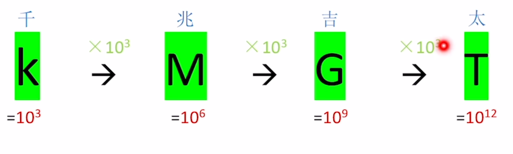
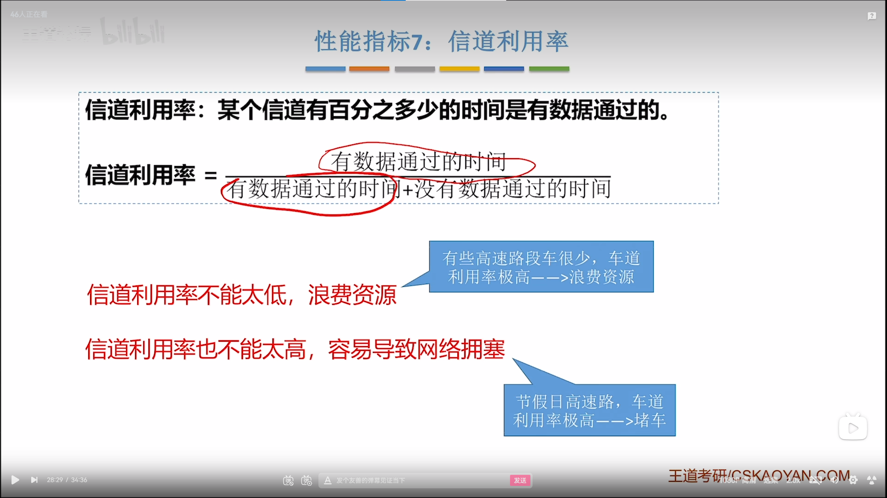

# 一、计算机网络体系结构

[传送门](https://www.bilibili.com/video/BV19E411D78Q/?p=2&spm_id_from=pageDriver&vd_source=64709a8217a1bbd540960dd246f1356a)

## 计算机网络的概念

什么是计算机网络

是一个将众多分散的、自治的计算机系统，通过通信设备与线路连接起来，由功能完善的软件实现资源共享和信息传递的系统。

计算机网络、互联网、互连网的区别

计算机网络：由若干节点和连接这些结点的链路组成

互联网：译为因特网，特指全世界最大的计算机网络，由各大ISP和国际机构组件，使用TCP/IP协议族作为通信规则

互连网：多个计算机网络通过路由器相互连接而成，可使用任意通信协议

## 计算机网络的组成、功能

### 组成

#### 从组成部分看：硬件、软件、协议

从工作方式看：边缘部分、核心部分

从逻辑功能看：资源子网、通信子网

### 计算机网络的功能

#### 资源共享

#### 分布式管理

如同矩阵乘法可以拆分成多个子任务：两个n行n列矩阵相乘，第i行与第j列相乘相加，得到<i,j>

#### 提高可靠性

如果服务A崩了，你还可以通过服务器B重新下载下来，远比自己电脑上保存着的可靠性高更高。

#### 负载均衡

比如说斗地主三个人已经完成了匹配，此时服务器C比较空闲，就可以让服务器C作为这三个斗地主的人的房间。

# 电路交换、报文交换、分组交换

[传送门](https://www.bilibili.com/video/BV19E411D78Q/?p=5&spm_id_from=pageDriver&vd_source=64709a8217a1bbd540960dd246f1356a)

## 电路交换

用于电话网络

电路交换：通过物理线路的连接，动态地分配传输线路资源

### “电路交换”的优缺点

优点:通信前从主叫端到被叫端建立一条专用的物理通路，在通信的全部时间内，两个用户始终扎用端到端的线路资源。数据直送，传输速率高。（更适用于低频次、大量地传输数据）

缺点：建立/释放连接，需要额外的时间开销

​	   线路被通信双方独占，利用率低

​	   线路分配的灵活性差 

​	   交换节点不支持”差错控制“（无法发现传输过程中的发生的数据错误）

## 报文交换

用于电报网络

### 报文交换的优缺点：

优点：

通信前无需建立连接

数据以”报文“为单位被交换节点间”存储转发“，通信线路可以灵活分配

在通信时间内，两个用户无需独占一整条物理线路。相比于电路交换，线路利用率高

 交换节点支持”差错控制“（通过校验技术）

缺点：

报文不定长，不方便存储转发管理

长报文的存储转发时间开销大、缓存开销大

长报文容易出错，重传代价高

## 分组交换

用于现代计算机网络

网络数据以固定长度的分组，在各个路由器中交换，而路由器判断一个分组，它是从什么地方发出又应该发到什么位置是通过IP地址来判断的，发送方由IP地址同时接收方也有IP地址

### 分组交换的优缺点

优点：

通信前无需建立连接

数据以“分组”为单位被交换节点间“存储转发”，通信线路可以灵活分配

在通信时间内，两个用户无需独占一整条物理线路。相比于电路交换，线路利用率高。

交换节点支持“差错控制”（通过校验技术）

#### 相比于报文交换，分组交换改进了如下问题：

分组定长，方便存储转发管理

分组的存储转发时间开销小、缓存开销小

分组不易出错，重传代价低

缺点：

相比于报文交换，分组交换占比增加

相比于电路交换，依然存在存储转发时延

报文被拆分为多个分组，传输过程中可能出现失序、丢失等问题，增加处理的复杂度

### 基于分组交换的基础上的“虚电路交换”

#### 分组交换与虚电路交换的区别：

由于计算机本身的算力强大，分组交换把保证分组不乱序、不丢失这些乱七八糟的问题交给了计算机终端自己解决，而虚电路交换是把这些问题交给了网络的核心部分去处理，这样的话反而会影响网络核心部分的数据传输能力

### 三种交换方式的性能对比

## 计算机网络的分类

### 按传输技术分类

广播式网络：当一台计算机发送数据分组时，广播范围内所有计算机都会受到该分组，并通过检查分组的目的地址决定是否接受该分组。

点对点网络:数据只会从发送方“点对点”发到接收方，精准送达。

### 按拓扑结构分类

总线性结构：数据“广播式“传输：存在”总线争用“问题

环形结构：数据”广播式“传输；通过“令牌”解决总线争用问题令牌顺环形依次传递，拿到令牌者可使用总线

典型代表:令牌环网(流行于2000年以前的局域网技术)

星形结构:由中央设备实现数据的“点对点”传输;不存在“总线争用”问题

典型代表: 以太网交换和连接的设备

网状结构:数据通过各中间节点逐一存储转发;属于“点到点”传输
典型代表:由众多路由器构建的广域网 

### 按使用者分类

公用网--向公众开放的网络。如:办宽带、交手机话费即可使用的互联网
专用网·--仅供某个组织内部使用的网络。如:政府、军队、电力、银行的内部网络

### 按传输介质

有线网络一如:网线、光纤
无线网络--如:5G、WiFi、卫星

## 性能指标1:速率

速率(Speed):指连接到网络上的节点在信道上传输数据的速率。也称数据率或比特率、数据传输速率速率单位:bit/s，或b/s，或bps
注意:有时也会用B/s,注意：有时也会用B/s(1B=8b，B=Byte字节，b=bit 比特)
#### 计算机网络中常用的数量前缀:

## 性能2:带宽

在《计算机网络》中:带宽(bandwidth)表示某信道所能通过的“最高数据率。单位:bps(或记为 b/s、bit/s;可加上数量前缀k、M、G、T)
在《通信原理》(通信领域的一门基础学科)中:带宽(bandwidth):表示某信道允许通过的信号频带范围单位:Hz(读作“赫/赫兹”;可加上数量前缀k、M、G、T)

### 性能指标3:吞吐量

重过某个网络(或信道、接口)的实际数据量吞吐量(Throughput):指单 位时间内吞吐量受带宽限制、受复杂的网络负载青况影响

### 性能指标4:时延

时延(Delay):指数据(一个报文或分组，甚至比特)从网络(或链路)的一端传送到另一端所需的时间。有时也称为延迟或迟延。

总时延=发送时延+传播时延+处理时延+排队时延

 

### 性能指标5:时延带宽积

### 性能指标6：往返时延

### 性能指标7：信道利用率

