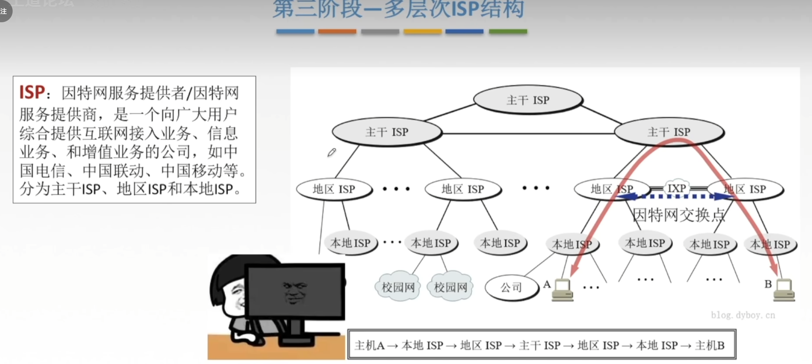

# 

计网体系结构
$$
\begin{cases}
计算机网络概述
\begin{cases}
概念、组成、功能、分类\\
标准化工作及相关知识\\
性能指标
\end{cases}
\\
体系结构和参考模型
\begin{cases}
分层结构\\
协议、接口、服务\\
ISO/OSI模型\\
TCP/IP模型
\end{cases}
\end{cases}
$$

## 计算机网络的概念

 计算机网络：是一个将分散的、具有独立功能的计算机系统，通过通信设备与线路连接起来，由功能完善的软件实现资源共享和信息传递的系统。简单来说计算机网路是互连的、自治的计算机集合。(互连–通过通信链路互联互通	自治—无主从关系)

* 数据通信：发送文件，又或者护发消息等
* 资源共享：同一个计算机网络上的其他计算机可以使用某台计算机的计算机资源的行为，可共享硬件、软件、数据。
* 分布式处理：多台计算机各自承担同一工作任务的不同部分
* 提高可靠性：当当前主机失效后，代替机能随时顶替他的工作
* 负载均衡：各计算机之间更亲密

### 计算机网络的发展—第一阶段

美国国防部高级研究计划局(ARPA)设计一个分散的指挥系统

网络把许多计算机连接在一起，而互联网则把许多网络连接在一起。因特网是世界上最大的互联网 

### 第二阶段—-三级结构

  1985年起，美国国家科学基金会NSF围绕6个大型计算机中心建设计算机网络，即国家科学基金网NSFNET

### 第三阶段—多层次IS

