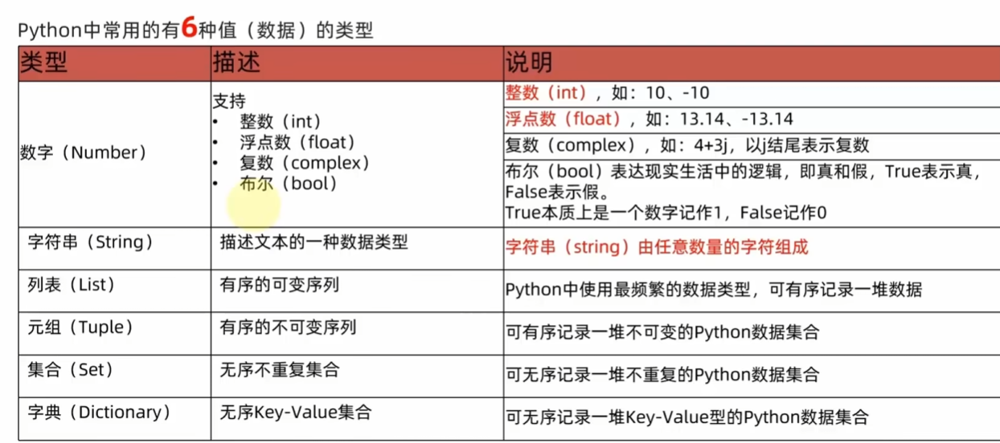
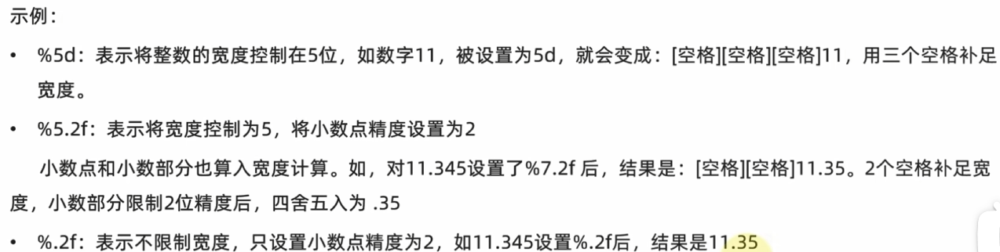

# 第一章

[传送门](https://www.bilibili.com/video/BV1qW4y1a7fU/?spm_id_from=333.788.top_right_bar_window_history.content.click&vd_source=64709a8217a1bbd540960dd246f1356a)

## 字面量

### 1. 字面量的含义

在代码中，被写下来的固定的值，称之为字面量

### 2.字面量的类型



字符串(string)，又称文本，是由任意数量的字符如中文、英文、各类符号、数字等组成。所以叫做字符的串

## 注释

[传送门](https://www.bilibili.com/video/BV1qW4y1a7fU?p=15)

单行注释：以#开头，#右边的所有文字当作说明，而不是真正要执行的程序，起辅助说明作用，（注意，#号和注释内容一般建议以一个空格隔开）

多行注释：一一对三个双引号引起来（“”“注释内容”“”）来解释说明一段代码的作用使用方法


## 变量

[传送门](https://www.bilibili.com/video/BV1qW4y1a7fU?p=16&vd_source=64709a8217a1bbd540960dd246f1356a)

在程序运行时，能储存计算结果或能表示值的抽象概念。简单地说，变量就是在程序运行时，记录数据用的

### 再用Print时，想输出多个变量的话用逗号隔开

## 数据类型

[传送门](https://www.bilibili.com/video/BV1qW4y1a7fU?p=17&vd_source=64709a8217a1bbd540960dd246f1356a)

|  类型  |       描述       |               说明                |
| :----: | :--------------: | :-------------------------------: |
| string |    字符串类型    |   用引号引起来的数据都是字符串    |
|  int   |  整型（有符号）  | 数字类型，存放正数 如 -1，10，0等 |
| float  | 浮点型（有符号） | 数字类型，存放小数 如 -3.14，6.66 |

 string、int、float这三个英文单词，就是类型的标准名称。

### type语句的使用方式

1. 在print语句中，直接输出类型信息

    ```python
    print(type("类型信息"))
    Print(type(666))
    print(type(11.345))
    输出结果
    <class 'str')
    <class 'int')
    <class 'float')
    ```

    

2. 用变量存储type()的结果（返回值）：

    ```python
    string_type =type('类型信息')
    int_type = type(666)
    float_type =type(11.345)
    print(string_type)
    print(int_type)
    print(float_type)
    输出结果
    <class 'str'>
    <class 'int'>
    <class 'float'>
    ```

    以上都查看的是<字面量>的类型，同时也能看到变量中存储的数据类型

    ```python
    name="数据类型"
    name_type= type(name)
    print(name_type)
    输出结果
    <class 'str'> 
    ```

    变量有类型么？

    通过type(变量)可以输出类型，这是查看变量的类型还是数据的类型？

    查看的是：变量存储的数据的类型。因为，变量无类型，但是它存储的数据有

### 数据类型的转换

[传送门](https://www.bilibili.com/video/BV1qW4y1a7fU?p=18)

为什么要进行转换类型

数据类型之间，在特定的场景下，是可以相互转换的，如字符串数字、数字转字符串等，那么，为什么要转换呢？

* 从文件中读取的数字，默认是字符串，我们需要转换成数字类型

* 后续学习input()语句，默认结果是字符串，若需要数字也需要转换

* 将数字转换成字符串用以写出外部系统

* 等等

    ### 常见的转换语句

    | 语句（函数） |        说明         |
    | :----------: | :-----------------: |
    |   int（x)    |  将x转换为一个整数  |
    |   float(x)   | 将x转换为一个浮点数 |
    |    str(x)    | 将对象x转换为字符串 |

## 标识符

[传送门](https://www.bilibili.com/video/BV1qW4y1a7fU?p=19&vd_source=64709a8217a1bbd540960dd246f1356a)

在Python中，可以给很多东西起名字，如：

* 变量的名字
* 方法的名字
* 类的名字，等等

这些名字，把它统一称之为标识符，用来做内容的标识。

  所以，标识符是用户在编程的时候所使用的一些列名字，用于给变量、类、方法等命名

### python中，标识符命名的规则主要有3类：

内容限定

大小写敏感

不可使用关键字

### 标识符命名中，只允许出现：英文、中文、数字、下划线且不可以是数字开头

变量名命名规范

变量名

类名

方法名

不同的标识符，有不同的规范

## 运算符

[传送门](https://www.bilibili.com/video/BV1qW4y1a7fU?p=20&vd_source=64709a8217a1bbd540960dd246f1356a)

### 算数运算符

| 运算符 |  描述  |                           实例                           |
| :----: | :----: | :------------------------------------------------------: |
|   +    |   加   |                 两个对象相加a+b输出结果                  |
|   -    |   减   |       得到负数或是一个数减去另一个数a-b输出结果-10       |
|   *    |   乘   | 两个数相乘或是返回一个被重复若干次的字符串a*b输出结果200 |
|   /    |   除   |                       b/a输出结果2                       |
|   //   | 取整除 |    返回商的整数部分9//2输出结果4，9.0//2.0输出结果4.0    |
|   %    |  取余  |                返回除法的余数b%a输出结果0                |
|   **   |  指数  |     a**b为10的20次方，输出结果1000000000000000000000     |

### 赋值运算符

| 运算符 | 描述       |                             实例                             |
| :----- | ---------- | :----------------------------------------------------------: |
| =      | 赋值运算符 | 把=号右边的结果 赋给 左边的变量，如num=1+2*3，结果num的值为7 |

### 复合赋值运算符

| 运算符 | 描述             | 实例                  |
| ------ | ---------------- | --------------------- |
| +=     | 加法赋值运算符   | +-a等效于c=c+a        |
| -=     | 减法赋值运算符   | c-=a等效于c=c-a       |
| *=     | 乘法赋值运算符   | c*=a等效于c=c * a     |
| /=     | 除法赋值运算符   | c/=a等效于c=c/a       |
| %=     | 取模赋值运算符   | c%=a等效于c=c%a       |
| **=    | 幂赋值运算符     | c ** =a等效于c=c ** a |
| //=    | 取整除赋值运算符 | c//=a等效于c=c//a     |


## 数据输入

### 掌握input语句（函数）的使用

用来获取键盘输入。

* 数据输出：print
* 数据输入：input

使用上也非常简单：

* 使用input()语句可以从键盘获取输入
* 使用一个变量接收(存储)input语句获取的键盘输入数据即可

# 字符串扩展

[传送门](https://www.bilibili.com/video/BV1qW4y1a7fU?p=21&vd_source=64709a8217a1bbd540960dd246f1356a)

## 字符串的三种定义方式

字符串在python中有多种定义形式：

1. 单引号定义法：name=‘名’
2. 双引号定义法：name=“名”
3. 三引号定义法：name=“”“名”“”

三引号定义法，和多行注释的写法一样，通过支持换行操作。

使用变量接收它，它就是字符串

不使用变量接受它，就可以作为多行注释使用

字符串的引号嵌套

* 单引号定义法，可以内含双引号

* 双引号定义法，可以内含单引号

* 可以使用转义字符( \ )来将引号解除效用，变成普通字符串

  ​    

## 字符串的拼接

如果有两个字符串（文本）字面量，可以将其拼接成一个字符串，通过+号即可完成，如：

```python
print("我孙博宇是***人的大爹"+"月薪百万")
输出结果：我孙博于是***人的大爹月薪百万
```

注意事项：拼接操作只能适用于字符串本身，不能够让字符串和其它的类型进行拼接  


## 格式化的精度控制

### 字符串格式化—数字精度控制

可以使用辅助符号“m.n”来控制数据的宽度和精度

* m，控制宽度，要求是数字（很少使用），设置的宽度小于数字本身，不生效
* .n，控制小数点精度，要求是数字，会进行小数的四舍五入

 

### 字符串格式化方式2

  通过语法：在字符串的前面添加一个f作为标记在字符串内容中通过大括号{} 进行占位，然后在大括号的内步填入变量就可以完成快速格式化

这种方式：

* 不理会类型
* 不做精度控制
* 适合对精度没有要求的时候快速使用

## 对表达式进行格式化

1. 什么是表达式

    一条具有明确执行结果的代码语句，例如：1+1、5*2，就是表达式，因为有具体的结果，结果是一个数字。

    2. 如何格式化表达式

     在无需使用变量进行数据存储的时候，可以直接格式化表达式，简化代码

    ```python
    f"(表达式)"
    "%s\%d\%f"%(表达式、表达式、表达式)
    
    ```


一个小例子：

```python
name ="SB新龙集团"
stock_price=19.9
stock_code="003032"
# print(stock_price,stock_code)
growth_days=7
stock_price_daily_growth_factor=float(stock_price)*1.2 ** growth_days
print(f"公司：{name},股票代码:{stock_code},当前股价：{stock_price}" )
print(f"每日增长系数是%.1f，经过%d天，股价达到了：%.2f" % (growth_days,growth_days,stock_price_daily_growth_factor))

```


* 
