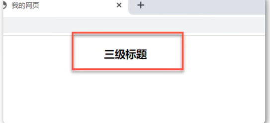

# html

## 标签

### html标签

定义HTML文档，这个元素在浏览器看到后就知道这是个HTML文档了，所以其他元素要包括在里面，标签限定了文档的开始点结束点。

```html
<!DOCTYPE html>
<html>
</html> 
```

### head标签

head标签用于定义文档的头部。文档的头部描述了文档的各种属性和..]信息，包括文档的标题、在web中的位置以及和其他文档的关系等。绝大多数文档头部包含的数据都不会真正作为内容显示给读者。

```html
<!DOCTYPE html>
<html>
	<head>
	</head>
</html>
```

### body标签

body 元素定义文档的主体。
body 元素包含文档的所有内容(比如文本、超链接、图像、表格和列表等等。)它会直接在页面中显示出来，也就是用户可以直观看到的内容 

```html
<!DOCTYPE html>
<html>
<head>
</head>
<body>
我会显示在浏览器中
</body>
</html>
```

### title标签

可定义文档的标题。
 它显示在浏览器窗口的标题栏或状态栏上。
`<tile>`标签是 `<head>`标签中唯一必须要求包含的东西，就是说写head一定要写title
`<title>`的增加有利于SEO优化
SEO是搜索引擎优化的英文缩写。通过对网站内容调整，满足搜索引擎的排名需求

```html
<!DOCTYPE html>
<html>
    <head>
   	 	<title>第一个页面</title>
    </head>
    <body>
    	我会显示在浏览器中
    </body>
</html>
```

### meta标签

meta标签(且是一个但标签，不用写`</meta>`用来描述一个HTML网页文档的属性，关键词等，例如:`charset="utf-8"`是说当前使用的是 `uf-8` 编码格式，在开发中我们经常会看到 `ut-8`，或是`gbk` ，这些都是编码格式，:通常使用 `utf-8` 。

```html
<!DOCTYPE html>
<html lang="en">
	<head>
        <meta charset="UTF-8">
        <title>itbaizhan</title>
	</head>
	<body>
	</body>
</html>
```

### div标签和span标签

```html
<div>(且它独占一行,相当于一个大盒子)和<span>(一行可以放多个，相当于一个小盒子) 是没有语义的，就是一个盒子，用来装饰内容的
```

### 文本格式化标签

在网页中，有时需要为文字设置**粗体**、_斜体_或<u>下划线</u>等效果，这时就需要用到HTML 中的文本格式化标签，使文字以特殊的方式显示。
标签语义: 突出重要性, 比普通文字更重要

| 语义   | 标签                         | 说明                                 |
| ------ | ---------------------------- | ------------------------------------ |
| 加粗   | <strong></strong>或者<b></b> | 更推荐使用<strong>标签加粗语义更强烈 |
| 倾斜   | <em></em>或者<i></i>         | 更推荐使用<em>标签加粗语义更强烈     |
| 删除线 | <del></del>或者<s></s>       | 更推荐使用<delg>标签加粗语义更强烈   |
| 下划线 | <ins></ins>或者<u></u>       | 更推荐使用<ins>标签加粗语义更强烈    |


## 快捷键

### 添加多个光标

<kbd>ctrl+alt+下箭头(上箭头）</kbd>

### 全局替换某些单词

<kbd>ctrl+h</kbd>

### 快速定位到某一行

<kbd>ctrl+g</kbd>

### 选择某个区块

<kbd>按住shift+alt然后拖动鼠标</kbd>

### 放大缩小整个编辑器界面

<kbd>ctrl+加号或者ctrl+减号</kbd>

### 自定义快捷键

有些快捷键可能使用不习惯，也可以自己定义

键盘快捷方式：<kbd>ctrl+K ctrl+s</kbd>

## 标题

### 标题介绍与应用

```html
标题(Heading)是通过<h1>-<h6>标签进行定义的。<h1>定义最大的标题<h6>定义最小的标题
```

```html
<h1>定义最大的标题,<h6>定义最小的标题
```

```html
<h1>一级标题</h1>
<h2>二级标题</h2>
<h3>三级标题</h3>
<h4>四级标题</h4>
<h5>五级标题</h5>
<h6>六级标题</h6>
```

```html
生成h1~h6快捷键:h$*6
```

### 正确使用标题

请确保将 HTML 标题标签只用于标题。
不要仅仅是为了生成粗体或大号的文本而使用标题。正确使用标题有益于SEO
应该将<h1>用作主标题(最重要的)，其后是<h2>(次重要的)，再其次是<h3>，以此类推

### 标题标签位置摆放

在标间中添加属性：`align="left | center | right"`默认居右



## 标签之段落、换行、水平线

### 标签之段落

段落是通过<p> 标签定义的

```html
<p>这是一个段落 </p>
<p>这是另一个段落</p>
```

### 换行

如果希望在不产生一个新段落的情况下进行换行，使用`<br>`

```html
<br>元素是一个空的 HTML 元素。
<p>这个<br>段落<br>演示了分行的效果</p>
显示结果：
这个
段落
演示了分行的效果
```

### 水平线

```html
<hr> 标签在 HTML 页面中创建水平线
```

```html
<hr color="" width=""Size=""align=""/>
```

属性:
 color:设置水平线的颜色
 width:设置水平线的长度
 size:设置水平线的高度
 align:设置水平线的对齐方式(默认居中)，可取值left|right

## 图片

网站中最多的元素：图片

标签定义HTML页面中的图像

```html

```

注意事项：``是单。标签，不需要进行闭合操作

属性:

1. src:路径(图片地址与名字)
2. alt:规定图像的替代文本（属性值为：文本）
3. title:鼠标悬停在图片上给予提示（属性值为：文本）
4. width:规定图像的宽度（属性值为：像素）
5. height:规定图像的高度（属性值为：像素）
6. border：设置图像的边框粗细（属性值为：像素）

### 图片路径

#### 绝对路径

绝对路径是电脑的盘符存储与访问的具体地址

```html
E:\itbaizhancode\1.jpg

```

#### 相对路径

两者相对关系，两者在同一路径下可以直接访问

1. 子级关系：/
2. 父级关系：../
3. 同级关系：./(可以省略)

#### 网络路径

具体的网络地址：链接

```html
来设置超文本链接

超链接可以是一个字，一个词，或者一组词，也可以是一幅图像，您可以点击这些内容来跳转到新的文档或者当前文档中的某个部分。

```html
<a href="url">链接文本</a>
```

#### 属性

在标签 <a> 中使用了 href 属性来描述链接的地址
默认情况下，链接将以，以下形式出现在浏览器中:

1. 一个未 访问过的链接显示为蓝色字体并带有下划线。
2. 访问过的链接显示为紫色并带有下划线。
3. 点击链接时，链接显示为红色并带有下划线。

特别提示：后期会通过CSS样式修改掉这些效果

#### 分辨超链接表现

当把鼠标指针移动到网页中的某个链接上时，箭头会变成一只小手

### 超链接标签（重点）

空链接：如果当时没有确定链接目标时，<a href="#">首页</a>

 下载链接：如果href里面地址是一个文件或者压缩包，会下载这个文件

 网页元素链接：在网页中的各种网页元素，如文本、图像、表格、音频、视频等都可以添加超链接

锚点链接：点击链接后，可以快速定位到页面中的某个位置

* 在链接文本的href属性中，设置属性值为**#名字**的形式，如:

```html
<a href="#two">第2集</a>
```

* 找到目标位置标签，里面添加一个id属性=刚才的名字，如：

    ```html
    <h3 id="two">第2集介绍</h3>
    ```

#### 注释标签

如果需要在HTML文档中添加一些便于阅读和理解又不需要显示在页面上的文字，就需要注释标签。

HTML中的注释一“<!--”开头，以“-->”结束

```html
<!--注释语句-->
```

快捷键：<kbd>ctrl+/</kbd>

一句话：注释标签里面的内容是给程序猿看的,这个代码是不执行不显示到页面中的。

添加注释是为了更好地解释代码的功能，便于相关开发人员理解和阅读代码，程序是不会执行注释内容的。

## 特殊字符

 在 HTML 页面中，一些特殊的符号很难或者不方便直接使用，此时我们就可以使用下面的字符来替代。

| 特殊字符 | 描述           | 字符的代码（不带空格） |
| -------- | -------------- | ---------------------- |
| &nbsp;   | **空格符**     | **&nbsp ;**            |
| **<**    | **小于号**     | **&lt ;**              |
| **>**    | **大于号**     | **&gt ;**              |
| &        | 和号           | &amp ;                 |
| ￥       | 人民币         | &yen ;                 |
| &copy;   | 版权           | &copy ;                |
| &reg;    | 注册商标       | &reg ;                 |
| &deg;    | 摄氏度         | &deg ;                 |
| &plusmn; | 正负号         | &plusmn ;              |
| &times;  | 乘号           | &times ;               |
| &divide; | 除号           | &divide ;              |
| &sup2;   | 平方2（上标2） | &sup2 ;                |
| &sup3;   | 平方3（上标3） | &sup3 ;                |

## 表格标签

### 表格的主要作用

表格主 要<font color="red">用于显示、展示数据</font>，因为它可以让数据显示的非常的规整，可读性非常好。特别是后台展示数据的时候，能够熟练运用表格就心得很重要。一个清爽简约的表格能够把繁杂的数据表现得很有条理。(表格不是用来布局页面的，而是用来<font color="red">展示数据</font>的)

### 表格的基本语法 

```html
<table>
	<tr>
		<td>单元格内的文字</td>
		……
	</tr>
	……
</table>
```

1. &lt;table&gt;&lt;/table&gt;是用于定义表格的标签。
2. &lt;tr&gt;&lt;/tr&gt;标签用于定义表格中的行，必须嵌套在&lt;table&gt;&lt;/table&gt;标签中
3. &lt;td&gt;&lt;/td&gt;用于定义表格中的单元格，必须嵌套在&lt;tr&gt;&lt;/tr&gt;标签中。
4. 字母td指表格个数据（table data），即数据单元格的内容。

## 表头单元格标签

一般表头单元格位于表格的第一行或第一列，表头单元格里面的文本内容加粗居中显示。

&lt;th&gt;标签表示 HTML 表格的表头部分(table head 的缩写)

```html
<table>
	<tr>
		<th>姓名</th>
		……
	</tr>
	……
</table>
```

### 表格属性

表格标签这部分属性实际开发不常用，后面通过CSS设置

目的有2个:

1. 记住这些英语单词,后面 CSS 会使用.
2. 直观感受表格的外观形态

| 属性名      | 属性值              | 描述                                             |
| ----------- | ------------------- | :----------------------------------------------- |
| align       | left、center、right | 规定表格相对周围元素的对齐方式                   |
| border      | 1或“”               | 规定表格单元是否拥有边框，默认为“”，表示没有边框 |
| cellpadding | 像素值              | 规定单元边沿与其内容之间的空白，默认1像素        |
| cellspacing | 像素值              | 规定单元格个之间的空白，默认2像素                |
| width       | 像素值或百分比      | 规定表格的宽度                                   |

### 表格结构标签

使用场景:因为表格可能很长,为了更好的表示表格的语义，可以将表格分割成 表格头部和表格主体两大部分

在表格标签中，分别用:<font color="red">&lt;thead>标签表格的头部区域、&lt;tbody>标签 表格的主体区域</font>,这样可以更好的分清表格结构。

1. &lt;thead&gt;&lt;/thead&gt;:用于定义表格的头部。&lt;thead>内部必须拥有&lt;tr>标签。一般位于第一行
2. &lt;tbody&gt;&lt;/thody>:用于定义表格的主体，主要用于放数据本体。
3. 以上标签都是放在&lt;table></table&gt;标签中

### 合并单元格

特殊情况下，可以把多个单元格合并为一个单元格

1. #### 合并单元格方式

    * 跨行合并：rowspan=“合并单元格个的个数”
    * 跨列合并：colspan=“合并单元格个的个数”

2. #### 目标单元格

    * 跨行：最上侧单元格为目标单元格，写合并代码
    * 跨列：最左侧单元格为目标单元格，写合并代码

3. 合并单元格的步骤 

    #### 三部曲：

    1. 先确定是跨行还是跨列合并

    2. 找到目标单元格，写上合并方式=合并的单元格个数量。比如:

        ```html
        <td colspan="2"></td>
        ```

    3. 删除多余的单元格

## 列表标签

表格是用来显示数据的，那么<font color="orange">列表就是用来布局的</font>,列表最大的特点就是整齐、整洁、有序，它作为布局会更加自由和方便。

根据使用情景不同，列表可以分为三大类:<font color="green">无序列表、有序列表和自定义列表</font>

### 无序列表（重点）

&lt;ul&gt;标签表示 HTML 页面中项目的无序列表，一般会以项目符号呈现列表项，而列表项使用 <li&gt;标签定义。

无序列表的基本语法格式如下：

```HTML
<ul>
<1i>列表项1</1i>
<li>列表项2</1i>
<1i>列表项3</1i>
...
</u1>
```

1. 无序列表的各个列表项之间没有顺序级别之分，是并列的。
2. &lt;ul></ul&gt;中只能嵌套&lt;li></li&gt;,直接在&lt;ul></ul&gt;标签中输入其他标签或者文字的做法是不被允许的。
3. &lt;li></li&gt;之间相当于一个容器，可以容纳所有元素。
4. 无序列表会带有自己的样式属性，但在实际使用时，会使用CSS来设置。

### 有序列表（理解）

有序列表即为有排列顺序的列表，其各个列表项会按照一定的顺序排列定义。

在 HTML 标签中，<0l>标签用于定义有序列表,列表排序以数字来显示,并且使用 &lt;li>标签来定义列表项.

有序列表的基本语法格式如下：

```html
<ol>
<li>列表项1</1i>
<li>列表项2</1i>
<li>列表项3</1i>
...
</o1>
```

1. <ol&gt;&lt;/ol>中只能嵌套&lt;li></li&gt;,直接在<ol&gt;&lt;/ol>标签中输入其他标签或者文字的做法是不被允许的。
2. &lt;li>与</li&gt;之间相当于一个容器，可以容纳所有元素。
3. 有序列表会带有自己样式属性，但在实际使用时，会使用CSS设置

### 自定义列表（重点）

自定义列表的使用场景：

自定义列表常用于对术语或名词进行解释和描述，定义列表的列表项钱没有任何项目符号。

在 HTML 标签中，&lt;dl>标签用于定义描述列表(或定义列表)，该标签会与<dt&gt;(定义项目/名字)和&lt;dd>(描述每一个项目/名字)一起使用。
其基本语法如下:

```html
<dl>
<dt>名词1</dt>
<dd>名词1解释1</dd>
<dd>名词1解释2</dd>
</d1>
```

1. &lt;dl></dl&gt;里面只能包含&lt;dt>和<dd&gt;。
2. &lt;dt>和&lt;dd>个数没有限制,经常是一个<dt&gt;对应多个<dd&gt;。

在 HTML标签中，&lt;dl>标签用于定义描述列表(或定义列表)，该标签会与&lt;dt>(定义项目/名字)和&lt;dd>(描述每一个项目/名字)一起使用。

### 总结

|     标签名      |     定义     |                            说明                             |
| :-------------: | :----------: | :---------------------------------------------------------: |
| &lt;ul></ul&gt; | **无需标签** |  里面只能包含li,没有顺序，使用较多，li里面可以包含任何标签  |
| &lt;ol></ol&gt; |   有序标签   | 里面只能包含li,有顺序，使用相对较少，li里面可以包含任何标签 |
| &lt;dl></dl&gt; |  自定义列表  |       里面只能包含dt和dd。dt和dd里面可以放任何标签。        |

## 表单标签

### 为什么需要表单

使用表单目的是为了<font color='orange'>收集用户信息</font>.

### 表单的组成

在 HTML 中，一个完整的表单通常由<font color="green">表单域、表单控件(也称为表单元素)和 提示信息</font>3个部分构成.

#### 表单域

**表单域**是一个包含表单元素的区域

在HTML标签中，<font color="green"><form&gt;</font>标签用于定义表单域，以实现用户信息的收集和传递。

<font color='orange'>&lt;form>会把它范围内的表单元素信息交给服务器</font>

```html
<form action=“url地址” method="提交方式” name="表单域名称">
各种表单元素控件
</form>
```

### 表单控件（表单元素）

在表单域中可以定义各种表单元素，这些表单元素就是允许用户在表单中输入或者选择的内容控件。

#### 1.input输入表单元素

在&lt;input>标签中，包含一个type属性，根据不同的type属性值，输入字段拥有很多种形式（可以是文本字段、复选框、掩码后的文本控件、单选按钮、按钮等）。

```html
<input type="属性值"	/>
```

* &lt;input/>标签为但标签

* type属性设置不同的属性值用来指定不同的控件类型

    | 属性值   | 描述                                                         |
    | -------- | ------------------------------------------------------------ |
    | button   | 定义可点击按钮（多数情况下，用于通过JavaScript启动脚本）。   |
    | checkbox | 定义复选框                                                   |
    | file     | 定义输入字段和”浏览“按钮，供文件上传                         |
    | hidden   | 定义隐藏的输入字段                                           |
    | image    | 定义图像形式的提交按钮                                       |
    | password | 定义密码字段，该字段中的字符被掩码                           |
    | radio    | 定义单选按钮                                                 |
    | reset    | 定义重置按钮，重置按钮会清除表单中的所有数据                 |
    | submit   | 定义提交按钮，提交按钮会把表单数据发送到服务器               |
    | text     | 定义单行的输入字段，用户可在其中输入文本。默认宽度为20个字符。 |

    #### 除了type属性外，还有别的属性，常用的如下：

    | 属性      | 属性值       | 描述                                |
    | --------- | ------------ | ----------------------------------- |
    | name      | 由用户自定义 | 定义input元素的名称                 |
    | value     | 由用户自定义 | 规定input元素的值                   |
    | checked   | checked      | 规定此input元素首次加载时应当被选中 |
    | maxlength | 正整数       | 规定输入字段中的字符的最大长度      |

    例如：

    ```html
    <input type="text" name="username">
    <input type="radio" name="sex"><input type="radio" name="sex"><!--性别需要进行单选，所以两个radio的单选按钮加上一个相同的name就可以做到”多选1“ -->
    ```

    1. name和value是每个表单元素都有的属性值，主要给后台人员使用。
    2. name表单元素的名字，要求单选按钮和复选框要有相同的Name值
    
    #### 2.select下拉表单元素
    
    使用场景：在页面中，如果有多个选项让用户选择，并且想要节约页面空间时，我们可以使用<font color="red"><select&gt;</font>标签控件定义<font color="orange">下拉列表</font>
    
    ```HTML
    <select>
    <qption>选项1</option>
    <option>选项2</option>
    <option>选项3</option>
    ...
    </select>
    ```
    
     1.&lt;select>中至少包含一对<option&gt;
    2.在&lt;option>中定义selected=“selected"时，当前项即为默认选中项,
    
    #### 3.textarea文本域元素
    
    使用场景: 当用户输入内容较多的情况下，我们就不能使用文本框表单了，此时我们可以使用 ==&lt;textarea>==标签
    
    在表单元素中 ，==&lt;textarea>==标签是用于定义多行文本输入的控件。
    
    ```html
    <textarea rows="3"cols="20">
    文本内容
    </textarea>
    ```
    
    

## Label标签

&lt;label>标签为input元素定义标注（标签）。

<label&gt;标签用于绑定一个表单元素,当点击<label&gt;标签内的文本时，浏览器就会自动将焦点(光标)转到或者选择对应的表单尤素上,用来增加用户体验.

```html
<label for="sex">男</label>
<inpuWtype="radio" name="sex"id="sex"/>
```

核心：&lt;label>标签的for属性英语相关元素的id属性相同。