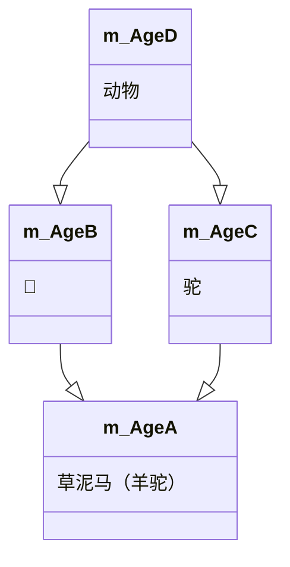

#   类和对象

C++面向对象的三大特性为：封装、继承、多态

C++认为万事万物皆为对象、对象上有其属性和行为

人可以作为对象，属性有姓名、年龄、身高、体重..，行为有走、跑、跳、吃饭、唱歌...车也可以作为对象，属性有轮胎、方向盘、车灯…,行为有载人、放音乐、放空调....具有相同性质的对象，我们可以抽象称为类，人属于人类，车属于车类

## 封装

### 封装的意义

封装是C++面向对象三大特性之一

封装的意义：

* 将属性和行为作为一个整体，表现生活中的事务
* 将属性和行为加以权限控制

封装意义一：

​	在设计类的时候，属性和行为写在一起，表现事物

语法：class类名{访问权限：属性/行为}

示例：

```c++
#include <iostream>
#include <string>
using namespace std;

const double PI = 3.14;//圆周率
//设计一个圆类，求圆的周长
//圆的周长=2*3.14*半径
//class 代表设计一个类，类后面紧跟整的就是类名称
class Circle
{
	//访问权限
	//公共权限
public:
	//属性为半径
	int m_r;
	//行为为获取圆的周长
	double calculateZC()
	{
		return 2 * PI * m_r;
	}
};
int main()
{
	//通过圆类创建具体的圆对象
	//实例化一个对象(通过一个类创建一个对象的过程叫实例化)
	Circle c1;
	//给圆对象的属性进行赋值
	c1.m_r = 10;
	cout << "圆的周长为：" << c1.calculateZC() << endl;
	system("pause");
	return 0;
}
```

示例2：

```c++
#include <iostream>
#include <string>
using namespace std;

//设计一个学生类，属性有姓名和学号，可以给姓名和学号赋值，可以显示学生的姓名和学号
class Student
{
public:
	//类中的属性和行为统称为成员
	// 属性也称为成员属性或成员变量
	// 行为也称为成员函数或成员方法
	//设置属性，姓名和学号
	string setName;
	int m_id;
	//行为
	//显示姓名和学号
	void showstudent()
	{
		cout << "姓名：" << setName << "学号：" << m_id << endl;
	}
};

int main()
{
	Student stu;
	stu.setName = "张三";
	stu.m_id = 1;
	stu.showstudent();
	system("pause");
	return 0;
}
```

封装意义二：

类在设计时，可以把属性和行为放在不同的权限下，加以控制

访问权限有三种：

1. public	公共权限
2. protected   保护权限
3. private       私有权限

```c++
#include <iostream>
#include <string>
using namespace std;

//访问权限
//public:公共的			成员类内可以访问，类外可以访问
//protected:受保护的	成员类内可以访问，类外不可以访问	儿子也可以访问父亲中的保护内容 
//private:私有的		成员类内可以访问，类外不可以访问	儿子不可以访问父亲中的私有内容
class person
{
public:
	//公共权限
	string m_Name;//姓名
protected:
	//保护权限
	string m_Car;//汽车
private:
	//私有权限
	int m_Password;//银行卡密码

public:
	void func()
	{
		m_Name = "张三";
		m_Car = "拖拉机";
		m_Password = 123456;
	}
};

int main()
{
	//实例化具体对象
	person p1;
	p1.m_Name = "李四";
	//p1.m_Car = "奔驰";//保护权限内容，在类外不可以访问
	//p1.m_Password = 123;//私有权限内容，在类外不可以访问
	system("pause");
	return 0;
}
```


### struct和class区别

在C++中struct和class唯一的区别就在于们的访问权限不同

区别：

* struct默认权限为公共
* class默认权限为私有

```c++
#include <iostream>
#include <string>
using namespace std;

class c1
{
	int m_A;//默认权限是私有
};
struct C2
{
	int m_A;//默认权限是 公共
};
int main()
{
	//struct 和class的区别
	//struct默认权限是公共public
	//class默认权限是私有的
	c1 C1;
	//C1.m_A = 100;//在class里默认权限为私有，因此类外不可以访问
	C2 c2;
	c2.m_A = 100;//在struct默认权限为公共、因此可以访问
	system("pause");
	return 0;
}
```

### 成员属性设置为私有

优点1：将所有成员属性设置为私有，可以自己控制读写权限

优点2：对于写权限，可以检测数据的有效性

 ```c++
 #include <iostream>
 #include <string>
 using namespace std;
 
 //成员属性设置为私有
 //1、可以自己控制读写权限
 //2、对于写可以检测数据有效性
 class Person
 {
 public:
 	//设置姓名
 	void setName(string name)
 	{
 		m_Name = name;
 	}
 	string getName()
 	{
 		return m_Name;
 	}
 	//获取年龄
 	void setAge(int age)
 	{
 		if (age > 0 && age < 150)
 		{
 			m_Age = age;
 		}
 		else
 		{
 			m_Age = 0;
 		}
 	}
 	int getAge()
 	{
 		return m_Age;
 	}
 	//设置年龄
 	
 	//设置偶像
 	void setIdol(string idol)
 	{
 		m_Idol = idol;
 	}
 private:
 	string m_Name;//姓名 可读可写
 	int m_Age;//年龄 只读  也可以写（条件为0-150之间）
 	string m_Idol;//偶像  只写
 };
 int main()
 {
 	Person p;
 	//姓名设置
 	p.setName("张三");
 	cout << "姓名：" << p.getName() << endl;
 	//年龄设置
 	p.setAge(20);
 	//p.setAge = 20;
 	//获取年龄
 	cout << "年龄：" << p.getAge() << endl;
 	//偶像设置
 	p.setIdol("李四");//只写，外界访问不到
 	//cout << "偶像：" << p.getIdol() << endl;
 	system("pause");
 	return 0;
 }
 ```

  

## 对象的初始化清理

* 生活中买的电子产品都基本有出厂设置，在某一天不用时候也会删除一些自己信息数据保证安全
* C++中的面向兑现来源于生活，每个对象也都会有初始设置以及对象销毁前的清理数据的设置。

### 构造函数和析构函数

对象的**初始化和清理**也是两个非常重要的安全问题

​	一个对象胡哦这变量没有初始状态，对其使用后果是未知

​	同样的使用完一个变量或对象，没有及时清理，也会造成一定的安全问题

C++利用了构造函数和析构函数解决上述问题，这两个函数将会被编译器自动调用，完成对象初始化和清理工作。

对象的初始化和清理工作是编译器强制要我们做的事情，因此如果不提供构造和析构，编译器会提供编译器提供的构造函数和析构函数是空实现。

* 构造函数：主要作用在于创建对象时为对象的成员属性赋值，构造函数有编译器自动调用，无需手动调用
* 析构函数：主要作用于对象销毁前系统自动调用，执行一些清理工作。


### 构造函数语法：`类名()`

1. 构造函数，没有返回值也不写void
2. 函数名称与类名相同
3. 构造函数可以有参数，因此可以发生重载
4. 程序在调用对象时候会自动调用够早，无须手动调用，而且只会调用一次

### 析构函数语法：`~类名(){}`

1. 析构函数：没有返回值也不写void
2. 函数名称与类名相同，在名称前加上符号~
3. 析构函数不可以有参数，因此不可以发生重载
4. 程序在对象销毁前会自动调用析构，无须手动调用而且只会调用一次

```c++
#include <iostream>
#include <string>
using namespace std;

//对象的初始化和清理
class Person
{
public:
	 //1.1 构造函数
	//没有返回值，不用写void
	//函数名与类名相同
	//构造函数可以有参数，可以发生重载
	//对象一建立，构造函数就会调用，而且只调用一次 
	Person()
	{
		cout << "Person的构造函数调用" << endl;
	}

	//1.2 析构函数,进行清理操作
	//没有返回值，不用写void
	//函数名和类名相同，在名称前假~符号
	//析构函数不可以有参数，不可以发生重载
	//对象在销毁前，会自动调用析构函数，而且只调用一次
	~Person()
	{
		cout << "Person的析构函数调用" << endl;
	}
};
//构造和析构都是必须有的实现，如果我们自己不提供，编译器会提供一个空实现的构造和析构
void test01()
{
	Person p1;//在栈上的数据，test01执行完毕后，释放这个对象
}

int main()
{
	test01();
	Person p; 
	system("pause");
	return 0;
}

```

### 构造函数的分类和调用 

两种分类方式：

​	按参数分为：有参构造和无参构造

​	按类型分为：普通构造和拷贝构造

三种调用方式：

​	括号法

​	显示法

​	隐式转换法

```C++
#include <iostream>
#include <string>
using namespace std;

//1、构造函数的分类和调用
//分类
//	按参数分类	无参构造(默认构造）和有参构造
//	按类型分类	普通构造 拷贝构造
class person
{
public:
	person()
	{
		cout << "Person的构造函数调用" << endl;
	}
	person(int a)
	{
		age = a;
		cout << "Person的有参数构造函数调用" << endl;
	}
	//拷贝构造函数
	person(const person &p)
	{
		//将传入的人身上的所有属性，拷贝到我身上
		age = p.age;
		cout << "Person的拷贝构造函数调用" << endl;
	}
	~person()
	{
		cout << "Person的析构函数调用" << endl;
	}
	int age;
};
//调用
void test01()
{
	//1、括号法
	//person p;//调用默无参)构造函数 
	//person p1(10);//调用有参构造函数
	//person p2(p1);//调用拷贝构造函数
	//cout << "p2的年龄为：" << p2.age << endl;

	//注意事项
	// 调用默认构造函数的时候，不要加()
	// 因为下面这行代码会被编译器认为是一个函数声明，不会认为在创建对象
	//person p4();
	
	//2、显示法
	//person p1;
	//person p2 = person(10);//有参构造
	//person p3 = person(p2);//拷贝构造
	//person(10);//匿名对象  当前行执行结束后，系统会立即回收掉匿名对象
	//注意事项2：
	//不要利用拷贝构造函数，初始化匿名对象，编译器会认为person (p3)等价于person p3;对象的声明
	
	//3、隐式转换法
	person p4 = 10;//相当于person p4 = person(10);
}
int main()
{
	test01();
	system("pause");
	return 0;
}

```


#### 拷贝构造函数调用时机

C++中拷贝构造函数调用时机通常有三种情况

* 使用一个已经创建完毕的对象来初始化一个新对象
* 值传递的方式给函数参数传值
* 以值方式返回局部对象

```c++
#include <iostream>
#include <string>
using namespace std;

//拷贝构造函数调用时机
class Person
{
public:
	Person()
	{
		cout << "调用默认构造函数" << endl;
	}
	Person(int age)
	{
		m_Age = age;
		cout << "调用有参构造函数" << endl;
	};
	Person(const Person & p)
	{
		m_Age = p.m_Age;
		cout << "调用拷贝构造函数" << endl;
	}
	~Person()
	{
		cout << "调用析构函数" << endl;
	}
	int m_Age;
};

//1.使用一个已经创建完毕的对象来初始化一个新对象
//void test01()
//{
//	Person p1(20);
//	Person p2(p1);
//
//	cout << "p2的年龄为：" << p2.m_Age << endl;
// }
//2.值传递的方式给函数传参
void doWork(Person p)
{

}
void test02()
{
	Person p;
	doWork(p);
 }
//3.值方式返回局部对象

Person doWork2()//应该是调用到拷贝构造函数的，但有可能由于返回值被优化了所以没有调用到拷贝构造函数
{
	Person p1;
	cout << (int*)&p1 << endl;
	return p1;
}
void test03()
{
	Person p = doWork2();
	cout << (int*)&p << endl;
}


int main()
{
	/*cout << "执行test01" << endl;
	test01();*/
	cout << "执行test02" << endl;
	test02();
	cout << "执行test03" << endl;
	test03();
	system("pause");
	return 0;
}

```

### 构造函数调用规则

默认情况下，C++编译器至少给一个类型添加3个函数

1. 默认构造函数(无参，函数体为空)
2. 默认析构函数(无参，函数体为空)
3. 默认拷贝构造函数，对属性进行值拷贝

构造函数调用规则如下：

* 如果用户定义有参构造函数，C++不在提供默认无参构造，但是会提供默认拷贝构造
* 如果用户定义拷贝构造函数，C++不会再提供其他构造函数

```c++
#include <iostream>
#include <string>
using namespace std;

//构造函数的调用规则
//1、创建一个类，C++编译器会给出每个类都添加至少三个数
//默认构造(空实现)
//析构函数(空实现)
//拷贝构造(值拷贝)
//2、如果写了有参构造函数，编译器就不再提供默认构造，依然提供拷贝构造
//	 如果写了拷贝构造函数，编译器就不再提供其他普通构造函数了
class Person
{
public:
	Person()
	{
		cout << "Person的默认构造函数调用" << endl;
	}
	Person(int age)
	{
		cout << "Person的有参构造函数调用" << endl;
		m_Age = age;
	}
	Person(const Person &p)
	{
		cout << "Person的拷贝造函数调用" << endl;
		m_Age = p.m_Age;
	}
	~Person()
	{
		cout << "Person的默认构造函数调用" << endl;
	}
	int m_Age;
};

//void test01()
//{
//	Person  p;
//	p.m_Age = 18;
//	Person p2(p);
//	cout << "p2的年龄为:" << p2.m_Age << endl;
//}

void test02()
{
	Person p(28);
	Person p2(p);
	cout << "p2的年龄为：" << p2.m_Age << endl;
}
int main()

{
	//test01();
	test02();
	system("pause");
	return 0;
}

```

#### 深拷贝和浅拷贝

深浅拷贝是面试经典问题，也是常见的一个坑

浅拷贝：简单的复制拷贝操作

深拷贝：再堆区重新申请内存空间，进行拷贝操作

```c++
#include <iostream>
#include <string>
using namespace std;

//深拷贝和浅拷贝

class Person
{
public:
	Person()
	{
		cout << "Person的默认构造函数调用" << endl;
	}
	Person(int age ,int height)
	{
		cout << "Person的有参构造函数调用" << endl;
		m_Age = age;
		m_Height=new int(height);
	}
	Person(const Person &p)
	{
		cout << "Person的拷贝造函数调用" << endl;
		m_Age = p.m_Age;
		//m_Height = p.m_Height;//编译器默认实现的就是这行代码
		//深拷贝操作
		m_Height = new int(*p.m_Height);
	}
	~Person()
	{
		//析构代码，将堆区开辟数据做释放操作，但是由于p2是通过拷贝函数过来的值，也只想了同一块堆区所指向的内存，因此，浅拷贝带来的问题就是堆区的内存重复释放
		if (m_Height != NULL)
		{
			delete m_Height;
			m_Height = NULL;
		}
		cout << "Person的析构构造函数调用" << endl;
	}
	int m_Age;//年龄
	int* m_Height; //身高
};

void test01()
{
	Person  p1(18,183); 
	cout << "p1的年龄为:" << p1.m_Age <<"p1的身高为："<<*p1.m_Height << endl;
	Person p2(p1);
	cout <<"p2的年龄为:" << p2.m_Age << "p2的身高为：" <<* p2.m_Height << endl;
}

int main()

{
	test01();
	system("pause");
	return 0;
}

```

### 初始化列表

作用：

C++提供了初始化列表语法，用来初始化属性

语法：构造函数()：属性1（值1），属性2（值2）…{ }

```c++
#include <iostream>
#include <string>
using namespace std;

//初始化列表
class Person
{
public:
	//传统初始化操作
	//Person(int a ,int b,int c)
	//{
	//	m_A = a;
	//	m_B = b;
	//	m_C = c;
	//}
	//初始化列表方式初始化
	Person(int a,int b,int c): m_A(a), m_B(b), m_C(c)
	{

	}
	~Person()
	{
		cout << "Person的析构构造函数调用" << endl;
	}
	int m_A;
	int m_B;
	int m_C;
};
void test01()
{
	Person  p(30,20,10);
	cout << "m_A=" << p.m_A << endl;
	cout << "m_B=" << p.m_B << endl;
	cout << "m_C=" << p.m_C << endl;
}
int main()
{
	test01();
	system("pause");
	return 0;
}

```

### 类队形作为类成员

C++类中的成员可以是另一个类的对象，我们称该成员为对象成员

例如：

```c++
class A {}
class B
{
	A a;
}
```

B类中有对象A作为成员，A为对象成员

那么当创建B对象时，A与B的构造和析构的顺序时谁先谁后？

```c++
#include <iostream>
#include <string>
using namespace std;
//类对象作为类成员
//手机类
class Phone
{
public:
	Phone(string pName)
	{
		m_PName = pName;
		cout << "Phone的构造函数调用" << endl;
	}
	~Phone()
	{
		cout << "Phone的析构函数" << endl;
	}
	//手机品牌名称
	string m_PName;
};
//人类
class Person
{
public:
	//Phone m_Phone=pName 隐式转换法
	Person(string name, string pName):m_Name(name),m_Phone(pName)
	{
		cout << "Person的构造函数调用" << endl;
	}
	
	//姓名
	string m_Name;
	//手机
	Phone m_Phone;
};
//当其他类对象作为本类成员，构造时候先构造对象，再构造自身，析构的顺序与构造相反
void test01()
{
	Person  p("张三","苹果MAX");
	cout << p.m_Name << "拿着：" << p.m_Phone.m_PName << endl;
}
int main()
{
	test01();
	system("pause");
	return 0;
}

```

### 静态成员

静态成员就是在成员变量和成员函数前加上关键字static，称为静态成员

静态成员为：

* 静态成员变量
    * 所有对象共享同一份数据
    * 在编译阶段分配内存
    * 类内声明，类外初始化

```c++
#include <iostream>
#include <string>
using namespace std;
//静态成员变量
class Person
{
public:
	//1、所有对象都共享同一份数据
	//2、编译阶段就分配内存
	//3、类内进行声明，类外初始化操作
	static int m_A;
	//静态成员变量也是有访问权限的,私有权限类外是访问不到的
private:
	static int m_B;
};
int Person::m_A = 100;
int Person::m_B = 200;
void test01()
{
	Person p; 
	cout << p.m_A << endl; 
	Person p2;
	p.m_A = 200;
	cout << p.m_A << endl; 
}
void test02()
{
	//静态成员变量，不属于某个对象上，所有对象都共享同一份数据
	//因此静态成员变量有两种访问方式
	//1、通过对象进行访问 
	Person p;
	cout << p.m_A << endl;
	//2、通过类名进行访问
	cout << Person::m_A << endl;
	//cout << Person::m_B << endl;
}
int main()
{
	//test01();
	test02();
	system("pause");
	return 0;
}

```

*  静态成员函数
    * 所有对象共享同一个函数
    * 静态成员只能访问静态成员变量

```c++
#include <iostream>
#include <string>
using namespace std;
//静态成员函数
//所有对象共享同一个函数
//静态成员只能访问静态成员变量
class Person
{
public:
	//静态成员函数
	static void func()
	{
		m_A = 100;//静态成员函数可以访问静态成员变量
		//m_B = 200;//静态成员函数不可以访问非静态成员变量，无法区分到底是那个对象的m_B属性
		cout << "static void func调用" << endl; 
	}
	static int m_A;
	int m_B;
private:
	static void func2()
	{
		cout << "static void func2调用" << endl;
	}
};
int Person::m_A;
void test01()
{
	//通过对象访问
	Person p; 
	p.func(); 
	//通过类名访问
	Person::func();
	//Person::func2();//类外访问不到私有静态成员函数
}
int main()
{
	test01();
	system("pause");
	return 0;
}

```

## C++对象模型和this指针

### 成员变量和成员函数分开存储

在C++中，类内的成员变量和成员函数分开存储

只有非静态成员变量才属于类的对象上 

```c++
#include <iostream>
#include <string>
using namespace std;
//成员变量 和 成员函数 分开存储的
class Person
{
	int m_A;//非静态成员变量 属于类的对象上
	static int m_B;//静态成员变量 不属于类的对象上
	void func() {} //非静态成员函数 不属于类的对象上
	static void func2(){}//静态成员函数 不属于类的对象上
};
int Person::m_B=0;
void test01()
{
	Person p;
	//空对象占用内存空间为： 1字节
	//C++编译器会给每个空对象也分配一个字节空间，是为了区分空对象占内存的位置
	//每个空对象也应该有一个独一无二的内存地址
	cout << "size of p= " <<sizeof(p)<< endl;
}

void test02()
{
	Person p;
	cout << "size of p=" << sizeof(p) << endl;
}

int main()
{
	test01();
	test02();
	system("pause");
	return 0;  
}
```

### this指针

通过上一节成员变量知道了在C++中成员变量和成员函数是分开存储的

每个非静态成员函数只会诞生一份函数实例，也就是说多个同类型的对象会共用一块代码

那么问题是：这一块代码是如何区分那个兑现调用自己？

C++通过提供特殊的对象指针，this指针，解决上述问题，this指针指向被调用的成员函数所属的对象

this指针是隐含每一个非静态成员函数内的一种指针

this指针不需要定义，直接使用即可

this指针的用途：

* 当形参和成员变量同名时，可用this指针来区分
* 在类的非静态成员函数中返回对象本身，可用return \*this

 ```c++
 #include <iostream>
 #include <string>
 using namespace std;
 class Person
 {
 public:
 	Person(int age)
 	{
 		//this指针指向 想被调用的成员函数所属对象
 		this->age = age;
 	}
 	Person& PersonAddAge(Person& p)
 	{
 		this->age += p.age;
 
 		//this指向p2的指针，而*this指向的就是p2这个对象本体
 		return *this;
 	}
 	int age;
 };
 //1、解决名称冲突
 void test01()
 {
 	Person p1(18);
 	cout << "p1的年龄= " <<p1.age<< endl;
 }
 //2、返回对象本身用*this
 void test02()
 {
 	Person p1(10);
 	Person p2(10);
 	//链式编程思想
 	p2.PersonAddAge(p1).PersonAddAge(p1).PersonAddAge(p1);
 	cout << "p2的年龄为：=" << p2.age << endl;
 }
 int main()
 {
 	test01();
 	//test02();
 	system("pause");
 	return 0;  
 }
 ```

### 空指针访问成员函数

C++中空指针也是可以调用成员函数的，但是也要注意有没有用到this指针

如果用到this指针，需要加以判断保证代码的健壮性

```c++
#include <iostream>
#include <string>
using namespace std;
//空指针调用成员函数
class Person
{
public:
	void showClassName()
	{
		cout << "this is Person class" << endl;
	}
	void showPersonAge()
	{
		//解决报错异常错误方案
		if (this == NULL)
			return;
		//报错原因是因为传入的指针是为NULL，相当于this->m_Age
		cout << "这个人的年龄为：" << m_Age << endl;
	}
	int m_Age;	
};

void test01()
{
	Person * p = NULL;
	p->showClassName();
	p->showPersonAge();
}

int main()
{
	test01();
	system("pause");
	return 0;  
}
```

### const 修饰成员函数

常含数：

* 成员函数后加const后我们称这个函数为常函数
* 常函数内不可以修改成员属性
* 成员属性声明时加关键字mutable后，在常含数中依然可以修改

```c++
#include <iostream>
#include <string>
using namespace std;
//常函数
class Person
{
public:

	//this指针的本质 是指针常量	指针的指向是不可以修改的
	//const Person * const this ;
	//在成员函数后面加const，修饰的是this指向，让指针指向的值也不可以修改，相当于是在成员函数前面家的const
	void showPerson() const
	{
		this->m_B = 100;
		//this->m_A = 100;
		//this = NULL;//this指针不可以修改指针的指向
	}
	int m_A;
	mutable int m_B;//特殊变量，即使在常函数中，也可以修改这个值，加关键字mutable
};
void test01()
{
	Person p;
	p.showPerson();
}
int main()
{
	test01();
	system("pause");
	return 0;  
}
```

常对象：

* 声明对象前加const称该对象为常对象
* 常对象只能调用常函数

```c++
#include <iostream>
#include <string>
using namespace std;
//常函数
class Person
{
public:

	//this指针的本质 是指针常量	指针的指向是不可以修改的
	//const Person * const this ;
	//在成员函数后面加const，修饰的是this指向，让指针指向的值也不可以修改，相当于是在成员函数前面家的const
	void showPerson() const
	{
		this->m_B = 100;
		//this->m_A = 100;
		//this = NULL;//this指针不可以修改指针的指向
	}
	void func(){}
	int m_A;
	mutable int m_B;//特殊变量，即使在常函数中，也可以修改这个值，加关键字mutable
	void func(){}
};


void test01()
{
	Person p;
	p.showPerson();
}

void test02()
{
	const Person p;//在对象前加const,变为常对象
	//p.m_A = 100; 
	p.m_B = 100;//m_B是特殊值，在常对象下也可以修改
	//常对象只能调用常函数
	p.showPerson();
	//p.func();//常对象 不可以调用普通成员函数，因为普通成员函数可以修改属性
}
int main()
{
	test01();
	system("pause");
	return 0;
}
```


## 友元

生活中家里有客厅（public)，有卧室(private)

客厅所有客人都可以进去，但是卧室是私有的，只有自己能进

但是，也可以允许朋友兄弟进去。

在程序里，有些私有属性也想让类外特殊的一些函数或者类进行访问，就需要用到友元的技术

友元的目的就是让一个函数或者类访问另一个类中私有成员

友元的关键字为 <font color='yellow'>friend</font>

友元的三种实现

* 全局函数做友元

```c++
#include <iostream>
#include <string>
using namespace std;

//建筑物类	
class Building
{
	//goodfriend全局函数是Building好朋友，可以访问Building中私有成员
	friend void goodfriend(Building* building);

public:
	Building()
	{
		m_SittingRoom = "客厅";
		m_BedRoom = "卧室";
	}
public:
	string m_SittingRoom;//客厅
private:
	string m_BedRoom;//卧室
};

//全局函数
void goodfriend(Building *building)
{
	cout << "好基友全局函数 正在访问；" << building->m_SittingRoom << endl;
	cout << "好基友全局函数 正在访问；" << building->m_BedRoom << endl;

}

void test02()
{
	Building building;
	goodfriend(&building);
} 
int main()
{
	test02();
	system("pause");
	return 0;
}
```

* 类做友元

```c++
#include <iostream>
#include <string>
using namespace std;

//类做友元	
class Building;
class goodfriend
{
public:
	goodfriend();
	void visit();//参观函数	访问Building中的属性
	Building * building;
};

class Building
{
	//goodfriend类是本类的好朋友，可以访问本类的私有成员
	friend class goodfriend;
public:
	Building();
public:
	string m_SittingRoom;//客厅
private:
	string m_BedRoom;//卧室	
};

//类外写成员函数
Building::Building()
{
	m_SittingRoom = "客厅";
	m_BedRoom = "客厅";
}

goodfriend::goodfriend()
{
	//创建建筑物对象
	building = new Building;
}

void goodfriend::visit()
{
	cout << "好基友正在访问:" << building->m_SittingRoom<<endl;
	cout << "好基友正在访问:" << building->m_BedRoom << endl;

}

void test01()
{
	goodfriend gg;
	gg.visit();
} 
int main()
{
	test01();
	system("pause");
	return 0;
}
```

* 成员函数做友元

```c++
#include <iostream>
#include <string>
using namespace std;
class Building;
class goodfriend
{
public:
	goodfriend();
	void visit();//让visit函数可以访问Building中的私有成员
	void visit2();//visit函数不可以访问Building中的私有成员
	Building * building;
};
class Building
{
	friend void goodfriend::visit();//告诉编译器，goodfriendl类下的visit成员函数作为本类的好朋友，可以访问私有成员
public:
	Building();//声明
	string m_SittingRoom;//客厅
private:
	string m_BedRoom;//卧室
};
//类外实现成员函数
goodfriend::goodfriend()
{
	building = new Building;
}
Building::Building()
{
	m_SittingRoom = "客厅";
	m_BedRoom = "卧室";
}
void goodfriend::visit()
{
	cout << "visit正在访问" << building->m_SittingRoom << endl;
	cout << "visit正在访问" << building->m_BedRoom << endl;
}
void goodfriend::visit2()
{
	cout << "visit2正在访问" << building->m_SittingRoom << endl;
	//cout << "visit2正在访问" << building->m_BedRoom << endl;
}
void test01()
{
	goodfriend gg;
	gg.visit(); 
	gg.visit2();
} 
int main()
{
	test01();
	system("pause");
	return 0;
} 
```

## 运算符重载

运算符重载概念：对已有的运算符重新进行定义，赋予其另一种功能，以适应不同额数据类型

### 加号运算符重载

作用：实现两个自定义数据类型相加的运算

```c++
#include <iostream>
#include <string>
using namespace std;
//加号运算符重载
class Person
{
public:
	//1、成员函数重载+号
	/*Person operator+(Person& p)
	{
		Person temp;
		temp.m_A = this->m_A + p.m_A;
		temp.m_B = this->m_B + p.m_B;
		return temp;
	}*/
	int m_A;
	int m_B;
};
//2、全局函数重载+号
Person operator+(Person& p1, Person& p2)
{
	Person temp;
	temp.m_A =p1.m_A + p2.m_A;
	temp.m_B = p1.m_B + p2.m_B;
	return temp;
}
//函数重载的版本
Person operator+(Person& p1, int num)
{
	Person temp;
	temp.m_A = p1.m_A + num;
	temp.m_B = p1.m_B + num;
	return temp;
}
void test01()
{
	Person p1;
	p1.m_A = 10;
	p1.m_B = 10;
	Person p2;
	p2.m_A = 10;
	p2.m_B = 10;
	//成员函数重载本质调用
	//Person p3=p1.operator+(p2);
	//全局函数的本质调用
	Person p3 = operator+(p1, p2);
	//这是成员函数和全局函数都一样形式的简化版本
	Person p3 = p1 + p2;
	//运算符重载也可以发生函数重载
	Person p3 = p1 + 19;//person+int
	cout << "p3.m_A=" << p3.m_A << endl;
	cout << "p3.m_B=" << p3.m_B << endl;
}
int main()
{
	test01();
	system("pause");
	return 0;
} 
```

> 总结1：对于内置的数据类型的表达式的运算符是不可能改变的。
>
> 总结2：不要滥用运算符重载

### 左移运算符重载

作用：可以输出自定义数据类型

```c++
#include <iostream>
#include <string>
using namespace std;
//加号运算符重载
class Person
{
	friend ostream& operator<<(ostream& out, Person& p);
public:
	Person(int a, int b)
	{
		m_A = a;
		m_B = b;
	}
private:
	//利用成员函数重载 左移运算符	p.operator<<(cout)	简化版本 p << cout
	//通常不会利用成员重载<<运算符，一位内无法实现 cout在左侧
	/*void operator<<(Person &p)
	{
	}*/
	int m_A;
	int m_B;
};
//只能利用全局函数重载左移运算符
ostream &operator<<(ostream& out, Person& p)//本质 operator<< (cout ,p) 简化 cout<<p
{
	out << "m_A=" << p.m_A << " m_B=" << p.m_B;
	//引用的本质是起别名，因为函数形参中的out是一个标准输出流的引用所以cout和out没区别
	return cout;
}
void test01()
{
	Person p(10,10);
	cout << p<<"   hello world"<<endl;
}
int main()
{
	test01();
	system("pause");
	return 0;
} 
```

> 总结：重载左移运算符配合友元可以实现输出自定义数据类型

### 递增运算符重载

作用：通过重载递增运算符，实现自己的整形数据

```` c++
#include <iostream>
#include <string>
using namespace std;
//重载递增运算符
//自定义整型
class myInteger
{
	friend ostream& operator<<(ostream& cout, myInteger mint);
public:
	myInteger()
	{
		m_Num = 0;
	}

	//重载前置++运算符 返回引用是为了一直对一个数据进行递增操作
	myInteger& operator++()
	{
		//先进行++运算
		m_Num++;
		//再将自身做返回
		return *this;
	}
	//重载后置++运算符
	//void operator++(int) int代表占位参数，可以用于区分前置和后置递增
	myInteger operator++(int)
	{
		//先 记录当时结果
		myInteger temp = *this;
		//后 递增
		m_Num++;
		//最后将记录结果做返回操作
		return temp;
	}
private:
	int m_Num;
};
//重载左移运算符
 ostream& operator<<(ostream& cout, myInteger mint)
{
	cout << mint.m_Num;
	return cout;
}
void test01()
{
	myInteger  mint;
	cout << ++mint << endl;
	cout << ++(++mint) << endl;
}
void test02()
{
	myInteger myint;
	cout << myint++ << endl;
	cout << myint << endl;
}
int main()
{
	test01();
	test02();
	system("pause");
	return 0;
} 
````

> 总结：前置递增返回引用，后置递增返回值 

### 赋值运算符重载

C++编译器至少给一个类添加4个函数

1. 默认构造函数（无参，函数体为空）
2. 默认析构函数（无参，函数体为空）
3. 默认拷贝构造函数，对属性进行值拷贝
4. 赋值运算符 operator=,对属性进行值拷贝

如果类中有属性指向堆区，做赋值操作时也会出现深浅拷贝问题

```c++
#include <iostream>
#include <string>
using namespace std;

//赋值运算符重载
class Person
{
public:
	Person(int age)
	{
		m_Age=new int(age);
	}
	~Person()
	{
		if (m_Age != NULL)
		{
			delete m_Age;
			m_Age = NULL;
		}
	}

	//重载赋值运算符
	Person & operator =(Person &p)
	{
		//编译器是提供浅拷贝
		
		//应该先判断是否有属性在堆区，如果有先释放干净，然后再深拷贝
		if (m_Age != NULL)
		{
			delete m_Age;
			m_Age = NULL;
		}

		//深拷贝
		m_Age = new int(*p.m_Age);

		//返回本身
		return *this;
	}
	int *m_Age;

};

void test01()
{
	Person p1(18);
	Person p2(20);
	Person p3(30);
	p3=p2 = p1;//赋值操作
	cout << "p1的年龄为：" << *p1.m_Age << endl;
	cout << "p2的年龄为：" << *p2.m_Age << endl;
	cout << "p3的年龄为：" << *p3.m_Age << endl;
}
int main()
{
	test01();
	system("pause");
	return 0;
} 
```

### 关系运算符重载

作用：重载关系运算符，可以让两个自定义类型对象进行对比操作

```c++
#include <iostream>
#include <string>
using namespace std;

//关系运算符重载

class Person
{
public:
	Person(string name, int age)
	{
		m_Name = name;
		m_Age = age;
	}

	bool  operator ==(Person&p)
	{
		if (this->m_Name == p.m_Name && this->m_Name == p.m_Name)
		{
			return true;
		}
		return false;
	}


	bool  operator !=(Person&p)
	{
		if (this->m_Name == p.m_Name && this->m_Name == p.m_Name)
		{
			return false;
		}
		return true;
	}
	string m_Name;
	int m_Age;

};

void test01()
{
	Person p1("tom",18);
	Person p2("2om", 18);
	if (p1 == p2)
	{
		cout << "p1,p2相等" << endl;
	}
	else
	{
		cout << "p1,p2不相等" <<endl;
	}

	if (p1 != p2)
	{
		cout << "p1,p2不相等" << endl;
	}
	else
	{
		cout << "p1,p2相等" << endl;
	}
}
int main()
{
	test01();
	system("pause");
	return 0;
} 
```

### 函数调用运算符重载

* 函数调用运算符()也可以重载
* 由于重载后使用的方式非常像函数的调用，因此称为仿函数
* 仿函数没有固定写法，非常灵活

```c++
#include <iostream>
#include <string>
using namespace std;
//函数调用运算符重载
//打印输出类
class MyPrint
{
public:
	//重载函数调用运算符
	void operator()(string test)
	{
		cout << test << endl;
	}
};
void myPrint2(string test)
{
	cout << test << endl;
}
void test01()
{
	MyPrint myPrint;
	myPrint("hello world");//由于使用起来非常类似于函数调用，因此称为仿函数
	myPrint2("hello world");
}
//仿函数非常灵活，没有固定的写法
//加法类
class MyAdd
{
public:
	int operator()(int num1,int num2)
	{
		return num1 + num2;
	}
};
void test02()
{
	MyAdd myadd;
	int ret=myadd(100, 100);
	cout << "ret=" << ret << endl;

	//匿名函数对象
	cout << MyAdd()(100, 100) << endl;
}
int main()
{
	test01();
	test02();
	system("pause");
	return 0;
} 
```

## 继承

**继承是面向对象三大特性之一**

有些类与类之间存在特殊的关系，例如
$$
动物
\begin {cases}
猫
\begin {cases}
加菲猫\\
布偶猫\\
波斯猫等等……
\end{cases}\\
狗
\begin {cases}
哈士奇\\
京巴\\
德国牧羊犬……等等
\end {cases}\\
\end {cases}
$$
我们发现，定义这些类时，下级别的成员除了拥有上一级的共性，还有自己的特性。

这个时候我们就可以考虑利用继承的技术，减少代码的重复性

### 继承的基本语法

例如网站中，都有公共的头部，公共的底部，甚至公共的左侧列表，只有中心内容不同，接下来分别利用普通写法和继承写法来实现网页中的内容，看一下继承存在的意义以及好处

#### 继承实现：

```c++
#include <iostream>
#include <string>
using namespace std;
//继承实现页面
//公共页面类
class BasePage
{
public:
	void header()
	{
		cout << "首页、公开课、登录、注册……（公共头部）" << endl;
	}
	void footer()
	{
		cout << "帮助中心、交流合作、站内地图……（公共底部）" << endl;
	}
	void left()
	{
		cout << "java、python、c++、（公共分类列表）" << endl;
	}
	void content()
	{
		cout << "java学科视频" << endl;
	}
};
//继承的好处：减少重复代码
//语法：class 子类 : 继承方式 父类
//子类 也称为 派生类
//父类 也称为 基类
//Java页面
class Java : public BasePage
{
public:
	void content()
	{
		cout << "Java学科视频" << endl;
	}
};
//Python页面
class Python : public BasePage
{
public:
	void content()
	{
		cout << "Python学科视频" << endl;
	}
};
void test01()
{
	cout << "Java下载视频页面如下：<" << endl;
	Java ja;
	ja.header();
	ja.footer();
	ja.left();
	
	Python py;
	py.header();
	py.footer();
	py.left();
}
int main()
{
	test01();
	test02();
	system("pause");
	return 0;

} 
```

总结：

继承的好处：可以减少重复代码

 语法：class 子类 : 继承方式 父类
子类 也称为 派生类
父类 也称为 基类

**派生类中的成员，包含两大部分**：

一类时从基类继承过来的，一类时自己增加的成员

从基类继承过过来的表现其共性	而新增成员体现了其个性。


### 继承方式

继承的语法：`class 子类（派生类） : 继承方式 父类（基类）`

继承方式一共有三种：

* 公共继承
* 保护继承
* 私有继承

```c++
#include <iostream>
#include <string>
using namespace std;
//继承方式	
//公共继承
class Base1
{
public:
	int m_A;
protected:
	int m_B;
private:
	int m_C;
};
//公共继承
class Son1 : public Base1
{
public:
	void func()
	{
		m_A = 10;//父类中的公共权限成员到子类中依然是公共权限
		m_B = 10;//父类中的保护权限成员到子类中依然是保护权限
		//m_C = 10;//父类中的私有权限，子类访问不到
	}
};
//保护继承
class Base2
{
public:
	int m_A = 10;
protected:
	int m_B = 10;
private:
	int m_C = 10;
};
class Son2 :protected Base2
{
public:
	void func()
	{
		m_A = 100;//父类中公共成员，到子类中变为保护权限
		m_B = 100;//父类中公共成员，到子类中依然为保护权限
		//m_C = 100;//父类中私有成员，子类访问不到
	}
};
//私有继承
class Base3
{
public:
	int m_A = 10;
protected:
	int m_B = 10;
private:
	int m_C = 10;
};
class Son3 :private Base3
{
public:
	void func()
	{
		m_A = 100;//父类中公共成员到子类中变为了私有成员
		m_B = 100;//父类中的保护成员到子类中变为私有成员
		m_C = 100;//父类中的私有成员，子类访问不到
	}
};
void test01()
{
	Son1 s1;
	s1.m_A = 100;
	//s1.m_B = 100;//到Son1中 m_B是保护权限 类外访问不到
}
void test02()
{
	Son2 s1;
	//s1.m_A = 100;//到Son2中 m_A变为了保护权限 类外访问不到
	//s1.m_B = 100;//再Son2中 m_B保护权限 不可以访问
} 
void test03()
{
	Son3 s1;
	//s1.m_A = 1000;//到Son3中 变为了私有成员 类外访问不到
	//s1.m_B = 1000;//到Son3中 变为了私有成员 类外访问不到
}
class GrandSon3 :public Son3
{
public:
	void func()
	{
		m_A = 1000;//到了Son3中，M_A变为私有，即使是儿子，也是访问不到
		m_B = 1000;//到了Son3中，M_B变为私有，即使是儿子，也是访问不到
	}
};
int main()
{
	test01();
	system("pause");
	return 0;
} 
```

### 继承中的对象模型

问题：从父类继承过来的成员，那些属于子类对象中？

```c++
#include <iostream>
#include <string>
using namespace std;

//继承中的对象模型

class Base
{
public:
	int m_A;
protected:
	int m_B;
private:
	int m_C;
};

class Son :public Base
{
public:
	int m_D;
};
//利用开发人员命令提示工具即Developer Command Prompt for VS 2022 查看对象模型
//跳转盘符 E:
//跳转文件路径 cd..具体路径
//查看命令
// cl /dl reportSingleClassLayout类名 文件名

void test01()
{
	//父类中所有非静态成员属性都会被子类继承下去
	//父类中私有成员属性 是被编译器给隐藏了，因此是访问不到，但是确实被继承下去了
	cout << "sizeof of Son=" << sizeof(Son) << endl;
}


int main()
{
	test01();
	system("pause");
	return 0;

} 
```

> 结论：父类中私有成员也是被子类继承下去了，只是由编译器给隐藏后访问不到

### 继承中构造和析构顺序

子类继承父类后，当创建子类对象，也会调用父类的构造函数

问题：父类和子类的构造和析构顺序是谁先谁后？

```c++
#include <iostream>
#include <string>
using namespace std;
//继承中的构造和析构顺序
class Base
{
public:
	Base()
	{
		cout << "Base的构造函数！" << endl;
	}
	~Base()
	{
		cout << "~Base的析构函数！" << endl;
	}
};
class Son :public Base
{
public:
	Son()
	{
		cout << "Son构造函数！" << endl;
	}
	~Son()
	{
		cout << "~Son构造函数！" << endl;
	}
};
void test01()
{
	//Base b;
	//继承中的构造和析构顺序如下：
	//先构造父类，再构造子类，析构的顺序和构造的顺序相反  
	Son s;
}
int main()
{
	test01();
	system("pause");
	return 0;
} 
```

> 总结：继承中 先调用父类构造函数，再调用子类构造函数，析构顺序与构造相反

### 继承同名成员处理方式

问题：当子类与父类出现同名的成员，如何通过子类对象，访问到子类或父类中同名的数据呢？

* 访问子类同名成员 直接访问即可
* 访问父类同名成员 需要加作用域

```c++
#include <iostream>
#include <string>
using namespace std;
//继承中同名成员处理
class Base
{
public:
	Base()
	{
		m_A = 100;
	}

	void func()
	{
		cout << "Base -func()调用" << endl;
	}
	void func(int a)
	{
		cout << "Base -func(int a)调用" << endl;
	}
	int m_A;
};
class Son :public Base
{
public:
	Son()
	{
		m_A = 200;
	}
	void func()
	{
		cout << "Son -func()调用" << endl;
	}
	int m_A;
};
//同名成员属性处理
void test01()
{
	Son s;
	cout << "Son s中的m_A值为：" <<s.m_A<< endl;
	cout << "Base中的m_A值为：" << s.Base::m_A << endl;//如果通过子类对象，访问到父类成员需要加作用域
}
//同名成员函数处理
void test02()
{
	Son s;
	s.func();//直接调用 调用是子类中的同名成员
	// 如何调用到父类中同名成员函数?加作用域
	s.Base::func();
	//如果子类中出现和父类同名的成员函数，子类的同名成员会隐藏掉父类中所有同名成员函数
	//如果想要访问到父类中被隐藏的同名成员函数，需要加作用域
	s.Base::func(100);
}
int main()
{
	//test01();
	test02();
	system("pause");
	return 0;
} 
```

总结：

1. 子类对象可以直接访问到子类中同名成员
2. 子类对象加作用域可以访问到父类同名成员
3. 当子类与父类拥有同名的成员函数，子类会隐藏父类中同名成员函数，加作用域可以访问到父类中同名函数

### 继承同名静态成员处理方式

问题：继承中同名的静态成员再子类对象上如何进行访问？

静态成员和非静态成员出现同名，处理方式一致

* 访问子类同名成员 直接访问即可
* 访问父类同名成员 需要加作用域

```c++
#include <iostream>
#include <string>
using namespace std;
//继承中同名静态成员处理方式
class Base
{
public:
	static int m_A;
	static void func(int a)
	{
		cout << "Base - static void func(int a )" << endl;
	}
};
int Base::m_A = 100;
class Son :public Base
{
public:
	static int m_A;
	static void func()
	{
		cout << "Son - static void func()" << endl;
	}
};
int Son :: m_A = 200;
//同名静态成员属性
void test01()
{
	//1、通过对象访问
	cout << "通过对象访问" << endl;
	Son s;
	cout << "Son 下 m_A=" << s.m_A << endl;
	cout << "Base 下 m_A=" << s.Base::m_A << endl;

	//2、通过类名访问
	cout << "通过类名访问" << endl;
	cout << "Son 下 m_A = " << Son::m_A << endl;
	//第一个：：代表通过类名的方式进行访问，第二个：：代表访问父类Base作用域下
	cout << "Base 下 m_A=" << Son::Base::m_A << endl;
}
//同名静态成员函数
void test02()
{
	 //通过对象访问
	cout << "通过对象访问" << endl;
	Son s;
	s.func();
	s.Base::func(1000);
	//通过类名访问
	cout << "通过类名访问" << endl;
	Son::func();
	//子类出现和父类同名静态成员函数，也会隐藏父类中所有同名成员函数
	//如果想访问父类中被隐藏同名成员，需要加作用域
	Son::Base::func(100);
}
int main()
{
	//test01();
	test02();
	system("pause");
	return 0;
} 
```

> 总结：同名静态成员处理方式和非静态处理方式一样，只不过有两种访问的方式（通过对象和通过类名）

### 多继承语法

C++允许一个类继承多个类

语法：`class 子类 : 继承方式 父类1 ,继承方式 父类2……`

多继承可能会引发父类中同名成员出现，需要加作用域区分

**C++实际开发中不建议用多继承**

```c++
#include <iostream>
#include <string>
using namespace std;
//多继承语法
class Base1
{
public:
	Base1()
	{
		m_A = 100;
	}
	int m_A;
};
class Base2
{
public:
	Base2()
	{
		m_A = 1000;
		m_B = 200;
	}
	int m_B,m_A;
};

//子类	需要继承Base1和Base2
//语法： class 子类:继承方式  父类1，继承方式 父类2 ……
class Son :public Base1, public Base2
{
public:
	Son()
	{
		m_C = 300;
		m_D = 400;
	}
	int m_C, m_D;
};

void test01()
{
	Son s;
	cout << "sizeof Son=" << sizeof(s) << endl;
	//当父类中出现同名成员，需要加作用域区分
	cout << "Base::m_A=" << s.Base1::m_A << endl;
	cout << "Base2::m_A=" << s.Base2::m_A << endl;
}
int main()
{
	test01();
	//test02();
	system("pause");
	return 0;
} 
```

> 总结：多继承中如果父类中出现了同名情况，子类使用时要加作用域

### 菱形继承

**菱形继承概念**：

​	两个派生类继承同一个基类

​	又有某个类同时继承者两个派生类

​	这种继承被称为菱形继承，或者钻石继承



菱形继承问题：

1. 羊继承了动物的数据，驼同样继承了动物的数据，当草泥马使用数据时，就会产生二义性
2. 草泥马继承自动物的数据继承了两份，其实我们清楚，这份数据我们只需要一份就可以。

```c++
#include <iostream>
#include <string>
using namespace std;
//动物类
class Animal
{
public:
	int m_Age;
};
//利用虚继承，解决菱形继承的问题
// 继承之前 加上关键字 virutal 变为虚继承
// Animal类称为虚基类
//羊类
class Sheep:virtual public Animal 
{
};
//驼类
class Tuo :virtual public Animal
{
};

//草泥马
class SheepTuo :public Sheep,public Tuo
{
};
void test01()
{
	SheepTuo st;
	st.Sheep::m_Age = 18;
	st.Tuo::m_Age = 28;
	//当菱形继承，两个父类拥有相同数据，需要加作用域
	cout << "st.Sheep::m_Age=" << st.Sheep::m_Age << endl;
	cout << "st.Tuo::m_Age=" << st.Tuo::m_Age << endl;
	cout << "st.m_Age" <<st.m_Age<<	 endl;
	//比如年龄，一个动物不可能有两个年龄，只有一份就可以了，菱形继承导致了数据有两份，导致资源浪费
}
int main()
{
	test01();
	//test02();
	system("pause");
	return 0;
} 
```

> 总结：
>
> * 菱形继承嗲来的主要问题是子类继承两份相同的数据，导致资源浪费以及毫无意义
> * 利用虚继承可以解决菱形继承问题

## 多态

### 多态基本概念

**多态时C++面向对象的三大特性之一**

多态分为两类：

* 静态多态：函数重载和运算符重载属于静态多态，复用函数名
* 动态多态：派生类和虚函数实现运行时多态

静态多态和动态多态区别：

* 静态多态的函数地址早绑定 - 编译阶段确定函数地址
* 动态多态的函数地址晚绑定 - 运行阶段确定函数地址

```c++
#include <iostream>
#include <string>
using namespace std;
//多态
//动物类
class Animal
{
public:
	virtual void speak()
	{
		cout << "动物在说话" << endl;
	}
};
//猫类
class Cat :public Animal
{
public:
	//重写概念：函数返回值类型	函数名	参数列表	完全相同
	//重载概念：函数名相同，参数列表可以不同 
	void speak()
	{
		cout << "猫在说话" << endl;
	}
};
//狗类
class Dog :public Animal
{
public:
	void speak()
	{
		cout << "狗在说话" << endl;
	}
};
//创造说话的函数
//地址早绑定	在编译阶段确定函数地址
//如果想执行让猫说话，那么这个函数地址就不能提前绑定，需要在运行阶段进行绑定，地址晚绑定
//动态多态满足条件
//1、有继承关系
//2、子类重写父类的虚函数
//动态多态使用
//父类的指针或引用 指向子类对象
void dospeak(Animal &animal)//Animalk animal=cat;
{
	animal.speak();
}
void test01()
{
	Cat cat;
	dospeak(cat);
	Dog dog;
	dospeak(dog);
}
int main()
{
	test01();
	//test02();
	system("pause");
	return 0
} 
```

 总结：

多态满足条件

* 有继承关系
* 子类重写父类中的虚函数

多态使用条件

* 父类指针或引用指向子类对象

重写概念：函数返回值类型 函数名 参数列表 完全一致才为重写

#### 多态的深入刨析

传送门：[54 类和对象-多态-多态的原理剖析_哔哩哔哩_bilibili](https://www.bilibili.com/video/BV1et411b73Z?spm_id_from=333.788.player.switch&vd_source=64709a8217a1bbd540960dd246f1356a&p=136)

当写了如下代码的时候：

```c++
class Animal
{
public:
	virtual void speak()//虚函数
	{
		cout << "动物在说话" << endl;
	}
};
```

当写了这段代码后，相当于Animal中有一个4字节大小的指针，这指针叫做`vfptr`(virtual function pointer)，中文翻译过来叫做虚函数指针也叫做虚函数表指针，这两个是同一种东西，它会指向一个虚函数表，表内部记录一个虚函数的地址

因为speak属于一个成员函数，既然是成员函数的函数地址要加一个作用域，告诉它这是一个Animal作用域下的函数。

如果想要记住这个函数的地址那么格式为：`&Animal speak`,这样虚函数表记录的就是这个虚函数的地址。

接下来就是子类与父类在多态的概念中的关系以及虚函数表中的地址的改变关系：

代码如下：

```c++
class Cat :public Animal
{
public:
	//重写概念：函数返回值类型	函数名	参数列表	完全相同
	//重载概念：函数名相同，参数列表可以不同 
	void speak()
	{
		cout << "猫在说话" << endl;
	}
};
```

没有重写前，子类继承父类的所有内容，没有什么变化

重写后，子类会把子类中的虚函数表中的内容做一个覆盖操作 ，即子类中的虚函数表内部会替换称子类的虚函数地址。

就是原本父类中虚函数表的&Animal ::speak变为了 Cat::speak（是继承过来的子类的虚函数表发生改变，而不是父类的！！！，父类的没变！！！）

当父类的指针或者引用指向子类对象的时候，就会发生多态，即由于本身还是子类对象，所以当调取公共的speak函数的时候会从子类的地址表中找到子类的入口地址，这便是多态原理。验证用的是VIsual Studio 中的开发者工具

### 多态案例 ———-计算机类

案例描述：分别利用普通写法和多态技术，设计实现两个操作数进行运算的计算机类

多态的优点：

* 代码组织结构清晰
* 可读性强
* 利于前期和后期的扩展以及维护

```c++
#include <iostream>
#include <string>
using namespace std;
//分别利用普通写法和多态技术实现计算机类
//普通写法
class Calculator
{
public:
	int getResult(string oper)
	{
		if (oper == "+")
		{
			return m_Num1 + m_Num2;
		}
		else if (oper == "-")
		{
			return m_Num1 - m_Num2;
		}
		else if (oper == "*")
		{
			return m_Num1 * m_Num2;
		}
		//如果想扩展新的功能，需求修改源码
		//在真实开发中，提倡 开闭原则
		//开闭原则：对扩展进行开放，对修改进行关闭
	}
	int m_Num1,m_Num2;
};
void test02()
{
	//创建计算器对象
	Calculator c;
	c.m_Num1 = 10;
	c.m_Num2 = 20;
	cout << c.m_Num1 << "+" << c.m_Num2 << "=" << c.getResult("+") << endl;
	cout << c.m_Num1 << "-" << c.m_Num2 << "=" << c.getResult("-") << endl;
	cout << c.m_Num1 << "*" << c.m_Num2 << "=" << c.getResult("*") << endl;

}
//利用多态实现计算器
//实现计算机抽象类
class AbstractCalculator
{
public:
	virtual int getResult()
	{
		return 0;
	}
	int m_Num1,m_Num2;
};
//加法计算器类
class AddCalculator :public AbstractCalculator
{
public:
	int getResult()
	{
		return m_Num1 + m_Num2;
	}
};
//减法计算器类
class SubCalculator :public AbstractCalculator
{
public:
	int getResult()
	{
		return m_Num1 - m_Num2;
	}
};
//乘法计算器类
class MulCalculator :public AbstractCalculator
{
public:
	int getResult()
	{
		return m_Num1 * m_Num2;
	}
};
void test01()
{
	//多态使用条件
	// 多态的好处
	// 1、组织机构清晰
	// 2、可读性强
	// 3、对于后期和前期扩展以及维护性强
	//父类指针或者引用指向子类对象
	//加法运算
	AbstractCalculator* abc = new AddCalculator;
	abc->m_Num1 = 10;
	abc->m_Num2 = 20; 
	cout << abc->m_Num1 << "+" << abc->m_Num2 << "=" << abc->getResult() << endl;
	//用完后记得销毁
	delete abc;
	//减法运算器
	abc = new SubCalculator;
	abc->m_Num1 = 10;
	abc->m_Num2 = 20;
	cout << abc->m_Num1 << "-" << abc->m_Num2 << "=" << abc->getResult() << endl;
	delete abc;
	// 乘法运算器
	abc = new MulCalculator;
	abc->m_Num1 = 10;
	abc->m_Num2 = 20;
	cout << abc->m_Num1 << "*" << abc->m_Num2 << "=" << abc->getResult() << endl;
	delete abc;
}
int main()
{
	test01();
	//test02();
	system("pause");
	return 0;

} 
```

> 总结：C++开发提倡利用多态设计程序架构，因为多态优点很多

### 纯虚函数和抽象类

在多态中，通常非类中虚函数的实现是毫无意义的，主要都是调用子类重写的内容

因此可以将虚函数改为纯虚函数

纯虚函数语法：`virtual 返回值类型 函数名 (参数列表)=0;`

当类中有了纯虚函数，这个类也称为抽象类

**抽象类特点**：

* 无法实例化对象
* 子类必须重写抽象类中的纯虚函数，否则也属于抽象类

```c++
#include <iostream>
#include <string>
using namespace std;

//纯虚函数和抽象类
class Base
{
public:
	//纯虚函数
	//只要有一个纯虚函数，这个类称为抽象类
	//抽象类特点
	//1、无法实例化对象
	//2、抽象类的子类 必须要重写父类中的纯虚函数，否则也属于抽象类
	virtual void func() = 0;
};
class Son :public Base
{
public:
	virtual void func() 
	{
		cout << "func函数调用" << endl;
	};
};
void test01()
{
	/*Base b;//无法实例化对象
	new Base;*///无法实例化对象
	Son s;//子类必须重写父类中的纯虚函数，否则无法实例化对象
	Base* base = new Son;
	base->func();
}
int main()
{
	test01();
	//test02();
	system("pause");
	return 0;
} 
```

### 虚析构和纯虚析构

多态使用时，如果子类中有属性开辟到堆区，那么父类指针在释放时无法调用到子类的析构代码

解决方式：将父类中的析构函数改为虚析构或者纯虚析构

虚析构和纯虚析构共性：

* 可以解决父类指针释放子类对象
* 都需要有具体的函数实现

虚析构和纯虚析构区别：

* 如果是纯虚析构，该类属于抽象类，无法实例化对象

虚析构语法：

虚析构语法：`virtual ~类名(){}`

纯虚析构语法：`virtual ~类名()=0;`这是声明，还需在类外写一下`类名::~类名(){}`

```c++
#include <iostream>
#include <string>
using namespace std;
//纯虚函数和抽象类
class Animal 
{
public:
	Animal()
	{
		cout << "Animal构造函数调用" << endl;
	}
	//纯虚函数
	virtual void speak() = 0;
	//利用虚析构可以解决 父类指针释放子类对象时不干净的问题
	/*virtual ~Animal()
	{
		cout << "Animal析构函数调用" << endl;
	}*/
	//纯虚析构	既需要声明也需要实现
	//有了纯虚析构之后，这个类也属于抽象类，无法实例化对象
	virtual ~Animal() = 0;
};
Animal::~Animal() 
{
	cout << "Animal的纯虚析构调用" << endl;
};
class Cat : public Animal
{
public:
	Cat(string name)
	{
		cout << "Cat构造函数调用" << endl;
		m_Name = new string(name);
	}
	virtual void speak()
	{
		cout << * m_Name<<"小猫在说话：" << endl;
	}
	~Cat()
	{
		if (m_Name != NULL)
		{
			cout << "Cat析构函数调用" << endl;
			delete m_Name;
			m_Name = NULL;
		}
	}
	string* m_Name; 
};
void test01()
{
	Animal* animal = new Cat("Tom");
	animal->speak();
	//父类指针在析构时候，不会调用子类中析构函数，导致子类如果有堆区属性，出现内存泄露情况
	delete animal;
}
int main()
{
	test01(); 
	//test02();
	system("pause");
	return 0;
} virtual ~类名()=0;
```

总结：

1. 虚析构或纯虚析构就是用来解决通过父类指针释放子类对象
2. 如果子类中没有堆区数据，可以不写为虚析构或纯虚析构
3. 拥有纯虚析构函数的类也属于抽象类

### 多态案例—-电脑组装

案例描述：

电脑主要组成不见尾CPU（用于计算机），显卡（用于显示），内存条（用于存储）将每个零件封装出抽象基类，并且提供不同的厂商生产不同的零件，例如Intel厂商通过
