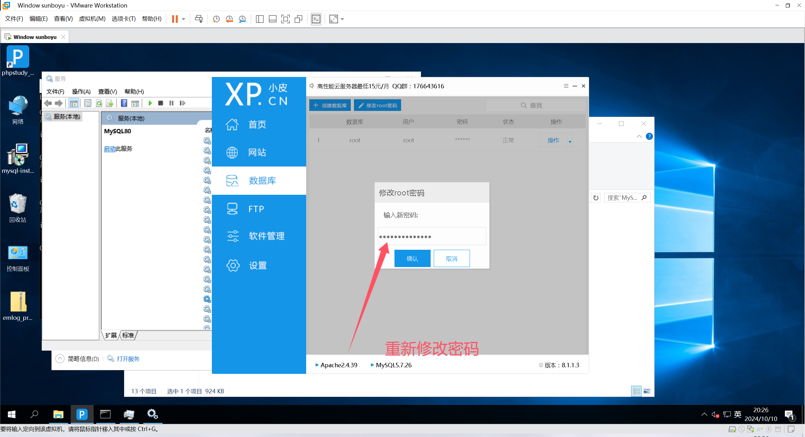

1. **下载**httpd命令行工具 ]

​      

将Apache的中的httpd加入到环境变量中，和mysql同理

**配置**httpd，编辑 ".\Apache24\conf\httpd.conf" 配置文件

Define SRVROOT"c:/Apache24"##这里是本人自己的阿帕奇安装路径默认的

Listen 80 # 监听端口，不冲突就默认80端口
ServerName localhost:80 # 指定服务器主机名

1. 下载 PhP     Study [下载 PhPStudy](https://old.xp.cn/download.html)

​      

1. 打开安装程序，设置安装路径，安装

​      

1. 关闭系统自带的httpd和mysql，使用phpStudy内置的服务

​      

1. 启动 PhPStudy内置的Apache服务

​      

1. 打开就行了

​      

访问成功

‘

项目完成