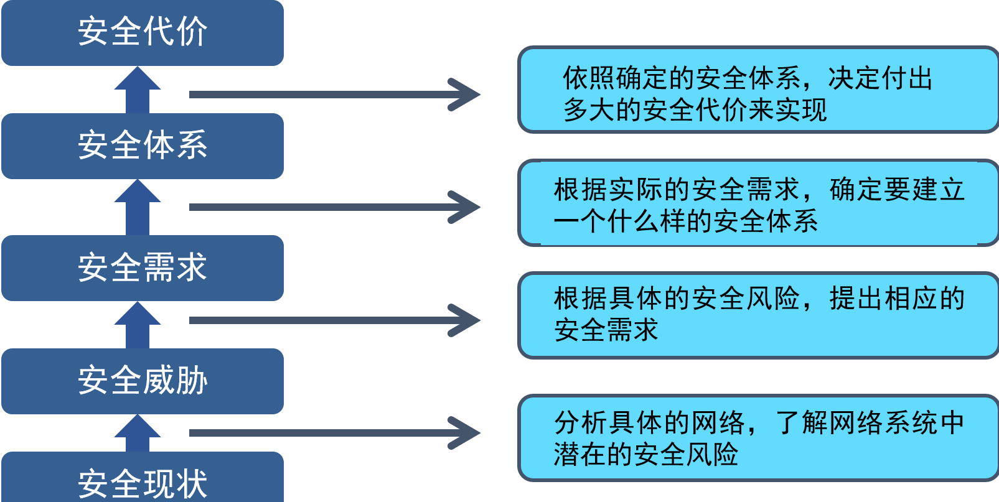

# 网络安全的基本概念

网络安全是指网络系统的硬件，软件及其系统中的数据受到保护，不因偶然的或恶意的原因而遭受到破坏、更改、泄露，系统连接、可靠、正常地运行，网络服务不中断。

### 网络安全大致包含四个方面

网络实体安全、软件安全、数据安全、安全管理

### 特征上看，网络安全包括五个基本要素

机密性、完整性、可用性、可控性、可审查性

### PDRR模型

Protection:安全保护，访问控 [安全威胁于网络攻击.md](安全威胁于网络攻击.md) 制机制

Detection:入侵检测，入侵检测机制

Recovery：安全恢复，备份与恢复机制

Response:安全响应，安全响应机制

### MPDRR 模型

Management:安全管理，安全管理机制

其它四个和PDRR模型一样

pidr:模型	

## 安全体系

[学生学习页面 (chaoxing.com)](https://mooc1.chaoxing.com/mycourse/studentstudy?chapterId=881264732&courseId=244760688&clazzid=103546439&cpi=413965646&enc=ddd229a5e420cddec199d2583723b6c2&mooc2=1&openc=bd37acdc21e6ca25c82633103976e983)

如何设计安全体系？

## 安全标准

1. 可信计算机评估标准（TCSEC)

## 安全目标

保障网络安全的基本目标：

* 安全保护能力
* 隐患发现能力
* 应急反应能力
* 信息对抗能力

## 安全服务

* 网络安全咨询
* 网络安全专业培训
* 网络安全检测
* 网络安全管理
* 应急响应服务

~~~ mermaid
graph LR
用户 --wifi --> AP--eth-->sw-->Router路由器-->运营商-->sever
运营商-->基站-->User
~~~

# 网络威胁

